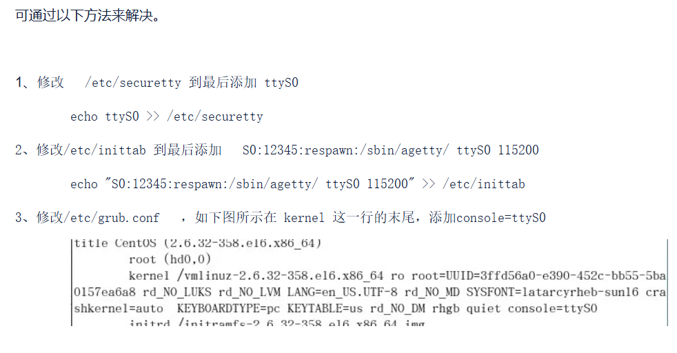
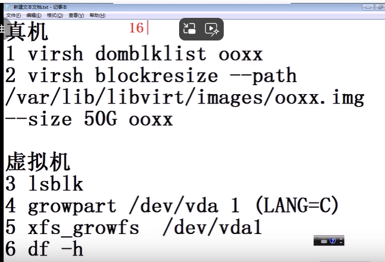

# KVM虚拟化

[toc]

## 磁盘挂载

> 在挂载之前一定是块设备

```
mount #只能挂载块设备
losetup # 是可以把文件做成块设备
```

```
losetup -a # 列出所有块设备
losetup /dev/loop1 /var/ftp/iso/RHEL7-e.iso # 把文件映射为块设备
moun -t iso9660 -o ro /dev/loop1/ /var/ftp/extras/
# 以上两个命令合起来就相当于
mount -t iso9660 -o ro,loop /var/ftp/iso/RHEL7-e.iso /var/ftp/extras/

```

## 自定义yum源

```

mkdir /var/ftp/yumreport
cd /var/ftp/yumreport
createrepo . # 初始化当前目录为yum仓库地址
```

## 验证系统是否支持虚拟化

```
egrep '(vmx|svm)' /proc/cpuinfo ## 有输出，说明cpu支持虚拟化
```

### Hyper-V 虚拟机开启虚拟化

```
hyber-V 机器开启嵌套虚拟化：
关闭虚拟机，管理员权限打开powershell
Get-VM ##列出虚拟机
Get-VMProcessor -VMName KVM主机 | fl ##查看虚拟化选项参数
# 查看上面命令输出`ExposeVirtualizationExtensions` 的值是false,通过下面命令设置为true
Set-VMProcessor -ExposeVirtualizationExtensions $true -VMName KVM主机 ##将其设置为True
重启虚拟机，验证查看已支持虚拟化
```

### 硬件开启虚拟化去bois中设置

> 具体更加自己品牌的电脑


## 虚拟化及管理软件安装配置

>  KVM：时linux内核的模块，它需要CPU的支持，采用硬件辅助虚拟化技术Intel-VT,AMD-V,内存的相关如Intel的EPT和AMD的 RVI技术。

>  QEMU：是一个虚拟化仿真工具，通过ioctl 与内核kvm交互完成对硬件虚拟化的支持
>
> Libvirt(用于简化启动)：是一个对虚拟化管理的接口和工具，提供用户端程序vitsh，virt-install,virt-manager,virt-view与用户交互

### 配置文件

> 虚拟机配置声明文件：
>
> > 位置：/etc/libvirt/qemu/
>
> 虚拟机的硬盘文件：
>
> > 位置：/var/lib/libvirt/images/

### 需要安装的软件

> qemu-kvm: 提供硬件虚拟化仿真环境的支持
>
> libvrit-daemon： 守护进程，管理虚拟机
>
> libvirt-client 客户端，提供客户端管理命令
>
> libvirt-daemon-driver-qemu： libvirtd连接qemu的驱动

### 虚拟化平台安装

```
sudo apt install qemu-kvm libvirt-daemon libvirt-clients bridge-utils virt-manager

```

```
sudo apt update
sudo apt install qemu-kvm qemu-kvm-tools libvirt-daemon libvirt-daemon-system virt-manager libvirt-daemon-driver-qemu qemu-img bridge-utils libvirt-clients virt-install libvirt 
```

```
systemctl start libvirtd
systemctl enable libvirtd
```

### 可选功能

```
- virt-install # 系统安装工具
- virt-manager # 图形管理工具
- virt-v2v # 虚拟机迁移工具
- virt-p2v # 物理机迁移工具 
```

## 虚拟机命令行管理

### 虚拟机操作命令

```
virsh # 交互式 接下来输入list
virsh list # virsh 后跟命令，非交互式
```

#### 虚拟机启动、停止、重启

```
virsh start|shutdown|reboot
```

#### 强制停止虚拟机

```
virsh destroy
```

#### 根据xml文件创建/删除虚拟机

> 使用xml定义出来的kvm虚拟机缺陷是在启动时console进不了终端。网上说通过一下方式设置，但是这些方法都是要在客户机系统上执行修改。但是此时kvm虚拟机连引导系统安装界面都没看到，怎么修改客户端系统呢。所以还是推荐是用`virsh-install`命令创建系统。
>
> 
>
> ```
> [root@centos7-3 ~]# echo "ttyS0" >> /etc/securetty 
> [root@centos7-3 ~]# grubby --update-kernel=ALL --args="console=ttyS0" # 更新内核参数
> [root@centos7-3 ~]# reboot
> ```
>
> 

```
virsh define|undefine
```

##### 虚拟机定义xml文件模板[/etc/libvirt/qemu/centos7_base.xml]

```
<!--
WARNING: THIS IS AN AUTO-GENERATED FILE. CHANGES TO IT ARE LIKELY TO BE
OVERWRITTEN AND LOST. Changes to this xml configuration should be made using:
  virsh edit centos7_base
or other application using the libvirt API.
-->

<domain type='kvm'>
  <name>centos7_base</name>
  <uuid>7733d4ff-e977-4e82-96a5-abb11a223698</uuid>
  <memory unit='KiB'>2000000</memory>
  <currentMemory unit='KiB'>2000000</currentMemory>
  <vcpu placement='static'>2</vcpu>
  <os>
    <type arch='x86_64' machine='pc-i440fx-rhel7.0.0'>hvm</type>
    <boot dev='hd'/>
  </os>
  <features>
    <acpi/>
    <apic/>
    <pae/>
  </features>
  <clock offset='utc'/>
  <on_poweroff>destroy</on_poweroff>
  <on_reboot>restart</on_reboot>
  <on_crash>destroy</on_crash>
  <devices>
    <emulator>/usr/libexec/qemu-kvm</emulator>
    <disk type='file' device='disk'>
      <driver name='qemu' type='qcow2'/>
      <source file='/var/lib/libvirt/images/centos7_base.img'/>
      <target dev='vda' bus='virtio'/>
      <address type='pci' domain='0x0000' bus='0x00' slot='0x04' function='0x0'/>
    </disk>
    ## CD 配置：系统安装镜像文件，
    <disk type='file' device='cdrom'>
      <driver name='qemu' type='raw'/>
      <source file='/path/to/your/centos-7-x86_64-minimal.iso'/>
      <target dev='hda' bus='ide'/>
      <readonly/>
      <address type='drive' controller='0' bus='0' target='0' unit='0'/>
    </disk>
     <disk type='file' device='cdrom'>
      <driver name='qemu' type='raw'/>
      <source file='/mnt/k/系统镜像/CentOS-7-x86_64-Minimal-1708.iso'/>
      <target dev='sda' bus='sata'/>
      <readonly/>
      <address type='drive' controller='0' bus='0' target='0' unit='0'/>
    </disk>
   
    <controller type='usb' index='0' model='piix3-uhci'>
      <address type='pci' domain='0x0000' bus='0x00' slot='0x01' function='0x2'/>
    </controller>
    <controller type='pci' index='0' model='pci-root'/>
    <interface type='network'>
      <mac address='52:54:00:09:c5:2c'/>
      <source network='default'/>
      <model type='virtio'/>
      <address type='pci' domain='0x0000' bus='0x00' slot='0x03' function='0x0'/>
    </interface>
    <serial type='pty'>
      <target type='isa-serial' port='0'>
        <model name='isa-serial'/>
      </target>
    </serial>
    <console type='pty'>
      <target type='serial' port='0'/>
    </console>
    <input type='mouse' bus='ps2'/>
    <input type='keyboard' bus='ps2'/>
    <graphics type='vnc' port='-1' autoport='yes'>
      <listen type='address'/>
    </graphics>
    <video>
      <model type='cirrus' vram='16384' heads='1' primary='yes'/>
      <address type='pci' domain='0x0000' bus='0x00' slot='0x02' function='0x0'/>
    </video>
    <memballoon model='virtio'>
      <address type='pci' domain='0x0000' bus='0x00' slot='0x05' function='0x0'/>
    </memballoon>
  </devices>
</domain>
```

```
<disk> 标签中的 type 属性定义了磁盘类型，这里使用的是 file，表示磁盘文件。
<source> 标签中的 file 属性指定了 ISO 文件的路径。
<target> 标签中的 dev 属性定义了虚拟 CD-ROM 在虚拟机中的设备名称，这里使用的是 hda。
<target> 标签中的 bus 属性定义了虚拟 CD-ROM 的总线类型，这里使用的是 ide。
```

#### 挂载镜像（没试过）

```
virsh change-media win2k12vm01  hdb /usr/share/virtio-win/virtio-win.iso
```


#### 直接创建虚拟机

> 如果bridge 的值是不存在的虚拟交换机，会报 ”ERROR    无法在 'br0' 获取接口 MTU: 没有那个设备“

```
virt-install --name=node1 --memory=2048 --vcpus=2 --disk path=/var/lib/libvirt/images/node1.img,size=25,format=qcow2 --network bridge=virbr0 --os-variant=rhel7 --cdrom=/var/local/CentOS-7-x86_64-Minimal-1708.iso
```

```
 virt-install  --name centos7 --vcpus 2 --memory 2048 --disk /var/lib/libvirt/images/centos7.qcow2,bus=virtio,size=10 --network bridge=virbr0,model=virtio    --graphics=none --console=pty,target_type=serial --location=/var/local/CentOS-7-x86_64-Minimal-1708.iso --extra-args="console=tty0 console=ttyS0"
```

```
# 已存在虚拟磁盘，并且已有系统
virt-install -n hadoop --memory 2048 --vcpus 2 --metadata name=hadoop,title="My big data platform template" --import --boot hd --disk hadoop.qcow2,cache=none -w bridge=virbr0,model=virtio 

# 脚本循环创建
#/bin/bash
for i in {100..104}
do
virt-install -n node$i --memory 2048 --vcpus 2 --metadata name=node$i --import --boot hd --disk node$i.qcow2,cache=none -w bridge=virbr0,model=virtio
done
```


> 在执行上面命令时报错：
>
> ```
> 开始安装......
> 正在分配 'centos7-1.img'                                                                                                                                                            |  25 GB  00:00:00     
> ERROR    无法在 'br0' 获取接口 MTU: 没有那个设备
> 正在删除磁盘 'centos7-1.img'                                                                                                                                                      |    0 B  00:00:00     
> 域安装失败，您可以运行下列命令重启您的域：
> 'virsh start virsh --connect qemu:///system start centos7'
> 否则请重新开始安装。
> ```
>
> 解决方案：(这里的问题时bro 网桥不存在，brctl命令查看默认的时virbro)
>
> > 错误信息 “无法在 ‘br0’ 获取接口 MTU: 没有那个设备” 表示系统无法找到名为 ‘br0’ 的网络接口或者该接口没有正确配置。这通常发生在尝试配置或操作网络桥接（bridge）接口时。以下是一些可能的解决方案：
> >
> > 1. **检查桥接接口是否存在**：
> >
> >    - 使用
> >
> >       
> >
> >      ```
> >      ip link show
> >      ```
> >
> >       
> >
> >      或
> >
> >       
> >
> >      ```
> >      brctl show
> >      ```
> >
> >       
> >
> >      命令来检查 ‘br0’ 是否存在。
> >                            
> >      bash
> >                            
> >      复制
> >                            
> >      ```
> >      ip link show
> >      ```
> >                            
> >      或者
> >                            
> >      bash
> >                            
> >      复制
> >                            
> >      ```
> >      brctl show
> >      ```
> >
> > 2. **确保桥接接口已正确创建**：
> >
> >    - 如果 ‘br0’ 不存在，您可能需要创建它。例如，使用以下命令创建一个名为 ‘br0’ 的桥接接口：
> >
> >      bash
> >
> >      复制
> >
> >      ```
> >      ip link add name br0 type bridge
> >      ```
> >
> >    - 然后，将物理网络接口添加到桥接接口：
> >
> >      bash
> >
> >      复制
> >
> >      ```
> >      ip link set dev <物理接口名称> master br0
> >      ```
> >
> >    - 最后，启动桥接接口和物理接口：
> >
> >      bash
> >
> >      复制
> >
> >      ```
> >      ip link set dev br0 up
> >      ip link set dev <物理接口名称> up
> >      ```
> >
> > 3. **检查网络配置文件**：
> >
> >    - 如果您使用的是网络管理工具（如 NetworkManager），检查您的网络配置文件（如 `/etc/network/interfaces` 或 NetworkManager 的配置）确保 ‘br0’ 的配置是正确的。
> >
> > 4. **重启网络服务**：
> >
> >    - 如果您更改了网络配置，可能需要重启网络服务。在基于 Systemd 的系统上，使用以下命令：
> >
> >      bash
> >
> >      复制
> >
> >      ```
> >      sudo systemctl restart network
> >      ```
> >
> >    - 或者，如果您使用的是 NetworkManager，使用以下命令：
> >
> >      bash
> >
> >      复制
> >
> >      ```
> >      sudo systemctl restart NetworkManager
> >      ```
> >
> > 5. **检查防火墙和SELinux配置**：
> >
> >    - 确保防火墙或 SELinux 没有阻止您访问 ‘br0’ 接口。
> >
> > 6. **查看日志文件**：
> >
> >    - 检查系统日志文件，如 `/var/log/syslog` 或 `/var/log/messages`，以获取更多关于问题的信息。

#### 连接虚拟机的console

```
virsh console
```

#### 修改虚拟机配置

```
virsh edit <node>
```

#### 设置虚拟机自启动

```
virsh autostart <node>
```

#### 查看虚拟机网卡信息

```
virsh domiflist <node>
```

#### 查看虚拟机硬盘信息

```
virsh domblklist <node>
```

#### 查看虚拟机的虚拟交换机

```
virsh domiflist <node>
```

### 虚拟网络

#### 列出虚拟交换机

```
virsh net-list
```

#### 启动虚拟交换机

```
virsh net-start 
```

#### 强制停止虚拟交换机

```
vitsh net-destroy
```

#### 根据xml文件创建/删除虚拟网络

```
virsh net-define |-net-undefine
```

#### 修改虚拟交换机配置

```
virsh net-edit
```

#### 设置虚拟交换机自启动

```
vitsh net-autostart
```

### 虚拟磁盘

> 虚拟磁盘格式支持raw、qcow2、vdi、vmdk
>
> qcow2: 性能较优,支持快照、磁盘复用、压缩、空间占用小、IO效率高等特点
>
> 虚拟盘是可以叠加的，创建虚拟盘时可以叠加后端虚拟盘，后端虚拟盘中的内容在前端盘中可读。

#### 创建虚拟磁盘（qemu-img 命令）

```

$ qemu-img create # 创建一个磁盘 
eg: 
$ qemu-img create -b backdisk.img -f qcow2 predisk.img 50G 
# backdisk.img 后端盘，qcow2 磁盘格式，predisk.img 创建的磁盘，50G 
qemu-img conver # 转换磁盘格式
qemu-img info # 磁盘信息
qemu-img resize # 扩充磁盘
```


## 网卡配置文件模板

> 路径：/etc/sysconfig/network-scripts/idcfg-eth0

```
DEVICE="eth0" # 驱动名称，与ifconfig看到的名称一致-
ONBOOT="yes" # 开机启动 -
NM_CONTROLLED="no" # 不接受NetworkManager 管理
TYPE=“Ethernet” # 类型 -
BOOTPROTO="static" #协议（dhcp|static|none）-
IPADDR="192.168.1.10" # IP地址
NETMASK="255.255.255.0" # 子网掩码
GATEWAY="192.168.1.254" # 默认网关
```

## virsh磁盘扩容

> 尽量不要缩容，会出问题

> 1. 硬件扩容
> 2. 磁盘分区，分区扩大
> 3. 文件系统扩容
>
> ```
> df -h # 查看文件系统空间大小
> lsblk # 查看磁盘空间大小和分区大小 
> ```
>
> 

```
virsh list # 列出磁盘空间
virsh domblklist node.img # 查看虚拟机硬盘信息，包括磁盘路径
virsh blockresize --path 磁盘绝对路径 --size 50G ooxx # 扩充到50G,对虚拟机ooxx的操作 # 硬件扩容

# 进入虚拟机操作如下命令
lsblk # 查看磁盘空间大小和分区大小 
growpart /dev/vda 1 # 磁盘空间扩容
xfs_growfs /dev/vda1 # 文件系统扩容
df -h #查看文件系统
```



