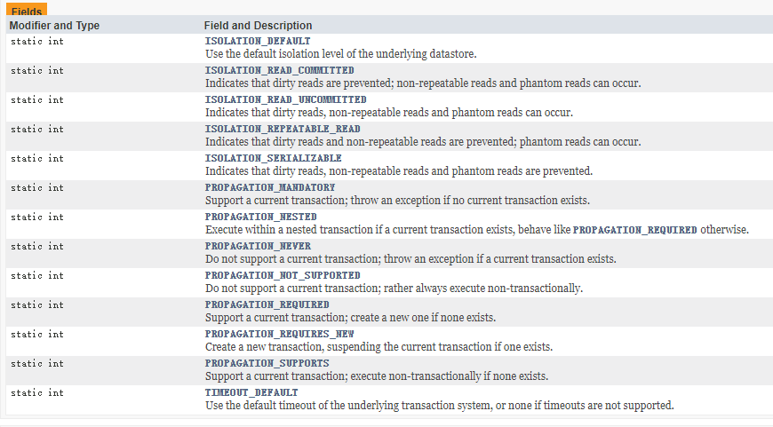
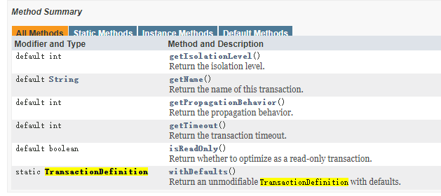

# Spring事务

- Spring 事务接口：

> TransactionDefinition 

1. 定义的属性主要有 事务的5种隔离级别、事物的7种传播方式、和事务的超时时间

   

2. 接口定义的方法也是和事务的隔离级别、传播方式、超时时间、事务名有关的获取方法

   

## 事务的特性

- 原子性（Atomic）:要么全部执行、要么全部不执行。
- 一致性（Consistency）:事务的知悉那个使得数据库从一种正确的状态转化为另一种正确的状态（比如转账,有人多一百就有人少一百）
- 隔离性（Isolation）:在事务正确提交之前，不允许把该事务对数据的任何改变提供给其他事务。
- 持久性（Durability）:事务提交后，其结果永久保存在数据库中。

## 事务并发产生的问题

1. 脏读（数据字段值）

   > 一个事务在处理过程中读取了另一个事务未提交的数据。
   >
   > 一个事务正在对一条记录做修改，在这个事务完成并提交前，这条数据就处于不一致状态；这时另一个事务也来读取同一条记录，如果不叫控制，第二个事务读取这些脏数据，并据此做进一步的处理，就会产生未提交的数据依赖关系，这种现象形象的叫做脏读。

2.  不可重复读（数据字段值或行）

   > 一个事务在读取某些数据后的某个时间，再次读取以前度过的数据，却发现其读取的数据已经发生了改变、或某些记录已经被删除了！这种现象就叫不可重复读

3. 幻读（数据行）

   > 同一个事务内多次查询返回的结果集不一样（比如增加了或减少了行记录）；
   >
   > 一个事务按相同的查询条件重新读取以前检索过的数据，却发现了其他事务插入了满足其查询条件的新数据，这种现象就称为幻读。

## 事务的隔离级别

| 名称                       | 说明           | 脏读    | 不可重复的 | 幻读    | 备注                                                         |
| -------------------------- | -------------- | ------- | ---------- | ------- | ------------------------------------------------------------ |
| ISOLATION_DEFAULT          | 使用数据库默认 |         |            |         | 使用数据库默认隔离级别，对于大多数数据库默认是ISOLATION_READ_COMMITED |
| ISOLATION_READ_UNCOMMITTED | 读未提交       | &radic; | &radic;    | &radic; | 可以读取另一个事务修改还没有提交的数据                       |
| ISOLATION_READ_COMMITTED   | 读已提交       | &times; | &radic;    | &radic; | 只能读取另一个事务已提交的数据                               |
| ISOLATION_REPEATABLE_READ  | 重复读         | &times; | &times;    | &radic; | 可以多次重复执行某个查询，并且每次返回的记录都相同。即使在多次查询之间有新增的数据满足该查询，这些新增的记录也会被忽略 |
| .ISOLATION_SERIALIZABLE    | 序列化（串行） | &times; | &times;    | &times; | 所有的事务依次逐个执行，事务之间就完全不可能产生干扰。性能最差。 |

## 事务的传播方式

| 名称                      | 说明                                                         |
| ------------------------- | ------------------------------------------------------------ |
| PROPAGATION_REQUIRED      | 如果当前存在事务，则加入该事务；如果当前没有事务，则创建一个新的事务。 |
| PROPAGATION_REQUIRES_NEW  | 创建一个新的事务，如果当前存在事务，则把当前事务挂起。       |
| PROPAGATION_SUPPORTS      | 如果当前存在事务，则加入该事务；如果当前没有事务，则以非事务的方式继续运行。 |
| PROPAGATION_NOT_SUPPORTED | 以非事务方式运行，如果当前存在事务，则把当前事务挂起。       |
| PROPAGATION_NEVER         | 以非事务方式运行，如果当前存在事务，则抛出异常。             |
| .PROPAGATION_MANDATORY    | 如果当前存在事务，则加入该事务；如果当前没有事务，则抛出异常。 |
| PROPAGATION_NESTED        | 如果当前存在事务，则创建一个事务作为当前事务的嵌套事务来运行；如果当前没有事务，则该取值等价于TransactionDefinition.PROPAGATION_REQUIRED。 |

Spring 默认回滚事务的异常是RuntimeException .class

