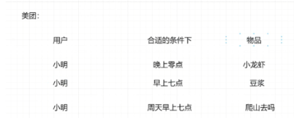

# 01-02 开学典礼

## 1 语言

python 是主要的建模 算法工具 tf libffm

scala 数据处理，流处理、批处理。 flink streaming

java MR 后期一些模型部署

## 2 学完这课 你能得到啥

1. 学完之后，大数据组件会很熟悉，大数据开发。---》大厂，小厂数据量达不到。

2. 对于一些对算法感兴趣的同学，你会收获到，业界算法建模经验。

3. 对于想做数据分析的，整个内容上完之后，你会知道怎么去做数据分析。

4. 推荐系统全链路，你会掌握，尤其是排序算法，还有召回算法以及业界策略。

   

## 3 大家比较在乎工作问题

简历会帮助大家修改。

钱多 就得难 看一 两年年  ，

代码能力，这个是你练出来的。

## 4 什么是大数据  

> 大数据特征  :

1. 数据量大  :

> 一切皆数据， 所能看
到的一切基本都可以
转化为数据。 海量数
据呈指数级别上升。

2. 数据多样 :
> 视频、 图片、 语音、
文本、 格式化数据、
xml、 各式各样数
据

3. 数据高速传播  
>2g、 3g、 4g、 5g
每秒几GB的传输速
度， 使得数据交互越
来越快。

4. 数据中的价值  
> 大量的价值潜在在数
据当中， 比如常见的
广告推荐、 用户画像、
行为检测

## 大数据的带来的问题以及解决方案  

1. 海量数据如何存储
> 分布式存储存储到多台机器
如HDFS,ODPS,AWS

2. 海量数据如何计算
> 分布式计算MapReduce

3. 在极其脏乱的数据中挖掘有价值的信息
> 机器学习、 深度学习算法。

# 03 推荐系统架构

> 前面两个ppt 讲的是概念性的东西和导向，我认为直接看ppt 即可，所以没有做笔记。
>
> 下面仅记录下01、02 有价值的知识：
>
> > 1.语言
>
> > python 是主要建模 算法工具。tf libffm
> > scala 数据处理，流处理、批处理。flink streaming
> > java MR	,后期一些模型部署。
>
> > 2.学完这课 你能得到啥。
>
> > 2.1 学完之后，大数据组件会很熟悉，大数据开发。---》大厂，数据量达不到。
> > 2.2 对于一些对算法感兴趣的同学，你会收获到，业界算法建模经验。
> > 2.3 对于想做数据分析的，整个内容上完之后，你会知道怎么去做数据分析。
> > 2.4 推荐系统全链路，你会掌握，尤其是排序算法，还有召回算法以及业界策略。
>
> > 3.推荐系统核心思想：==在合适的场景下给用户匹配最合适的信息 ==
> >
> > > ==用户角度==： 用户面对海量的信息， 如何选出自己最想要的信息。
> > > 信息（物品、 视频…） 角度： 如何把信息精确到匹配到某类用户。
> > > ==平台角度==： 如何提高平台的uv、 pv、 留存、 转化等  
> >
> > 
>
> > 4.推荐系统的几个概念：
> >
> > 
>
> > 5. 避免 信息茧房：
> >
> >    信息茧房：越喜欢看的越给你推荐。旅游自拍、美女。军事不给你推
> >
> >    解决信息茧房， MAB：大概率给你推荐你喜欢的，小概率给你推荐你没看过的。
> >
> >    > 100次展现，5 slots推荐一些没看过的，95次采用推荐系统，避免信息茧房。
>
> > 代码能力，这个是你练出来的。
>
> > 书单：第一个 核心  线性代数  统计学      数学之美（很好）

[TOC]

> 核心思想：给用户在合适得地方推荐合适得信息

## 推荐系统的演变

1. 从物品角度出发：

   > 1.1. 平台刚建立起来时： 此时可能只有少量的商品进入平台， 那此时主要是是要靠一些策
   > 略吸引用户， 比如满减、 免单、 热门推荐等， 靠吸引眼球来引流。
   >
   > 1.2. 平台运行了一段时间后， 此时物品数量越来越多， 用户与物品的交互也越来越频繁，
   > 那么简单的如热门推荐， 并不适合个性化的目标， 使得用户体验差。 此时可以基于用户行为
   > 数据上一些简单的机器学习算法。
   >
   > 1.3. 平台成熟后， 海量数据产生， TB、 PB的用户行为数据随之而来。 可以上一些复杂的机
   > 器学习模型如： 深度学习、 集成学习等。

2. 从用户角度出发：

> 2.1. 平台刚建立起来时： 只有少量的用户注册， 用户面临也是不多的商品， 可能需要基于
> 如线上导购， 传统的电视购物。
> 2.2. 平台运行了一段时间后， 用户数据量逐渐增大， 物品也逐渐增多。 用户与用户之间的
> 相似性突出， 比如喜欢运动的男生a,男生b， 两个人都购买过 蛋白粉、 鸡胸肉、 鸡蛋， 但是a
> 多买了一个哑铃， 那么可以推荐给b哑铃。
> 2.3. 平台成熟后， 海量数据产生， TB、 PB的用户行为数据随之而来， 此时用户的兴趣是多
> 峰的， 用户可能既喜欢运动、 也喜欢音乐等， 此时需要靠一些更加厉害的模型进行挖  

## 推荐系统流程

### 数据部分

### 模型部分

## 推荐系统数据源

### 用户画像

1.基于固有属性的用户属性：性别、年龄、手机型号、地区。

 2.基于用户的兴趣标签：购物、教育、影音。

 3.用户的行为标签，近期购买的物品，浏览记录。 

4. 定制化标签：群体属性（聚类）。

### 物品特征

1.物品id类特征：物品在数据库中的主键 

2.物品的一级、二级、三级品类：衣服、T恤、supremeT恤 

3.物品的特征性：产地、店铺、商家信誉、图片

### 上下文信息

1.用户购买物品的时间：是否节假日，是否促销日，早、中、晚、深夜 

2.用户的购物状态：是否刚还完花呗、是否信用额度提升 

3.用户购物的地点：家里、公司、学校等

> 核心是确定最优的f(u,I,c)

> 什么是机器学习?
>
> 普通算数是通过公式算结果，机器学习是通过大批量结果算公式，是普通算数的一个反向得过程。

-------

## 推荐系统流行架构

### 如何衡量一个推荐系统的优劣  

1. 用户满意度
   也就是加完这套推荐系统后用户的的满意度， 这个指标可以通过用户调查问卷等形式得到， 但值得注意的一点是获得指标的
   方式方法也有可能降低用户的满意度。
2. •预测准确率：
   就是我们预测结果的准确度。 一般情况下在TopN预测时我们计算召回率和准确率； 在评分等预测时用MAE或RMSE
3. •覆盖率：
   代表推荐的事物对全部事物的覆盖情况， 可以用来判断推荐系统是否有马太效应。 马太效应是出自《圣经 马太福音》 的一个典故，
   社会学中的一种强者越强弱者越弱的现象， 也就是说推荐系统是否会使被关注的事物更加被关注， 被忽视的事物更加被忽视。
   常用的协同过滤就有马太效应。 比较简单的指标就是信息熵。
4. •多样性：
   判断推荐结果是否覆盖用户各个兴趣点
5. •新颖性：
   例如不应该推荐用户已经看过的电影等， 应该多推荐给用户用户不知道的商品。 记得当时林教授举了一个例子， 一个朋友买了5L的洗衣液，
   应该几个月都不需要洗衣液了， 但那个电子商务平台（不说是哪个了） 还是想推荐洗衣液， 这就是一个新颖性不够的推荐。 假如用户买了
   一台电脑， 新颖性高的推荐是向他推荐一些外设， 而不是另一台电脑。
6. •惊喜性：
   用户对推荐的商品之前没有兴趣， 但用过之后很满意。
7. •信任性：
   这个是网站运营方面的， 推荐是不是受用户信任， 例如用户相比百度搜索的推广推荐更信任淘宝网的商品推荐
8. •健壮性：
   是否能承受住攻击和刷分（就是使用一些手段使自己的商品优先被推荐） 等现象
9. •商业目标：
   该推荐系统上线后商业目标完成情况， 如业绩提升、 销量增加等等  

###  传统的后端流程和大数据处理的大致流程：

> 属于下面讲的lambda 架构

### 实时个性化推荐技术：

> 这之中需要解决的问题?
>
> 系统业务中这么多信息需要为这么多用户的每个用户推荐哪些信息，需要大量的算力。
>
> 
>
> 解决流程：
>
> 
>
> 1、召回阶段：从海量物品中筛选出和用户直接相关或间接相关的物品，将原始数据从百万、 亿级别控制在万、千个物品。再召回的算法和策略一般都是比较简单，实时性较强的算法。 
>
> 2.排序阶段：基于一些复杂的算法将召回阶段筛选出来的万、千个物品继续缩小范围到几百 个。 
>
> 3.重排阶段：过滤掉重复推荐的、已经购买或阅读的、已经下线的物品，当召回和排序结果 不足时，需要使用热门物品进行补充，最后合并物品基础信息，将包含完整信息的物品推荐 列表返回给客户端。
>
> 

### lambda架构

> ####  什么是lambda架构?
>
> > 主流大数据平台一般将用户行为日志分为离线部分和实时部分-lambda架构。
>
> ==离线部分==  进入数仓供 离线任务进行处理，包括各种按天统计的报表、T+1的推荐业务(非实时推荐，一般每天更新一次)。
>
> ==实时部分==  一般进入消息队列(如Kafka)，供实时处理程序消费，如各类实时监控、大屏展示报表等

#### Lambda缺点

> Lambda架构历经多年发展，其优点是稳定，对于实时计算部分的计算成本可控，批量处理可以 用晚上的时间来整体规划。将实时计算和离线计算高峰分开，可以极大化利用服务器资源，减 少对用户的影响，这种架构支撑了数据行业的早期发展，但是它也有一些缺点，这些缺点导致 Lambda架构不适应部分数据分析业务的需求，具体缺点如下：
>
> 1.实时与批量计算结果不一致引起的数据口径问题：因为批量和实时计算走的是两套计算框架， 使用的是不同的计算程序，算出的结果往往不同，特别是对于那些累积的指标，时间长了容易 产生误差。因此，需要一套完善的机制来保证计算的一致性，纠正数据偏差。 
>
> 2.批量计算在计算窗口内存在无法算完的风险：在大数据时代，数据量级越来越大，经常发现夜 间只有4、5个小时的时间窗口用于离线计算，已经无法完成白天20多个小时累计的数据计算。 怎么保证早上上班前准时出数据报表已成为大数据团队头疼的问题。集群之间不同作业之间的 依赖关系及资源占用等更加剧了这种情况的发生。
>
> 3.数据源变化都要重新开发，开发周期长：每次数据源的格式变化，业务的逻辑变化都需要针对 ETL和Streaming做开发修改，整体开发周期很长，业务反应不够迅速。 4.服务器存储大：数据仓库的典型设计，会产生大量的中间结果表，造成数据急速膨胀，加大了 服务器存储压力。

### Kappa架构

> Kappa架构通过剔除Lambda架构中的批处理部分简化了Lambda架构。为了取代批量处理， 数据只需通过流式计算系统快速加工处理。Kappa体系结构中的规范数据存储不是使用类似于 SQL的关系数据库存储，而是一个只能追加数据的不可变日志系统。从日志中，数据通过计算 系统流式传输，并输入辅助存储器作为字典库供服务使用。典型的Kappa架构如下图：
>
> 

