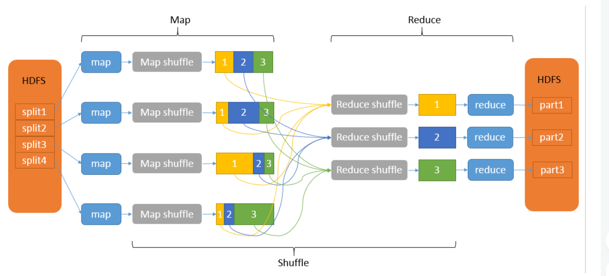
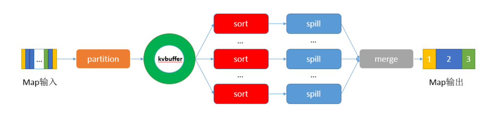

shuffer 过程中的 partition 是通过类似于hash(key) 的过程把数据分桶，就会出现相同key 被分配到相同的分区中，有几个分区就开几个raduser 处理，可以自定义partition , 通过partition 自定义也是解决数据倾斜的关键。

shuffer 过程中有 sort 排序 ,默认是按key 排序的，存在于mapper 节点的每个分区中，即每个分区中的数据是有序的。和 存在于copy mapper 输出到reduce端 合并中，即每个reducer的输入文件都是经过sort排过序的。可以通过自定义domain class实现WritableComparable 来完成sort排序。

shuffer 过程中的分组实在mapper 节点机器上完成的，并且实在每个分区内，默认分组也是按key 分的，可是implements RawComparator自定义分组功能。

MR 是分而治之的思想

Shuffle过程包含在Map和Reduce两端，即**Map shuffle**和**Reduce shuffle**

## 二、Map shuffle

在Map端的shuffle过程是对Map的结果进行分区、排序、分割，然后将属于同一划分（分区）的输出合并在一起并写在磁盘上，最终得到一个**分区有序**的文件，分区有序的含义是map输出的键值对按分区进行排列，具有相同partition值的键值对存储在一起，每个分区里面的键值对又按key值进行升序排列（默认），其流程大致如下：

