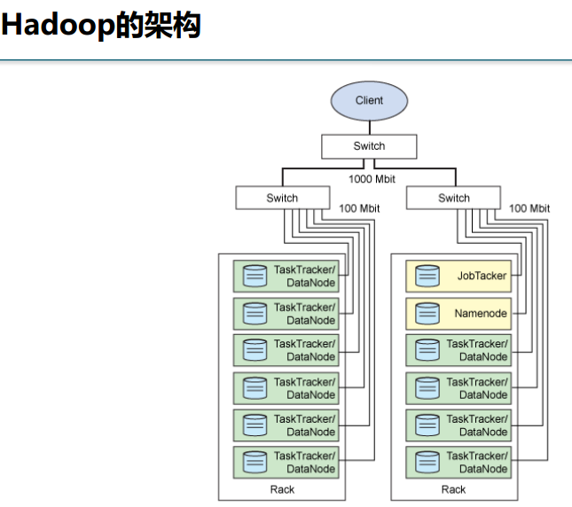
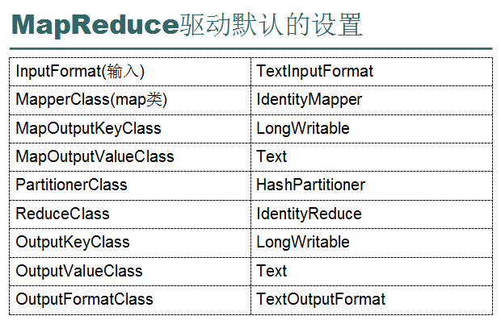
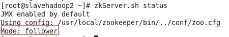
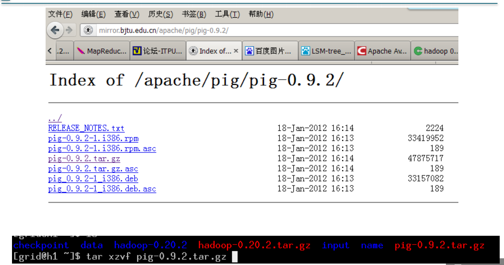

[toc]

概念、理解和由来:
=================

HDFS(Hadoop Distributed File
System):Hadoop分布式文件系统(想想windows的资源管理器)存储管理文件

MapReduce:是一个并行计算框架用于逻辑处理计算(计算目标来自HDFS)有java代码利用hadoop的API编写

非结构化数据:在非关系型数据库中存储(比如日志)如:MongoDB数据库

结构化数据:在关系型数据库中存储.如:Mysql oracole

Sqoop:可以从HDFS中相互导入与关系型数据库中

Hbase:Hadoop的数据库,处理达到P

Karmasphere:管理监控hadoop生态系统(磁盘,内存,cpu的监控等)

High Level Interfaces:用JAQL处理(相对于MapReduce(使用java处理的))

**Page Rank:**

{width="5.768055555555556in"
height="2.4327307524059494in"}

我觉的上面的那副矩阵图把一列看做一个网页更好,第一列是1号网页,他一共有三条链接,第一行也是代表1号网页,1号网页中的链接没有指向1号网页的,所以为0;然后第二行代表2号网页,而1号网页中的3个链接中有一个指向2号网页,所以值为1/3.

{width="1.243477690288714in"
height="0.3867279090113736in"}这个公式算出google矩阵

α都是google经验的出来的一个在0—1之间的数,它取多少使pageRank计算的效果最好

S

U是全部元素都是1的矩

Hadoop的特点:
-------------

扩充能力:能可靠的存储和处理千兆字节数据

成本低:可以通过普通机器组成的服务器群来分发以及处理数据.这些服务器群总设计可达数千个节点

高效率:通过分发数据,Hadoop可以在数据所在的节点上并行地处理他们,这使得处理非常的快

可靠性:Hadoop能自动滴维护数据的多份副本,并且在任务失败后能自动的重新部署计算任务

(总结:分布式,副本机制)

{width="5.768055555555556in"
height="4.377446412948381in"}

Hadoop子项目家族的功能简介:
---------------------------

Core和Avro:是Hadoop的核心代码

MapReduce和HDFS:是hadoop的两大支柱

Pig:Hadoop是java写的,开发时可以用java写MapReduce.如果你不会java,Hadoop家族中为你提供了Hadoop的轻量级语言Pig,他是以shell命令的方式通过pig把命令转换成MapReduce的程序,起到了一个转换的作用

Hive:面向数据库工程师,在Hive下输入Hive命令(和sql命令有少量差别,只支持sql标准的9个),然后它会转换成MapReduce执行.

HBase:是hadoop的一个非关系型数据库

ZooKeeper:服务器节点以及进程间的通信

Chukwa:数据集成工具,比如程序运行产生很多日志,他就可以抓取.

Hadoop集群的物理分布架构
========================

{width="5.768055555555556in"
height="5.115143263342082in"}

对文件读写找Hdfs(先接触的是NameNode),有一个计算任务找MapReduce(先接触的是JobTracker)

HDFS的架构:
-----------

主从结构:

主节点,只有一个:nameNode

从节点,有多个:datanodes

### NameNode:

作用:

接受用户操作请求

维护文件系统的目录结构

管理文件与block之间关系,block与dataname之间的关系

访问数据时先在NameNode中查找数据存放的位置节点再去访问Natenode

1.  HDFS的守护程序

2.  记录文件是如何分割成数据块的（文件与数据块的关系、数据块的顺序），以及这些数据块被存储在哪些节点上（数据块与节点的关系，为了以便查找）

3.  对内存和I/O集中管理

4.  是个单点,发生故障会使整个集群崩溃

{width="5.768055555555556in"
height="3.8253423009623795in"}

### Secondary Namenode:

1、监控HDFS状态的辅助后台程序

2、每个集群都有一个

3、与NameNode的进程通讯,定期保存HDFS元数据快照

4、当NameNode故障可以作为备用NameNode使用

{width="5.768055555555556in"
height="3.4835312773403326in"}

### DataNode:

作用:

存储文件

文件被分成block存储在磁盘上(block默认大小是64M)

为保证数据安全,文件会有多个副本

1.  每台从服务器都运行一个

2.  负责把HDFS数据块读写到本地文件系统

{width="5.768055555555556in"
height="3.8967760279965002in"}

MapReduce的架构
---------------

主从结构:

主节点,只有一个:JobTracker

从节点,有很多:TaskTracjers

### JobTracker:

1.  用于接收处理作业（用户提交的代码）的后台程序

2.  决定有哪些文件参与处理，然后切割task并分配节点(把计算任务分给TaskTrackers执行)

3.  监控task,重启失败的task(于不同的节点)

4.  每个集群只有唯一一个JobTracker,位于Maste节点

{width="5.768055555555556in"
height="3.41209864391951in"}

### TaskTrackers:

1.  位于slave节点上,与datanode结合(代码与数据一起的原则)

2.  管理各自节点上的task(由jobtracker分配)

3.  每个节点只有一个tasktracker,但一个tasktracker可以启动多个JVM,用于并行执行map或redice任务

4.  与jobtracker交互,执行jobTracker分配的任务

{width="5.768055555555556in"
height="3.3793864829396325in"}

单节点物理结构:
===============

{width="5.768055555555556in"
height="3.373611111111111in"}

linux常用的一些命令
===================

{width="5.768055555555556in"
height="3.915277777777778in"}

pwd 显示所在目录;

hostname 查看当前主机名

伪分布集群搭建:
===============

主要步骤(附):
-------------

1.  关闭防火墙

2.  修改ip

3.  修改hostname(主机名)

4.  设置ssh自动登录

5.  安装jdk

6.  安装hadoop

1.启用网卡
----------

1.  如果使用仅主机模式(相当于自己的主机与虚拟机就组成了一个独立的局域网)，必须启用主机的VMnet1的网卡，设置网卡的ip地址为192.168.80.1(此地址就相当于这个局域网的网关了)

(80网段，也可以设置为其他网段，如果192.168.1.30)

验证：在windows的命令行下执行ipconfig

2.启动linux
-----------

登陆时使用用户名root(超级管理员权限登录,因为他的有所有的权限,为以后减少不必要的麻烦,当然也可以自选)，密码hadoop(安装linux时密码)

3.修改ip地址\*(红字为主要步骤)
------------------------------

设置ip为192.168.80.100，子网掩码为255.255.255.0，网关为192.168.80.1

**（操作：**

修改IP,方式一:

命令:

```bash
vim /etc/sysconfig/network-scripts/ifcfg-eth0
```

ifcfg-eth0为和当前网络名一样的文件(当前网咯名为eth0)

**修改内容:**

```tex
DEVICE="eth0" 设备名

BOOTPROTO="static"
使用动态IP还是静态IP。此处为静态，如要使用动态（自动获取IP），将static改为dhcp即可

HWADDR="00:0C:29:BF:45:8B"

IPV6INIT="yes"

NM\_CONTROLLED="yes"

ONBOOT="yes"

TYPE="Ethernet"

UUID="99339c27-0884-46c0-85d5-2612e5c1f149"

IPADDR="192.168.80.100" IP地址

NETMASK="255.255.255.0" 子网掩码

GATEWAY="192.168.1.1" 网关

DNS1="8.8.8.8" 域名解析地址

DNS2="8.8.4.4"
```

修改IP,方式二:用图形化界面修改(简单方便)

**)**

重启网卡服务,命令:

```Shell
service network restart
```

验证,命令：在linux命令行下执行ifconfig

如果ping成功，可以在主机上使用PieTTY连接远程的linux。

4 .修改主机名
-------------

默认的主机名都是localhost-localhost.我们修改主机名是为了在hosts文件中映射ip地址,毕竟记主机名笔记ip地址好记

**方式一:**

修改主机名的配置文件/etc/sysconfig/network，

命令:

```Shell
vim /etc/sysconfig/network
```

如:把主机名改为hadoop0

```
HOSTNAME= hadoop0
```

方式二:

命令:hostname “新主机名”

缺点: 它只对当前回话有效,重启系统就回到原来的主机名了

验证：重启linux，查看是否真的生效

reboot重启命令.

5.绑定ip和hostname 
-------------------

目的:记主机名比记ip的容易

> 修改ip映射的配置文件:/etc/hosts，
>
> 命令:
>
> ```bash
> vim /etc/hosts
> ```
>
> 增加一行内容: ’ip’ ‘主机名’ 如: 
>
> ```tex
> 192.168.80.100 hadoop0
> ```
>
> 

验证：ping ‘主机名’

6 关闭防火墙
------------

关闭防火墙:

执行命令

```shell
service iptables stop
```

验证：

```bash
service iptables status
```

关闭防火墙的自动运行功能

执行命令

```bash
chkconfig iptables off
```

验证: 

```bash
chkconfig --list|grep iptables
```

(命令的一点语法1:查看状态(status)/关闭(close)/重启(restart)/打开(open)某个服务用”service
‘服务名’ ‘动作’比如查看防火墙状态:service iptables status
&lt;列出在之前知道的一些服务:network(网卡服务)、iptables(防火墙服务)、&gt;)

(命令的一点语法2:chkconfig关于服务是否自动启动,后跟参数—list
列出所有信息;查看特定服务是否自动启动可以加个管道 “|grep
’服务’”进行过滤)

目的:关闭防火墙的目的是为了不拦截hadoop的一些端口,因为他是在局域网内,安全危险很低,如果要外网的或就要逐个把端口放开,而不是关防火墙了.

关于vi编辑器,当非法操作文件时,在当前文件夹下会产生一个缓存文件(.a.awp)他是把你异常操作文件后而没对这个文件保存的缓存,像word一样,你可以把他删除,也可以继续之前的操作.

7.安装jdk
---------

使用WinSCP把jdk和hadoop复制到/usr/local目录下

```bash
chmod u+x jdk-6u24-linux-i586.bin
```


修改文件的权限为可执行权限(u代表当前权限,x代表可执行权限)

```bash
./jdk-6u24-linux-i586.bin //解压文件

mv jdk-1.6.0\_24 jdk //重命名文件夹
```


8.设置环境变量
--------------

执行

```bash
vi /etc/profile
```

，增加以下内容

```tex
export JAVA_HOME=/usr/local/jdk

export PATH=.:\$JAVA\_HOME/bin:\$PATH
```

保存退出。

执行命令:

```bash
source /etc/profile
```

;用于刷新,是文件立即生效

验证：执行

```bash
java –version
```


9 .配置SSH免密码登录
--------------------

&lt;1&gt;执行命令&lt;1&gt; ssh-keygen -t rsa
产生秘钥,位于\~/.ssh文件夹中

> (ssh-keygen是加密命令;rsa是一种加密算法)

```bash
ssh-keygen -t rsa
```

连续4个回车生成密钥文件

{width="3.3739129483814523in"
height="0.5394335083114611in"}

> 这是产生的秘钥文件,一个私钥一个公钥,公钥是要放到对方那的,但是这个公钥文件在对方那又不叫这个名字,他叫authorized\_keys,所以cp到对方的.ssh文件夹下时要改名为authorized\_keys,(疑惑:在真正的分布式系统中,是否本地也要copy一份authorized\_keys文件用于对比呢)

命令:

```bash
cp \~/.ssh/id\_rsa.pub \~/.ssh/authorized\_keys
```

(拷贝文件,产生授权文件authorized\_keys)

验证：命令:ssh hadoop0 用于免密码登录.

错误经历提示:如果你多次尝试ssh免密码登录配置,仍然不成功,你可以把配置配好后,重启这些机器,再做ssh免密码远程登录.因为可能配置还未生效.

10.安装hadoop 
--------------

虚拟机克隆后linux系统改密码和用户名问题:

passwd 用户名 为用户创建密码

usermod -l 新用户名 老用户名 为用户改名

上面改过之后,在图形化登录界面仍然是原用户名,需如下操作:

然后改如下俩文件,里面有个原用户名,把他给为新用户名

改/etc/shadow文件

改/etc/passwd文件

记得在登录新用户名之前用root账户改用户的问目录,把原名改为新名

{width="4.822916666666667in"
height="0.9270833333333334in"}

### &lt;1&gt;解压缩hadoop安装包

执行命令

```
tar -zxvf hadoop-1.1.2.tar.gz
```


### &lt;2&gt;重命名

执行

```
mv hadoop-1.1.2 hadoop
```


### &lt;3&gt;设置环境变量

编辑文件

```
vi /etc/profile
```

```
export HADOOP\_HOME\_WARN\_SUPPRESS=1

export HADOOP\_HOME=/usr/local/hadoop

export PATH=.:\$HADOOP\_HOME/bin:\$JAVA\_HOME/bin:\$PATH
```

保存退出

执行

```
source /etc/profile 
```

刷新配置文件立即生效

### &lt;4&gt;修改hadoop配置文件

修改四个位于conf目录下的文件，分别是如下

编辑hadoop-env.sh

第九行修改，

```
export JAVA\_HOME=/usr/local/jdk
```

开启JAVA\_HOME,为环境变量中的

#### (1) core-site.xml

在core-site.xml的&lt;configuration&gt; &lt;/ configuration
&gt;中添加如下代码

&lt;property&gt;

&lt;name&gt;fs.default.name&lt;/name&gt;

&lt;value&gt;hdfs://hadoop0:9000&lt;/value&gt;

&lt;description&gt;change your own hostname&lt;/description&gt;

&lt;/property&gt;

&lt;property&gt;

&lt;name&gt;hadoop.tmp.dir&lt;/name&gt;

&lt;value&gt;/usr/local/hadoop/tmp&lt;/value&gt;

&lt;/property>

#### (2)hdfs-site.xml

&lt;property&gt;

&lt;name&gt;dfs.replication&lt;/name&gt;

&lt;value&gt;1&lt;/value&gt;

&lt;/property&gt;

&lt;property&gt;

&lt;name&gt;dfs.permissions&lt;/name&gt;

&lt;value&gt;false&lt;/value&gt;

&lt;/property&gt;

#### (3)mapred-site.xml

&lt;property&gt;

&lt;name&gt;mapred.job.tracker&lt;/name&gt;

&lt;value&gt;hadoop0:9001&lt;/value&gt;

&lt;description&gt;change your own hostname&lt;/description&gt;

&lt;/property&gt;

### &lt;5&gt;格式化操作

执行命令hadoop namenode –format

不可多次格式化,如果多次格式化会使出错,看王杨挺的笔记.

### &lt;6&gt;启动

执行命令start-all.sh

验证：命令:jps,出现五个进程.分别是4706 NameNode

4939 SecondaryNameNode

4834 DataNode

5024 JobTracker

6667 Jps

5143 TaskTracker

其实看hadoop/bin可以知道{width="5.768055555555556in"
height="1.1756419510061242in"}

这五个进程都是对应的命令,可以一个一个的执行,刚开始建议一个一个运行(例如,命令:
hadoop-daemon.sh start
secondarynamenode启动附namenode),start-all.sh是全部运行.

一个一个启动之后tail命令可以查看启动日志

#### (1)执行jps(是jdk的一个命令,查看有几个进程在运行)

可以发现5个java进程，分别是NameNode、JobTracker、DataNode、TaskTracker、SecondaryNameNode

#### (2)浏览器访问

[*http://hadoop0:50070*](http://hadoop0:50070)
查看HDFS的进程运行情况,正常进入web页面说明NameNode活着

[*http://hadoop0:50030*](http://hadoop0:50030)
查看MapReduce的进程运行情况, 正常进入web页面说明JobTracker活着

如果要在windows浏览器访问

需要修改文件C:\\Windows\\System32\\drivers\\etc\\hosts把ip映射到主机名

10-1:分布式集群搭建(真正应用):
------------------------------

说明:

伪分布是在一台电脑上运行namenode、secondarynode、datanode、jobtracker、tacktracker

分布式hadoop集群是多台机器物理分布的，每一台物理机器都是承担不同的角色,如上有图&lt;hadoop集群的物理分布&gt;

分布式与伪分布的差别为:

集群的各个节点通常都是物理机器，但是也可以包含虚拟机。

1、
在VMWare中克隆出已经搭建好伪分布的那台机器两个,作为slave节点，删除这两个节点中的.ssh配置信息和/usr/local/目录下的所有内容(删除目的,从新生产自己的ssh私钥和公钥;删除local下的内容为了不惜要的麻烦(里面的东西有可能是在运行伪分布是生效的配置文件,虽然删除了,稍后会copy过去jdk、hadoop
，从搭建好的那台&lt;伪分布&gt;))

2、 设置这两个新节点的ip和主机名（hostname）。

3、 把所有的ip和hostname的映射信息配置在每一个节点的/etc/hosts中。

4、 集群的各个节点之间SSH免密码登陆

(1)在两个新节点中产生ssh秘钥文件

(2)ssh-copy-id -i ‘另一台主机名’

说明:我感觉这个命令就是把授权文件拷贝过去,因为授权文件和公钥的内容一样,并且执行了这条命令会看到另一台主机/root/.ssh/下多了个授权文件authotized\_keys.当又有另一台机器也把他的授权文件ssh-copy-id到同一台机器上时,他可能就是记录到这个文件known\_hosts中了.(说多了也没有,帮助理解)

具体操作:

> （主节点把密码传到从节点:在主节点的系统上运行）:
>
> ssh-copy-id -i ‘从节点机器名’ 过程中要输入从节点机器名密码一次
>
> 测试:从主节点免密码登录到从节点:
>
> ssh cloud41(‘从节点机器名’)
>
> （从节点把密码传到主节点:在从节点的机器上运行）:
>
> ssh-copy-id -i ‘主节点机器名’ 过程中要输入主节点机器名密码一次
>
> 测试:从主节点免密码登录到从节点:
>
> ssh ‘主节点机器名’

操作之后如果能通过,机器间免密码登陆完成.

5、
把主节点上原来的/usr/local/hadoop/logs和/usr/local/hadoop/tmp目录删除，因为在操作伪分布是格式化了，产生的tmp文件,配置了新的从节点,要再格式化一下,如果不删tmp文件夹,多次格式化可能是datanode启动不起来.

6、 把搭建好的主节点上的jdk目录和hadoop目录复制到其他节点

scp -r /usr/local/jdk hadoop1:/usr/local

scp -r /usr/local/hadoop hadoop1:/usr/local

7、
在’主节点’上配置主从关系，修改\$HADOOP\_HOME/conf/slaves文件，删除原有内容，修改为hadoop1和hadoop2.,
hadoop1和hadoop2就是他的从节点来了,在主节点上启动时,会启动这两个节点的datanode和tasktracker

8、 在hadoop0（主节点）上格式化文件系统 hadoop namenode -format

9、 在hadoop0（主节点）上执行命令 start-all.sh，启动hadoop集群

--2、.动态增加hadoop的从节点

2.1 假设hadoop4是将要被新增的从节点

2.2 修改主节点hadoop0的slaves文件，增加hadoop4

2.3 在从节点hadoop4上手工启动DataNode和TaskTracker进程

hadoop-daemon.sh start datanode|tasktracker

2.4 让主节点加载新的从节点信息

hadoop dfsadmin -refreshNodes

3.动态修改副本数

hadoop fs -setrep 2 /core-site.xml

// core-site.xml这个文件就为两个了.( setrep==set replication)

4.关闭安全模式”:hadoop dfsadmin –safemode leave

开启安全模式”:hadoop dfsadmin –safemode get

一图形化显示监控java进程的一个java命令: jconsole或者jvisualvm

10-2\# 启动hadoop自带的测试例子，通过的话环境就搭建成功了
---------------------------------------------------------

### \# hadoop jar hadoop-examples-1.1.2.jar pi 10 100

```
[hadoop@master hadoop-1.1.2\]\$ hadoop jar hadoop-examples-1.1.2.jar pi
10 100

Number of Maps = 10

Samples per Map = 100

Wrote input for Map \#0

Wrote input for Map \#1

Wrote input for Map \#2

Wrote input for Map \#3

Wrote input for Map \#4

Wrote input for Map \#5

Wrote input for Map \#6

Wrote input for Map \#7

Wrote input for Map \#8

Wrote input for Map \#9

Starting Job

14/02/28 16:04:00 INFO mapred.FileInputFormat: Total input paths to
process : 10

14/02/28 16:04:01 INFO mapred.JobClient: Running job:
job\_201402281553\_0001

14/02/28 16:04:02 INFO mapred.JobClient: map 0% reduce 0%

14/02/28 16:04:22 INFO mapred.JobClient: map 20% reduce 0%

14/02/28 16:04:38 INFO mapred.JobClient: map 40% reduce 0%

14/02/28 16:04:50 INFO mapred.JobClient: map 60% reduce 0%

14/02/28 16:04:51 INFO mapred.JobClient: map 60% reduce 16%

14/02/28 16:05:01 INFO mapred.JobClient: map 70% reduce 20%

14/02/28 16:05:02 INFO mapred.JobClient: map 80% reduce 20%

14/02/28 16:05:07 INFO mapred.JobClient: map 80% reduce 26%

14/02/28 16:05:11 INFO mapred.JobClient: map 90% reduce 26%

14/02/28 16:05:12 INFO mapred.JobClient: map 100% reduce 26%

14/02/28 16:05:16 INFO mapred.JobClient: map 100% reduce 33%

14/02/28 16:05:18 INFO mapred.JobClient: map 100% reduce 100%

14/02/28 16:05:22 INFO mapred.JobClient: Job complete:
job\_201402281553\_0001

14/02/28 16:05:23 INFO mapred.JobClient: Counters: 30

14/02/28 16:05:23 INFO mapred.JobClient: Job Counters

14/02/28 16:05:23 INFO mapred.JobClient: Launched reduce tasks=1

14/02/28 16:05:23 INFO mapred.JobClient: SLOTS\_MILLIS\_MAPS=130917

14/02/28 16:05:23 INFO mapred.JobClient: Total time spent by all reduces
waiting after reserving slots (ms)=0

14/02/28 16:05:23 INFO mapred.JobClient: Total time spent by all maps
waiting after reserving slots (ms)=0

14/02/28 16:05:23 INFO mapred.JobClient: Launched map tasks=10

14/02/28 16:05:23 INFO mapred.JobClient: Data-local map tasks=10

14/02/28 16:05:23 INFO mapred.JobClient: SLOTS\_MILLIS\_REDUCES=56177

14/02/28 16:05:23 INFO mapred.JobClient: File Input Format Counters

14/02/28 16:05:23 INFO mapred.JobClient: Bytes Read=1180

14/02/28 16:05:23 INFO mapred.JobClient: File Output Format Counters

14/02/28 16:05:23 INFO mapred.JobClient: Bytes Written=97

14/02/28 16:05:23 INFO mapred.JobClient: FileSystemCounters

14/02/28 16:05:23 INFO mapred.JobClient: FILE\_BYTES\_READ=68

14/02/28 16:05:23 INFO mapred.JobClient: HDFS\_BYTES\_READ=2380

14/02/28 16:05:23 INFO mapred.JobClient: FILE\_BYTES\_WRITTEN=555675

14/02/28 16:05:23 INFO mapred.JobClient: HDFS\_BYTES\_WRITTEN=215

14/02/28 16:05:23 INFO mapred.JobClient: Map-Reduce Framework

14/02/28 16:05:23 INFO mapred.JobClient: Map output materialized
bytes=260

14/02/28 16:05:23 INFO mapred.JobClient: Map input records=10

14/02/28 16:05:23 INFO mapred.JobClient: Reduce shuffle bytes=260

14/02/28 16:05:23 INFO mapred.JobClient: Spilled Records=40

14/02/28 16:05:23 INFO mapred.JobClient: Map output bytes=180

14/02/28 16:05:23 INFO mapred.JobClient: Total committed heap usage
(bytes)=495345664

14/02/28 16:05:23 INFO mapred.JobClient: CPU time spent (ms)=10760

14/02/28 16:05:23 INFO mapred.JobClient: Map input bytes=240

14/02/28 16:05:23 INFO mapred.JobClient: SPLIT\_RAW\_BYTES=1200

14/02/28 16:05:23 INFO mapred.JobClient: Combine input records=0

14/02/28 16:05:23 INFO mapred.JobClient: Reduce input records=20

14/02/28 16:05:23 INFO mapred.JobClient: Reduce input groups=20

14/02/28 16:05:23 INFO mapred.JobClient: Combine output records=0

14/02/28 16:05:23 INFO mapred.JobClient: Physical memory (bytes)
snapshot=760815616

14/02/28 16:05:23 INFO mapred.JobClient: Reduce output records=0

14/02/28 16:05:23 INFO mapred.JobClient: Virtual memory (bytes)
snapshot=2558492672

14/02/28 16:05:23 INFO mapred.JobClient: Map output records=20

Job Finished in 83.369 seconds

Estimated value of Pi is 3.14800000000000000000

\[hadoop@master hadoop-1.1.2\]\$
```


 11.常见问题：
--------------

### &lt;1&gt;启动问题

linux启动的时候，长时间停留在进度条页面，不能进入登录页面？

答：在VMWare上，对应的虚拟机的网络设置处，重新生成MAC。

### &lt;2&gt;windows下ping不通linux的ip

#### 模式问题

使用仅主机模式

#### 网段问题

> windows和linux的ip都在192.168.80的网段

#### command not found

环境变量设置没成功。

#### (4)hadoop启动时提示输入密码

SSH免密码设置失败。

#### (5) NameNode、JobTracker进程不存在

[[]{#OLE_LINK4 .anchor}]{#OLE_LINK3
.anchor}启动hadoop之后，jps命令发现NameNode、JobTracker进程不存在？

原因：配置文件中hadoop0应该改为自己的主机名。

启动hadoop之后，jps命令发现NameNode、JobTracker、datanode、tasktracker、secondarynamennode中只有namenode进程不存在,那么你没有格式化namenode,格式化命令:Hadoop
namenode -format

#### (6) ifconfig发现设置失败

在linux修改ip设置后，执行ifconfig命令，发现设置失败？

1.  设置是否保存了

2.  先执行service network restart,在执行ifconfig

3.  以上操作依旧失效，重启linux

4.  以上操作依旧失效，把linux的ip设置删除，然后重启linux

#### (7)网络总是连接不上:

前提:网络用的是虚拟机的host-only 模式.

错误前因:再启动虚拟机之前,某种原因把虚拟机在主机上的虚拟网卡禁用了.然后启动虚拟linux系统时出现找不到网卡(因为硬件有改变),然后本来在上次开机还是正常连入网络图标打上了叉号.然后意识到是网卡禁掉的原因,就把网卡启动,但是还是不行.改动ip地址还是不行又用命令:service
network restart本来该出现4个OK的却出现3个和一个false了,false报错是”
Bringing up interface Auto\_eth0: Error: Connection activation failed:
Device not managed by NetworkManager or
unavailable”,于是在网上搜索这个错误,有说是network服务于NetworkManager服务冲突,要关闭NetworkManager(chkconfig
NetworkManager off)自动启动然后关闭服务(service network
stop),然后虽然再运行service network
restart重启没有错误了,但是之前的系统上的网络图标不见了,网络还是连不通(看样网上的答案也不行),然后又改过来.

错误后因:索性就删除了网络的配置文件(/etc/sysconfig/network-scripts/
ifcfg-Auto\_Ethernet;或者是ifcfg-eth0&lt;这个不同机器说不定是这两个的哪一个呢,不一样的,但是都是ifcfg-开头的文件&gt;)这下更糟,还是不通;后来又想创建这个配置文件,但是没成功,后来发现在创建这个配置文件时有两处错误,&lt;1&gt;我的文件名本来是ifcfg-Auto\_Ethernet让我命名为了ifcfg-eth0&lt;2&gt;在这个文件的内容上有:
NAME="System eth0"(它会显示在图形化界面的网络的名字)
而我写错为ifcfg-eth0了;还有DEVICE=eth0(这个如果没有想错的话应该是网卡的名字,你可以在网上查找再确认一下)不要弄错.但是重启linux还是不行.然后我在虚拟机配置网卡的地方从新调用网桥模式,但是网桥也不是办法,其他几个node机器都是host-only,他们不在一个局域网上也不行,再说网桥没有网线也不行啊.又调了过来(感觉这一步应该是有用的,因为原因是这儿发起的.)时间晚上3点,索性睡觉.第二天开机,居然通了.

总结:如果错误原因和我的前因一样的话,建议先关闭虚拟机,把禁用的网卡从新启用,再开机,如果不行.再把虚拟机调为网桥,再重启,再调为host-only.如果总结不能解决你的问题,那么你可以按上面的走一遍,但是建议不要删那个网络的配置文件,可以改改内容.还是不行自己琢磨吧.

12.练习排错能力:
----------------

在启动hadoop用命令:start-all.sh是出现warning(警告),如何去掉这个警告呢.

{width="5.333333333333333in"
height="0.5833333333333334in"}

首先我们知道是在执行start-all.sh的命令时出现的,那么我们就去看看他的内容,

其中有:

{width="5.768055555555556in"
height="0.9666830708661417in"}

是一个if…else语句,e是exist(存在),如果存在文件{width="3.875in"
height="0.19791666666666666in"}执行什么,否则执行{width="2.8645833333333335in"
height="0.2708333333333333in"}

因为不存在,所以执行else,说明是bin/Hadoop-config.sh报的警告.我们去看看这个文件

这个文件内容这么多怎么找,找关键字warning

{width="5.768055555555556in"
height="0.540087489063867in"}

看这段文字,HADOOP\_HOME的环境变量我们已经配置了肯定不为空.那么我们配一下HADOOP\_HOME\_WARN\_SUPPRESS的环境变量好了.

还是文件/etc/profile (profileproperty file属性文件可以这样记)

命令:vim /etc/profile

新增一行:export HADOOP\_HOME\_WARN\_SUPPRESS=1

(在命令文件中常见到echo这个关键词,现在告诉自己,是显示的意思,就是显示后面的内容)

HDFS(hadoop distributed file system )
=====================================

描述与由来:
-----------

-   数据量越来越多，在一个操作系统管辖的范围存不下了，那么就分配到更多的操作系统管理的磁盘中，但是不方便管理和维护，因此迫切需要一种系统来管理多台机器上的文件，这就是分布式文件管理系统
    。

-   是一种允许文件通过网络在多台主机上分享的文件系统，可让多机器上的多用户分享文件和存储空间。

-   通透性。让实际上是通过网络来访问文件的动作，由程序与用户看来，就像是访问本地的磁盘一般。

-   容错。即使系统中有某些节点脱机，整体来说系统仍然可以持续运作而不会有数据损失。

-   分布式文件管理系统很多，hdfs只是其中一种。适用于一次写入多次查询的情况，不支持并发写情况，小文件不合适。

\# HDFS的shell操作
------------------

\# 调用文件系统(FS)Shell命令应使用 bin/hadoop fs 的形式。

\# 所有的FS shell命令使用URI路径作为参数。

\#
URI格式是scheme://authority/path。HDFS的scheme是hdfs，对本地文件系统，scheme是file。其中scheme和authority参数都是可选的，如果未加指定，就会使用配置中指定的默认scheme。

\#
例如：/parent/child可以表示成hdfs://namenode:namenodePort/parent/child，或者更简单的/parent/child（假设配置文件是namenode:namenodePort）

\# 大多数FS Shell命令的行为和对应的Unix Shell命令类似。

### HDFS命令

在分布式文件系统中,对文件的管理的命令都是以”hadoop fs -xxx ”如:

命令:”hadoop fs –lsr /” 递归列出/目录下每个目录下的目录及文件.

命令:”hadoop fs –ls /”查看hdfs的根目录下的内容的.

命令:”hadoop fs –mkdir /test”创建文件夹

{width="5.768055555555556in"
height="1.8352296587926509in"}

看上图,说一下与linux的不同.从上面取出一条记录:

drwxr-xr-x - root supergroup 0 2014-06-03 03:20 /tmp

-rw------- 1 root supergroup 4 2014-06-03 09:42

/tmp/hadoop-root/mapred/system/jobtracker.info

开头字母代表类型(为d的说明是文件夹;-代表文件),然后9位是权限,再然后是副本数(可以看到只有文件才有副本数,文件夹是没有副本数的),在然后是所属用户,再然后是用户所属组,在然后大小,文件是没有大小的都为0.然后文件名.

上传hdfs上文件,从linux系统上上传,命令:hadoop fs –put ‘linux系统上的文件’
‘hdfs位置’

例如: \[root@masterhadoop local\]\# hadoop fs -put
jdk-6u24-linux-i586.bin /test

注意1:上传到hdfs同一个目录上同一个文件时第二次上传提示已经存在,因为他不会默认覆盖操作的.

注意2:如\[root@masterhadoop local\]\# hadoop fs -put
jdk-6u24-linux-i586.bin /test

当test不存在这样一个文件夹时,它会把jdk-6u24-linux-i586.bin放到/下,并且命名为test

下载,命令:hadoop fs –get ‘源文件’ ‘目地路径’

如:\[root@masterhadoop local\]\# hadoop fs -get /test2 /

查看文件,命令:hadoop fs –text ‘文件’

删除文件,命令:hadoop fs –rm ‘文件’

删除文件/文件夹: hadoop fs –rmr ‘文件/文件夹’

命令:hadoop fs可以看到其下的很多命令

查看具体命令的帮助文档,命令:hadoop fs –help ‘命令’. 如: hadoop fs –help
ls 会出现ls的具体作用

{width="5.768055555555556in"
height="1.27044072615923in"}

尖括号意味着可选

以上的这些:hadoop fs –xxx / 都是简写方式.

全写为:hadoop fs –xxx hdfs://masterhadoop:90000/

{width="5.768055555555556in"
height="2.9674781277340334in"}

可以看出你在简写是它查询了core-site.xml文件

### 常用命令：

\

```
# -help \[cmd\] //显示命令的帮助信息

\# -ls(r) &lt;path&gt; //显示当前目录下所有文件(r代表递归)

\# -du(s) &lt;path&gt; //显示目录中所有文件大小

\# -count\[-q\] &lt;path&gt; //显示目录中文件数量

\# -mv &lt;src&gt; &lt;dst&gt; //移动多个文件到目标目录

\# -cp &lt;src&gt; &lt;dst&gt; //复制多个文件到目标目录

\# -rm(r) //删除文件(夹)

\# -put &lt;localsrc&gt; &lt;dst&gt; //本地文件复制到hdfs

\# -copyFromLocal //同put

\# -moveFromLocal //从本地文件移动到hdfs

\# -get \[-ignoreCrc\] &lt;src&gt; &lt;localdst&gt;
//复制文件到本地，可以忽略crc校验

\# -getmerge &lt;src&gt; &lt;localdst&gt;
//将源目录中的所有文件排序合并到一个文件中

\# -cat &lt;src&gt; //在终端显示文件内容

\# -text &lt;src&gt; //在终端显示文件内容

\# -copyToLocal \[-ignoreCrc\] &lt;src&gt; &lt;localdst&gt; //复制到本地

\# -moveToLocal &lt;src&gt; &lt;localdst&gt;

\# -mkdir &lt;path&gt; //创建文件夹

\# -touchz &lt;path&gt; //创建一个空文件

\# HDFS 的shell练习

\# hadoop fs -ls / 查看HDFS根目录

\# hadoop fs -mkdir /test 在根目录创建一个目录test

\# hadoop fs -mkdir /test1 在根目录创建一个目录test1

\# echo -e 'hadoop second lesson' &gt;test.txt 写内容'hadoop second
lesson'到test.txt文件中

\# hadoop fs -put ./test.txt /test　或 \# hadoop fs -copyFromLocal
./test.txt /test 上传文件到hdfs中

\# cd ..

\# hadoop fs -get /test/test.txt . 或\#hadoop fs -getToLocal
/test/test.txt . 从hdfs下载文件到本地

\# hadoop fs -cp /test/test.txt /test1 复制

\# hadoop fs -rm /test1/test.txt 删除

\# hadoop fs -mv /test/test.txt /test1 移动

\# hadoop fs -rmr /test1 递归删除
```


NameNode体系结构
----------------

\#
是整个文件系统的管理节点。它维护着整个文件系统的文件目录树(文件目录树这个文件在运行时被保存到内存中,因为为了提高速度)，文件/目录的元信息和每个文件对应的数据块列表(每个文件被分成小块存储)。接收用户的操作请求。

(见源码)

### \#管理的文件包括：

\#
fsimage:元数据镜像文件。存储某一时段NameNode内存元数据信息,(因为他是在一定时间内跟新一次,所以说是某一时段;可能放的就是目录结构和存储位置,因为datanode才是存放数据的)。

\#
edits:操作日志文件,或叫事物文件(secondarynamenode会把edits记录的文件和fsimage合并为新的fsimage,送给namenode,并清空edits);比如:上传一个文件,上传需要时间,当没有上传完时就存在HDFS中,这个过程有edits记录,传完了,就和fsimage文件合并为新的fsimage。他保存了事物的过程.

\# fstime:保存最近一次checkpoint的时间

\# 以上这些文件是保存在linux的文件系统中。

### 一些配置文件的配置及对应文件的作用

/data/hadoop/hdfs/name

{width="2.8854166666666665in"
height="4.010416666666667in"}

在源码中有文件hdfs-default.xml,打开文件可以看到:

红字”不要直接修改这个文件,要把他拷贝到*hdfs*-site.xml再做修改,这样知道我们在搭建分布式环境是为什么要设置这个hdfs-sit.xml了吧”他配置有些文件的存储位置,当查找一个文件时没有在hdfs-sit.xml配置,要到hdfs-default.xml配置的位置中去找.

&lt;?xml version=*"1.0"*?&gt;

&lt;?xml-stylesheet type=*"text/xsl"* href=*"configuration.xsl"*?&gt;

&lt;!-- Do not modify this file directly. Instead, copy entries that you
--&gt;

&lt;!-- wish to modify from this file into *hdfs*-site.xml and change
them --&gt;

&lt;!-- there. If *hdfs*-site.xml does not already exist, create it.
--&gt;

&lt;configuration&gt;

&lt;property&gt;

&lt;name&gt;dfs.namenode.logging.level&lt;/name&gt;

&lt;value&gt;info&lt;/value&gt;

&lt;description&gt;The logging level for *dfs* *namenode*. Other values
are "*dir*"(*trac*

e *namespace* mutations), "block"(trace block under/over replications
and block

creations/deletions), or "all".&lt;/description&gt;

&lt;/property&gt;

…………………

…

> hdfs-default.xml(部分内容):关于fsimage(源文件)
>
> content红字:确定在本地的分布式文件系统的名称节点(DFS name node)
> 存储的源文件(fsimage),
> 如果这是一个用逗号分隔的列表目录，那么在这些目录中都存在一份源文件(fsimage).(源文件很重要,我们可以设置这个来备份多个源文件)

&lt;property&gt;

&lt;name&gt;dfs.name.dir&lt;/name&gt;

&lt;value&gt;\${hadoop.tmp.dir}/*dfs*/name&lt;/value&gt;

&lt;description&gt;Determines where on the local *filesystem* the DFS
name node

should store the name table(*fsimage*). If this is a comma-delimited
list

of directories then the name table is replicated in all of the

directories, for redundancy. &lt;/description&gt;

&lt;/property&gt;

上面这段代码中有表达式\${hadoop.tmp.dir}我们可以找到这个表达式的值

在源码的核心包{width="1.2708333333333333in"
height="0.19791666666666666in"}里有个core-default.xml(看到他又有上面的对应关系,是否想到我们搭建环境是配置的core-sit.xml?)

core-default.xml(部分content)

&lt;property&gt;

&lt;name&gt;hadoop.tmp.dir&lt;/name&gt;

&lt;value&gt;/*tmp*/*hadoop*-\${user.name}&lt;/value&gt;

&lt;description&gt;A base for other temporary
directories.&lt;/description&gt;

&lt;/property&gt;

(是否记得我们在搭建配置环境时把这个值改为了:/usr/local/Hadoop/tmp)

根据这两段代码我们知道namenode的源文件(fsimage或叫文件系统镜像)、edits、current等其他都在/tmp/Hadoop-root/dfs/name(在修改core-sit.xml之前)下.

\[hadoop@master name\]\$ ls

current image in\_use.lock previous.checkpoint

\[hadoop@master name\]\$ cd current/

\[hadoop@master current\]\$ ls

edits fsimage fstime VERSION

> 如果想使用命令hadoop namenode –format命令格式化namenode
> 发现这个namenode下面的in\_use.lock
> 说明我们的namenode已经被某个进程使用了,就不能格式化
>
> 原因:当more in\_use.lock(命令) 发现此文件是空的 -----
> 这个文件存在表示namenode的文件就是在使用中,代表锁住namenode的文件,不可以多编辑.
>
> hdfs-default.xml(content片段):关于edits文件
>
> 红字: 确定在本地的分布式文件系统的名称节点(DFS name node)
> 存储的事物文件(edits),
> 如果这是一个用逗号分隔的列表目录，那么在这些目录中都存在一份edits.

&lt;property&gt;

&lt;name&gt;dfs.name.edits.dir&lt;/name&gt;

&lt;value&gt;\${dfs.name.dir}&lt;/value&gt;

&lt;description&gt;Determines where on the local *filesystem* the DFS
name node

should store the transaction (edits) file. If this is a comma-delimited
list

of directories then the transaction file is replicated in all of the

directories, for redundancy. Default value is same as dfs.name.dir

&lt;/description&gt;

> &lt;/property&gt;
>
> 说一下current 进入这个文件夹:
>
> 有四个文件 有一个VERSION
>
> 打开这个
>
> namespace ---- 命令空间是相对独立的名称空间
>
> namespaceID=-xxxx ---- 指的是文件系统的ID
>
> datanode中的块一定要和namenode之间有匹配关系 -----
> 如果两边的namespaceID相同的 --- 这样 通过namespaceID相同
> 就匹配datanode和
>
> 多次执行 hadoop -format 多次之后 出错
> 因为namespaceID被格式化之后改变了 和datanode中的namespaceID对应不上
> ----- 所以第一次之后就出错了

SecondaryNamenode:
------------------

{width="5.7652777777777775in"
height="3.7736111111111112in"}

\# HA的一个解决方案。但不支持热备。配置即可。

(见源码)

\#
执行过程：从NameNode上下载元数据信息（fsimage,edits），然后把二者合并，生成新的\#
fsimage，在本地保存，并将其推送到NameNode，同时重置NameNode的edits.

默认在安装在NameNode节点上，但这样...不安全！

\#
Datanode的数据并不是无限存储的，决定与namenode的fsimage，因为fsimage是放在内存中的，内存不可能上百T吧！（内存中放不下了，fsimage设计的时候是被放在内存中的）namenode的元数据信息占内存。

1.  给namenode加内存

2、尽量传大文件。

3、SequenceFile

4、增加block块的大小（这个看环境，就是看一般上传的文件有多大来设计的）

hdfs-default.xml(内容片断):block大小64M

&lt;property&gt;

&lt;name&gt;dfs.block.size&lt;/name&gt;

&lt;value&gt;67108864&lt;/value&gt;

&lt;description&gt;The default block size for new
files.&lt;/description&gt;

&lt;/property&gt;

一个文件被分成多个block,这些block可能放在不同的datenode上

HDFS的datanode在存储数据时,如果原始文件大小大于一个block大小(默认64M),按照block切分;如果小于一个block,只有一个block,但占用磁盘空间是源文件实际大小.

hdfs-default.xml(内容片断):datanode存储

&lt;property&gt;

&lt;name&gt;dfs.data.dir&lt;/name&gt;

&lt;value&gt;\${hadoop.tmp.dir}/*dfs*/data&lt;/value&gt;

&lt;description&gt;Determines where on the local *filesystem* an DFS
data node

should store its blocks. If this is a comma-delimited

list of directories, then data will be stored in all named

directories, typically on different devices.

Directories that do not exist are ignored.

&lt;/description&gt;

\${hadoop.tmp.dir}/*dfs*/data/current下存储的block

{width="5.768055555555556in"
height="0.596165791776028in"}

解释:为什么HDFS不适合小文件:

1.  namenode的fsimage运行时是存放在内存中的

2.  namenode是管理目录结构和一个文件的block的顺序和在datanode的位置.

3.  如果文件太小,在存储时在namenode的fsimage记录一下,当一些文件(每个文件不到一个block的大小)的大小和一个文件的大小相同时存入HDFS中这些文件写到namenode的fsimage的内容比较多,那么压力就大.文件太大也不好,文件的复制等也慢

{width="3.0in"
height="0.2604166666666667in"}\
hdfs-default.xml:

&lt;property&gt;

&lt;name&gt;dfs.replication&lt;/name&gt;

&lt;value&gt;3&lt;/value&gt;

&lt;description&gt;Default block replication.

The actual number of replications can be specified when the file is
created.

The default is used if replication is not specified in create time.

&lt;/description&gt;

浏览器可以查看HDFS的文件:
-------------------------

启动hadoop后浏览器中输入:

[*http://masterhadoop:50070*](http://masterhadoop:50070)

{width="5.768055555555556in"
height="2.4514238845144356in"}

HDFS的java操作
--------------

### java URL获取输入流的方式:只可读操作,不可写

**import** org.apache.hadoop.fs.FsUrlStreamHandlerFactory;

**import** org.apache.hadoop.io.IOUtils;

**public** **class** App1 {

**static** **final** String *INPUT\_PATH* =
"hdfs://masterhadoop:9000/hellol";

**public** **static** **void** main(String\[\] args) **throws**
Exception {

URL.*setURLStreamHandlerFactory*(**new** FsUrlStreamHandlerFactory());

//如果去掉会显示:java.net.MalformedURLException: unknown protocol:
*hdfs*;说明他是声明这个*hdfs*://的

**final** URL url = **new** URL(*INPUT\_PATH*);

**final** InputStream in = url.openStream();

IOUtils.*copyBytes*(in, System.*out*, 1024,**true**);

}

}

### 用hdfs提供的API:FileSystem.classcrud

**import** org.apache.hadoop.conf.Configuration;

**import** org.apache.hadoop.fs.FSDataInputStream;

**import** org.apache.hadoop.fs.FSDataOutputStream;

**import** org.apache.hadoop.fs.FileSystem;

**import** org.apache.hadoop.fs.Path;

**import** org.apache.hadoop.io.IOUtils;

**public** **class** App2 {

**static** **final** String *HDFS\_PATH*="/wgy";

**public** **static** **void** main(String\[\] args) **throws**
IOException, URISyntaxException {

**final** FileSystem fileSystem = *getFileSystem*();

//*mkdir*(fileSystem);

// upload(fileSystem);

// download(fileSystem);

//*delDri*(fileSystem);

**final** FileStatus\[\] listStatus = fileSystem.listStatus(**new**
Path("/"));

**for** (FileStatus fileStatus : listStatus) {

String isDir = fileStatus.isDir()?"d":"-";//是文件夹还是文件

**final** FsPermission permission = fileStatus.getPermission();//权限

**final** **short** replication = fileStatus.getReplication();//副本数

**final** String owner = fileStatus.getOwner();//所属用户

**final** String group = fileStatus.getGroup();//用户所属组

**final** **long** len = fileStatus.getLen();//文件大小

**final** **long** modificationTime =
fileStatus.getModificationTime();//

**final** String path = fileStatus.getPath().toString();//文件路径

**final** String line =
isDir+permission+"\\t"+replication+"\\t"+owner+"\\t"+group+"\\t"+len+"\\t"+modificationTime+"\\t"+path;

System.*out*.println(line);

}

}

// delete directory

**private** **static** **void** delDri(FileSystem fileSystem) **throws**
IOException {

**final** **boolean** tag = fileSystem.delete(**new**
Path(*HDFS\_PATH*),**true**);

System.*out*.println(tag);

}

// *dpwmload* file

**private** **static** **void** *download(FileSystem fileSystem)
**throws** IOException* {

**final** FSDataInputStream in = fileSystem.open(**new**
Path("/wgy"),1024);

IOUtils.*copyBytes*(in, **new** FileOutputStream(**new**
File("D:/hoats")), **new** Configuration(),**true**);

}

//upload files

**private** **static** **void** *upload(FileSystem fileSystem)
**throws** IOException* {

**final** FSDataOutputStream out = fileSystem.create(**new**
Path(*HDFS\_PATH*), **true**);

IOUtils.*copyBytes*(**new**
FileInputStream("C:/Windows/System32/drivers/etc/hosts"), out, **new**
Configuration(),**true**);

}

//*creat* directory

**private** **static** **void** *mkdir(FileSystem fileSystem) **throws**
IOException*{

**final** **boolean** *mkdirs* = fileSystem.mkdirs(**new** Path("/d1"));

}

**private** **static** FileSystem getFileSystem() **throws**
IOException, URISyntaxException {

**return** FileSystem.*get*(**new**
URI("hdfs://masterhadoop:9000/"),**new** Configuration());

}

}

\# --------------加深拓展----------------
=========================================

\# RPC调用
----------

-   RPC——远程过程调用协议，它是一种通过网络从远程计算机程序上请求服务，而不需要了解底层网络技术的协议。RPC协议假定某些传输协议的存在，如TCP或UDP，为通信程序之间携带信息数据。在OSI网络通信模型中，RPC跨越了传输层和应用层。RPC使得开发包括网络分布式多程序在内的应用程序更加容易。

-   RPC采用客户机/服务器模式。请求程序就是一个客户机，而服务提供程序就是一个服务器。首先，客户机调用进程发送一个有进程参数的调用信息到服务进程，然后等待应答信息。在服务器端，进程保持睡眠状态直到调用信息的到达为止。当一个调用信息到达，服务器获得进程参数，计算结果，发送答复信息，然后等待下一个调用信息，最后，客户端调用进程接收答复信息，获得进程结果，然后调用执行继续进行。

-   hadoop的整个体系结构就是构建在RPC之上的(见org.apache.hadoop.ipc)。

RPC([[]{#OLE_LINK6 .anchor}]{#OLE_LINK5 .anchor}Remote Procedure
Call):远程过程调用协议.这个远程是指不同java进程间的对象方法调用

一方称作服务端,一方称作客户端.

server端提供对象,供客户端调用,别调用的对象的方法的执行发生在server端

源码:core.org.apache.hadoop.ipc.RPC.java类

写一个RPC的调用:
MyRpcServer(服务类)、MyRpcClient(客户端)、MyInstance(协议类)、MyInstanceImpl(协议类接口)

### \# MyRpcServer类

**package** com.yting.hadoop.rpc;

**import** org.apache.hadoop.conf.Configuration;

**import** org.apache.hadoop.ipc.RPC;

**import** org.apache.hadoop.ipc.RPC.Server;

**public** **class** MyRpcServer {

**public** **static** String *BIND\_ADDRESS* = "localhost"; // 绑定地址

**public** **static** **int** *PORT* = 1129; // 绑定端口

/\*\* Construct an RPC server. 构造一个RPC的Server

\* **@param** instance the instance whose methods will be called
实例中的方法被客户端调用的实例(看参数类型,仅仅是有Object实例就可以,所以写个类构造一个,因为他是被客户端调用,肯定有功能实现)

\* **@param** conf the configuration to use 使用的配置

\* **@param** bindAddress the address to bind on to listen for
connection 绑定的地址用于监听链接的到来

\* **@param** port the port to listen for connections on
端口也是用于监听链接的到来

\* **@throws** Exception

\*/

**public** **static** **void** main(String\[\] args) **throws**
Exception {

MyInstance myInstance = **new** MyInstanceImpl();

**final** Server server = RPC.*getServer*(myInstance, *BIND\_ADDRESS*,
*PORT*, **new** Configuration());

server.start();

}

}

学会查看、分析源码：

(上)获取RPC服务:final Server server = RPC.getServer(myInstance,
BIND\_ADDRESS, PORT, new
Configuration());点getServer,进入源码,不住点(看下面红字,点击对象)找到方法的源头(如下源码)
**public** Server(Object
instance,……;看这个方法的注释翻译后就是上面的注释.

/\*\* Construct a server for a protocol implementation instance
listening on a

\* port and address. \*/

**public** **static** Server getServer(**final** Object instance,
**final** String bindAddress, **final** **int** port, Configuration
conf)

**throws** IOException {

**return** *getServer*(instance, bindAddress, port, 1, **false**, conf);

}

/\*\* Construct a server for a protocol implementation instance
listening on a

\* port and address. \*/

**public** **static** Server getServer(**final** Object instance,
**final** String bindAddress, **final** **int** port,

**final** **int** numHandlers,

**final** **boolean** verbose, Configuration conf)

**throws** IOException {

**return** *getServer*(instance, bindAddress, port, numHandlers,
verbose, conf, **null**);

}

/\*\* Construct a server for a protocol implementation instance
listening on a

\* port and address, with a secret manager. \*/

**public** **static** Server getServer(**final** Object instance,
**final** String bindAddress, **final** **int** port,

**final** **int** numHandlers,

**final** **boolean** verbose, Configuration conf,

SecretManager&lt;? **extends** TokenIdentifier&gt; secretManager)

**throws** IOException {

**return** **new** Server(instance, conf, bindAddress, port,
numHandlers, verbose, secretManager);

}

/\*\* Construct an RPC server.

\* **@param** instance the instance whose methods will be called

\* **@param** conf the configuration to use

\* **@param** bindAddress the address to bind on to listen for
connection

\* **@param** port the port to listen for connections on

\* **@param** numHandlers the number of method handler threads to run

\* **@param** verbose whether each call should be logged

\*/

**public** Server(Object instance, Configuration conf, String
bindAddress, **int** port,

**int** numHandlers, **boolean** verbose,

SecretManager&lt;? **extends** TokenIdentifier&gt; secretManager)

**throws** IOException {

**super**(bindAddress, port, Invocation.**class**, numHandlers, conf,

*classNameBase*(instance.getClass().getName()), secretManager);

**this**.instance = instance;

**this**.verbose = verbose;

}

### \# MyRpcClient类(客户端远程调用的是协议类的方法,但是他是在服务类中运行的,值放回客户端一个结果)

**package** com.yting.hadoop.rpc;

**import** java.net.InetSocketAddress;

**import** org.apache.hadoop.conf.Configuration;

**import** org.apache.hadoop.ipc.RPC;

**public** **class** MyRpcClient {

**public** **static** **void** main(String\[\] args) **throws**
Exception {

/\*\* Construct a client-side proxy object that implements the named
protocol,

\* talking to a server at the named address. \*/

/\*

\* Class&lt;? extends VersionedProtocol&gt; protocol,

\* long clientVersion,

\* InetSocketAddress addr,

\* Configuration conf

\*/

MyInstance proxy = (MyInstance) RPC.*waitForProxy*(MyInstance.**class**,
MyInstance.*versionID*, **new**
InetSocketAddress(MyRpcServer.*BIND\_ADDRESS*, MyRpcServer.*PORT*),
**new** Configuration());

String retVal = proxy.hello("world");

System.*out*.println("客户端调用结果：" + retVal);

RPC.*stopProxy*(proxy);

}

}

源码学习分析：如上一直点，找到执行的方法，看其注释怎么用。

（上）点击RPC.*waitForProxy*(。。。找到的最后方法，看其注释，翻译后如上

/\*\* Construct a client-side *proxy* object that implements the named
protocol,

\* talking to a server at the named address. \*/

**public** **static** VersionedProtocol getProxy(

Class&lt;? **extends** VersionedProtocol&gt; protocol,

**long** clientVersion, InetSocketAddress addr, UserGroupInformation
ticket,

Configuration conf, SocketFactory factory, **int** rpcTimeout,

RetryPolicy connectionRetryPolicy) **throws** IOException {

**if** (UserGroupInformation.*isSecurityEnabled*()) {

SaslRpcServer.*init*(conf);

}

**final** Invoker invoker = **new** Invoker(protocol, addr, ticket,
conf, factory,

rpcTimeout, connectionRetryPolicy);

VersionedProtocol proxy = (VersionedProtocol)Proxy.*newProxyInstance*(

protocol.getClassLoader(), **new** Class\[\]{protocol}, invoker);

**long** serverVersion = proxy.getProtocolVersion(protocol.getName(),

clientVersion);

**if** (serverVersion == clientVersion) {

**return** proxy;

} **else** {

**throw** **new** VersionMismatch(protocol.getName(), clientVersion,

serverVersion);

}

}

### \# MyInstance接口

因为jdk的获取代理类要用那个类的接口类所以

如上代码中的:红字必须是接口类

MyInstance proxy = (MyInstance) RPC.*waitForProxy*(MyInstance.**class**,
MyInstance.*versionID*, **new**
InetSocketAddress(MyRpcServer.*BIND\_ADDRESS*, MyRpcServer.*PORT*),
**new** Configuration());

**package** com.yting.hadoop.rpc;

**import** org.apache.hadoop.ipc.VersionedProtocol;

**public** **interface** MyInstance **extends** VersionedProtocol {

**public** **static** **final** **long** *versionID* = 1234567L;

**public** **abstract** String hello(String name);

}

### \# MyInstanceImpl 实现(协议类)

{width="4.145833333333333in"
height="0.2708333333333333in"}**看源码注释,我们知道协议类就是用户代码,就是我们要远程运行的方法所在的类.**

**package** com.yting.hadoop.rpc;

**import** java.io.IOException;

**public** **class** MyInstanceImpl **implements** MyInstance{

/\* (non-Javadoc)

\* @see com.yting.hadoop.rpc.MyInstance\#hello(java.lang.String)

\*/

@Override

**public** String hello(String name) {

System.*out*.println("我被调用了、、、");

**return** "hello" + name;

}

@Override

**public** **long** getProtocolVersion(String protocol, **long**
clientVersion) **throws** IOException {

**return** MyInstance.*versionID*;

}

}

以上RPC小例子获得的认识:

1.  服务端提供的对象必须是一个接口（jdK获取代理类决定）,接口extendds
    VersionedProtocol（RPC决定）

2.  客户端能够调用的对象中的方法必须位于对对象的接口中

在开启MyServer服务后会有一个服务的进程:

{width="2.2604166666666665in"
height="1.5729166666666667in"}

同理在启动hadoop后的那五个进程也是RCP的服务端线程.(看源码:namenode,下面进行分析)

### hadoop中的NameNode RPC服务源代码分析

org.apache.hadoop.hdfs.server.namenode.NameNode.class

1.  如果是RPC的服务的话,他一定有main方法:

> /\*\*
>
> \*/
>
> public static void main(String argv\[\]) throws Exception {
>
> try {
>
> StringUtils.startupShutdownMessage(NameNode.class, argv, LOG);
>
> NameNode namenode = createNameNode(argv, null);
>
> if (namenode != null)
>
> namenode.join();
>
> } catch (Throwable e) {
>
> LOG.error(StringUtils.stringifyException(e));
>
> System.exit(-1);
>
> }
>
> }

1.  如果是RPC服务,那么他会有RPC.getServer(…),这个方法

> 从上面main方法的红色code开始点,然后看下面red code:
>
> public static NameNode createNameNode(String argv\[\],
>
> Configuration conf) throws IOException {
>
> if (conf == null)
>
> conf = new Configuration();
>
> StartupOption startOpt = parseArguments(argv);
>
> if (startOpt == null) {
>
> printUsage();
>
> System.exit(-2);
>
> }
>
> setStartupOption(conf, startOpt);
>
> switch (startOpt) {
>
> case FORMAT:
>
> boolean aborted = format(conf, startOpt.getConfirmationNeeded(),
>
> startOpt.getInteractive());
>
> System.exit(aborted ? 1 : 0);
>
> case FINALIZE:
>
> aborted = finalize(conf, true);
>
> System.exit(aborted ? 1 : 0);
>
> case RECOVER:
>
> NameNode.doRecovery(startOpt, conf);
>
> return null;
>
> default:
>
> }
>
> DefaultMetricsSystem.initialize("NameNode");
>
> NameNode namenode = new NameNode(conf);
>
> return namenode;
>
> }

**public** NameNode(Configuration conf) **throws** IOException {

**try** {

initialize(conf);

} **catch** (IOException e) {

**this**.stop();

**throw** e;

}

/\*\*

\* Initialize name-node.要创建namenode的实例了

\*

\* **@param** conf the configuration

\*/

**private** **void** initialize(Configuration conf) **throws**
IOException {

InetSocketAddress socAddr = NameNode.*getAddress*(conf);

UserGroupInformation.*setConfiguration*(conf);

SecurityUtil.*login*(conf,
DFSConfigKeys.*DFS\_NAMENODE\_KEYTAB\_FILE\_KEY*,

DFSConfigKeys.*DFS\_NAMENODE\_USER\_NAME\_KEY*, socAddr.getHostName());

**int** handlerCount = conf.getInt("dfs.namenode.handler.count", 10);

// set service-level authorization security policy

**if** (serviceAuthEnabled =

conf.getBoolean(

ServiceAuthorizationManager.~~*SERVICE\_AUTHORIZATION\_CONFIG*~~,
**false**)) {

PolicyProvider policyProvider =

(PolicyProvider)(ReflectionUtils.*newInstance*(

conf.getClass(PolicyProvider.*POLICY\_PROVIDER\_CONFIG*,

HDFSPolicyProvider.**class**, PolicyProvider.**class**),

conf));

ServiceAuthorizationManager.*refresh*(conf, policyProvider);

}

*myMetrics* = NameNodeInstrumentation.*create*(conf);

**this**.namesystem = **new** FSNamesystem(**this**, conf);

**if** (UserGroupInformation.*isSecurityEnabled*()) {

namesystem.activateSecretManager();

}

// create *rpc* server 创建服务了吧!

InetSocketAddress dnSocketAddr = getServiceRpcServerAddress(conf);

**if** (dnSocketAddr != **null**) {

**int** serviceHandlerCount =

conf.getInt(DFSConfigKeys.*DFS\_NAMENODE\_SERVICE\_HANDLER\_COUNT\_KEY*,

DFSConfigKeys.*DFS\_NAMENODE\_SERVICE\_HANDLER\_COUNT\_DEFAULT*);

**this**.serviceRpcServer = RPC.*getServer*(**this**,
dnSocketAddr.getHostName(),

dnSocketAddr.getPort(), serviceHandlerCount,

**false**, conf, namesystem.getDelegationTokenSecretManager());

**this**.serviceRPCAddress =
**this**.serviceRpcServer.getListenerAddress();

setRpcServiceServerAddress(conf);

}

**this**.server = RPC.*getServer*(**this**, socAddr.getHostName(),

socAddr.getPort(), handlerCount, **false**, conf, namesystem

.getDelegationTokenSecretManager());

// The *rpc*-server port can be ephemeral... ensure we have the correct
info

**this**.serverAddress = **this**.server.getListenerAddress();

FileSystem.*setDefaultUri*(conf, *getUri*(serverAddress));

*LOG*.info("Namenode up at: " + **this**.serverAddress);

startHttpServer(conf);

**this**.server.start(); //start RPC server

**if** (serviceRpcServer != **null**) {

serviceRpcServer.start();

}

startTrashEmptier(conf);

}

看到上面红色代码的this了吧,被远程调用的实例是NameNode类本身,那么他肯定有他实现的接口.而他的接口肯定**extends**
VersionedProtocol

**public** **class** NameNode **implements** ClientProtocol,
DatanodeProtocol,

NamenodeProtocol, FSConstants,

RefreshAuthorizationPolicyProtocol,

RefreshUserMappingsProtocol {

这么多实现的接口啊?看哪个像Protocol结尾的都是

/\*\*\*\*\*\*\*\*\*\*\*\*\*\*\*\*\*\*\*\*\*\*\*\*\*\*\*\*\*\*\*\*\*\*\*\*\*\*\*\*\*\*\*\*\*\*\*\*\*\*\*\*\*\*\*\*\*\*\*\*\*\*\*\*\*\*\*\*\*\*\*\*\*\*\*\*\*

\* Protocol that a secondary NameNode uses to communicate with the
NameNode.

\* It's used to get part of the name node state

\*\*\*\*\*\*\*\*\*\*\*\*\*\*\*\*\*\*\*\*\*\*\*\*\*\*\*\*\*\*\*\*\*\*\*\*\*\*\*\*\*\*\*\*\*\*\*\*\*\*\*\*\*\*\*\*\*\*\*\*\*\*\*\*\*\*\*\*\*\*\*\*\*\*\*\*\*/

@KerberosInfo(

serverPrincipal = DFSConfigKeys.*DFS\_NAMENODE\_USER\_NAME\_KEY*,

clientPrincipal = DFSConfigKeys.*DFS\_NAMENODE\_USER\_NAME\_KEY*)

**public** **interface** NamenodeProtocol **extends** VersionedProtocol
{

@KerberosInfo(

serverPrincipal = DFSConfigKeys.*DFS\_NAMENODE\_USER\_NAME\_KEY*)

@TokenInfo(DelegationTokenSelector.**class**)

**public** **interface** ClientProtocol **extends** VersionedProtocol {

这个接口中的方法是客户端调用的所有方法,方法在NameNode.java中实现.

@KerberosInfo(

serverPrincipal = DFSConfigKeys.*DFS\_NAMENODE\_USER\_NAME\_KEY*,

clientPrincipal = DFSConfigKeys.*DFS\_DATANODE\_USER\_NAME\_KEY*)

**public** **interface** DatanodeProtocol **extends** VersionedProtocol
{

…….

好了,回到我们的NameNode.java中

/\*\*\*\*\*\*\*\*\*\*\*\*\*\*\*\*\*\*\*\*\*\*\*\*\*\*\*\*\*\*\*\*\*\*\*\*\*\*\*\*\*\*\*\*\*\*\*\*\*\*\*\*\*\*\*\*\*\*

\* NameNode serves as both directory *namespace* manager and

\* "*inode* table" for the *Hadoop* DFS. There is a single NameNode

\* running in any DFS deployment. (Well, except when there

\* is a second backup/*failover* NameNode.)

\*

\* The NameNode controls two critical tables:

\* 1) filename-&gt;*blocksequence* (*namespace*)

\* 2) block-&gt;*machinelist* ("*inodes*")

\*

\* The first table is stored on disk and is very precious.

\* The second table is rebuilt every time the NameNode comes

\* up.

\*

看这些注释:

NameNode服务即作为*blocksequence*的管理者,有作为Hadoop 的DFS的”inode
table”.有且仅有一个NameNode运行在部署有DFS的节点上(现象前面有个….use.Lock文件).

1\) filename-&gt;*blocksequence* (*namespace*)

\* 2) block-&gt;*machinelist* ("*inodes*")

*blocksequence
block块序列,一个文件被分成多个block是有顺序的machinelist记录存储这些block的node机器,因为block是有副本的,当一台机器down掉或添加新的机器,block块从数据多的node到这台新的node上.说明他是相对动态的,而block的序号相对是不变的相对静态,所以blocksequence这个文件比较重要所以存储在磁盘上.而machinelist是放在内存中的*

*看这是为上面的两个表文件的说明:*

The first table is stored on disk and is very precious.

\* The second table is rebuilt every time the NameNode comes

\* up.

第一个表是存储在磁盘上,因为他非常宝贵,当NameNode重启时第二个表经常被重建

\* NameNode implements the ClientProtocol interface, which allows

\* clients to ask for DFS services. ClientProtocol is not

\* designed for direct use by authors of DFS client code. End-users

\* should instead use the org.apache.nutch.hadoop.fs.FileSystem class.

\*

NameNode实现了ClientProtocol,并且允许客户端访问分布式文件系统的服务.

作者不是设计ClientProtocol直接操作DFS
客户端的代码代码.,最终使用应该是用org.apache.nutch.hadoop.fs.FileSystem
class来.

### NameNode的RPC通信过程FileSystem类操作HDFS原理

{width="6.104347112860893in"
height="3.250055774278215in"}
NameNode是一个RPC服务,按说调用RPC服务要有客户端操作,但是看我们的代码(MyRpcClient.java)也不像是我们的客户端啊.

从我们的代码开始点:

//upload files

**private** **static** **void** *upload(FileSystem fileSystem)
**throws** IOException* {

**final** FSDataOutputStream out = fileSystem.create(**new**
Path(*HDFS\_PATH*), **true**);

IOUtils.*copyBytes*(**new**
FileInputStream("C:/Windows/System32/drivers/etc/hosts"), out, **new**
Configuration(),**true**);

}

点到最后是FileSystem类的一个抽象方法

/\*\*

\* Opens an FSDataOutputStream at the indicated Path with write-progress

\* reporting.

\* **@param** f the file name to open

\* **@param** permission

\* **@param** overwrite if a file with this name already exists, then if
true,

\* the file will be overwritten, and if false an error will be thrown.

\* **@param** bufferSize the size of the buffer to be used.

\* **@param** replication required block replication for the file.

\* **@param** blockSize

\* **@param** progress

\* **@throws** IOException

\* **@see** \#setPermission(Path, FsPermission)

\*/

**public** **abstract** FSDataOutputStream create(Path f,

FsPermission permission,

**boolean** overwrite,

**int** bufferSize,

**short** replication,

**long** blockSize,

Progressable progress) **throws** IOException;

那么我们就看看他的子类吧：

选中FileSystem ctrl+t

{width="5.768055555555556in"
height="3.7432272528433947in"}

那就找子类DistributedFileSystem中的creat方法

发现返回的竟是创建一个输出流(点的过程不再写)

**public** FSDataOutputStream create(Path f, FsPermission permission,

**boolean** overwrite,

**int** bufferSize, **short** replication, **long** blockSize,

Progressable progress) **throws** IOException {

statistics.incrementWriteOps(1);

**return** **new** FSDataOutputStream

(dfs.create(getPathName(f), permission,

overwrite, **true**, replication, blockSize, progress, bufferSize),

statistics);

}

那么我们就看看这个流吧

/\*\* Utility that wraps a {@link OutputStream} in a {@link
DataOutputStream},

\* buffers output through a {@link BufferedOutputStream} and creates a
checksum

\* file. \*/

**public** **class** FSDataOutputStream **extends** DataOutputStream
**implements** Syncable {

**private** OutputStream wrappedStream;

看注释可以知道,这个流仅仅封装了OutputStream,那么我们只需看OutputStream(我们要找的是这个流指向的一个文件)

再回到DistributedFileSystem:看到红字就是FSDataOutputStream封装的一个OutputStream流吧.我们点他的dfs.create方法

**return** **new** FSDataOutputStream

(dfs.create(getPathName(f), permission,

overwrite, **true**, replication, blockSize, progress, bufferSize),

statistics);

到了DFSClient这个类中.

插曲:

这个类从名字上看,可以知道是NameNode的客户端(即RPC客户端),是客户端他指定会创建协议类代理类,由于是NameNode(服务类)实现了这个协议类,所以创建的就是这个协议类,在调用方法时向下转型为服务类了.

/\*\* Create a {@link NameNode} proxy \*/

**public** **static** ClientProtocol createNamenode(Configuration conf)
**throws** IOException {

**return** *createNamenode*(NameNode.*getAddress*(conf), conf);

}

往下点:

**private** **static** ClientProtocol createNamenode(ClientProtocol
rpcNamenode,

Configuration conf) **throws** IOException {

//default policy

**final** RetryPolicy defaultPolicy =

RetryUtils.*getDefaultRetryPolicy*(

conf,

DFSConfigKeys.*DFS\_CLIENT\_RETRY\_POLICY\_ENABLED\_KEY*,

DFSConfigKeys.*DFS\_CLIENT\_RETRY\_POLICY\_ENABLED\_DEFAULT*,

DFSConfigKeys.*DFS\_CLIENT\_RETRY\_POLICY\_SPEC\_KEY*,

DFSConfigKeys.*DFS\_CLIENT\_RETRY\_POLICY\_SPEC\_DEFAULT*,

SafeModeException.**class**

);

//create policy

RetryPolicy createPolicy =
RetryPolicies.*retryUpToMaximumCountWithFixedSleep*(

5, *LEASE\_SOFTLIMIT\_PERIOD*, TimeUnit.*MILLISECONDS*);

Map&lt;Class&lt;? **extends** Exception&gt;,RetryPolicy&gt;
remoteExceptionToPolicyMap =

**new** HashMap&lt;Class&lt;? **extends** Exception&gt;,
RetryPolicy&gt;();

remoteExceptionToPolicyMap.put(AlreadyBeingCreatedException.**class**,
createPolicy);

Map&lt;Class&lt;? **extends** Exception&gt;,RetryPolicy&gt;
exceptionToPolicyMap =

**new** HashMap&lt;Class&lt;? **extends** Exception&gt;,
RetryPolicy&gt;();

exceptionToPolicyMap.put(RemoteException.**class**,

RetryPolicies.*retryByRemoteException*(

defaultPolicy, remoteExceptionToPolicyMap));

RetryPolicy methodPolicy = RetryPolicies.*retryByException*(

defaultPolicy, exceptionToPolicyMap);

Map&lt;String,RetryPolicy&gt; methodNameToPolicyMap = **new**
HashMap&lt;String,RetryPolicy&gt;();

methodNameToPolicyMap.put("create", methodPolicy);

**return** (ClientProtocol)
RetryProxy.*create*(ClientProtocol.**class**,

rpcNamenode, defaultPolicy, methodNameToPolicyMap);

}

从新转入主题:

注释:

创建了一个dfs文件的block的副本数和写进度的报告(写的百分比),并且返回一个output
stream指向要写入的文件(即刚创建的文件)

/\*\*

\* Create a new dfs file with the specified block replication

\* with write-progress reporting and return an output stream for writing

\* into the file.

\*

\* **@param** src stream name

\* **@param** permission The permission of the directory being created.

\* If permission == null, use {@link FsPermission\#getDefault()}.

\* **@param** overwrite do not check for file existence if true

\* **@param** createParent create missing parent directory if true

\* **@param** replication block replication

\* **@return** output stream

\* **@throws** IOException

\* **@see** ClientProtocol\#create(String, FsPermission, String,
boolean, short, long)

\*/

**public** OutputStream create(String src,

FsPermission permission,

**boolean** overwrite,

**boolean** createParent,

**short** replication,

**long** blockSize,

Progressable progress,

**int** buffersize

) **throws** IOException {checkOpen();

**if** (permission == **null**) {

permission = FsPermission.*getDefault*();

}

FsPermission masked =
permission.applyUMask(FsPermission.*getUMask*(conf));

*LOG*.debug(src + ": masked=" + masked);

**final** DFSOutputStream result = **new** DFSOutputStream(src, masked,

overwrite, createParent, replication, blockSize, progress, buffersize,

conf.getInt("io.bytes.per.checksum", 512));

beginFileLease(src, result);

**return** result;

}

可以看出这个OutputStream流是在DFSOutputStream(这个类是DFSClient的子类)构造方法中创建的

也就是说就是在new
DFSOutputStream(…)这个构造方法中完成的创建文件和创建OutputStream流

看看这个构造方法:

/\*\*

\* Create a new output stream to the given DataNode.

\* **@see** ClientProtocol\#create(String, FsPermission, String,
boolean, short, long)

\*/

DFSOutputStream(String src, FsPermission masked, **boolean** overwrite,

**boolean** createParent, **short** replication, **long** blockSize,
Progressable progress,

**int** buffersize, **int** bytesPerChecksum) **throws** IOException {

**this**(src, blockSize, progress, bytesPerChecksum, replication);

computePacketChunkSize(writePacketSize, bytesPerChecksum);

**try** {

// Make sure the regular create() is done through the old create().

// This is done to ensure that newer clients (post-1.0) can talk to

// older clusters (pre-1.0). Older clusters lack the new create()

// method accepting createParent as one of the arguments.

**if** (createParent) {

namenode.create(

src, masked, clientName, overwrite, replication, blockSize);

} **else** {

namenode.create(

src, masked, clientName, overwrite, **false**, replication, blockSize);

}

} **catch**(RemoteException re) {

**throw** re.unwrapRemoteException(AccessControlException.**class**,

FileAlreadyExistsException.**class**,

FileNotFoundException.**class**,

NSQuotaExceededException.**class**,

DSQuotaExceededException.**class**);

}

streamer.start();

}

&lt;&lt;分一:&gt;&gt;

来看看这个
namenode.create(这里的namenode是他的父类(DFSClient中创建的协议类代理对象),所以方法.又点到了ClientProtocol(协议类接口)这个类中了ClientProtocol
的create方法(下代码),DFSClient看类名字可知是namenode的客户端,及RPC的客户端.就建一个服务端(namenode)代理对象上面看到的namenode.create的name就是NameNode类的代理对象了.

注释:创建了一个namespace.

还记得{width="2.7022845581802275in"
height="0.4646467629046369in"}?

/\*\*

\* Create a new file entry in the namespace.

\*

\*/

**public** **void** create(String src,

FsPermission masked,

String clientName,

**boolean** overwrite,

**short** replication,

**long** blockSize

) **throws** IOException;

&lt;&lt;分二&gt;&gt;

看上上一片源代码:
streamer.start();我们点start它进入了一个线程类,说明streamer是一个线程类

点进streamer是属于DataStreamer,点进DataStreamer类发现他是DFSClient类的内部类
看看这个线程的run方法走做了什么

注释:

这个DataStreamer类负责通过流管道往datanode发送数据包.然后从namenode取回一个新的blickid和block位置,并且并且开始发送包信息给datanodes.每个包信息有一个序列号相关联.当所有的包到datanode的一个block块发送完毕,并且确认接受完毕,然后
,这个数据流从现在的block关闭

(我们知道实际上这些block块还是存在于linux系统中的)

//

// The DataStreamer class is responsible for sending data packets to the

// datanodes in the pipeline. It retrieves a new blockid and block
locations

// from the namenode, and starts streaming packets to the pipeline of

// Datanodes. Every packet has a sequence number associated with

// it. When all the packets for a block are sent out and acks for each

// if them are received, the DataStreamer closes the current block.

//

**private** **class** DataStreamer **extends** Daemon {

**private** **volatile** **boolean** closed = **false**;

**public** **void** run() {

**long** lastPacket = 0;

**while** (!closed && clientRunning) {

// if the Responder encountered an error, shutdown Responder

**if** (hasError && response != **null**) {

**try** {

response.close();

response.join();

response = **null**;

} **catch** (InterruptedException e) {

}

}

Packet one = **null**;

**synchronized** (dataQueue) {

// process IO errors if any

**boolean** doSleep = processDatanodeError(hasError, **false**);

// wait for a packet to be sent.

**long** now = System.*currentTimeMillis*();

**while** ((!closed && !hasError && clientRunning

&& dataQueue.size() == 0 &&

(blockStream == **null** || (

blockStream != **null** && now - lastPacket &lt; timeoutValue/2)))

|| doSleep) {

**long** timeout = timeoutValue/2 - (now-lastPacket);

timeout = timeout &lt;= 0 ? 1000 : timeout;

**try** {

dataQueue.wait(timeout);

now = System.*currentTimeMillis*();

} **catch** (InterruptedException e) {

}

doSleep = **false**;

}

**if** (closed || hasError || !clientRunning) {

**continue**;

}

**try** {

// get packet to be sent.

**if** (dataQueue.isEmpty()) {

one = **new** Packet(); // heartbeat packet

} **else** {

one = dataQueue.getFirst(); // regular data packet

}

**long** offsetInBlock = one.offsetInBlock;

// get new block from namenode.

**if** (blockStream == **null**) {

*LOG*.debug("Allocating new block");

nodes = nextBlockOutputStream();

**this**.setName("DataStreamer for file " + src +

" block " + block);

response = **new** ResponseProcessor(nodes);

response.start();

}

**if** (offsetInBlock &gt;= blockSize) {

**throw** **new** IOException("BlockSize " + blockSize +

" is smaller than data size. " +

" Offset of packet in block " +

offsetInBlock +

" Aborting file " + src);

}

ByteBuffer buf = one.getBuffer();

// move packet from dataQueue to ackQueue

**if** (!one.isHeartbeatPacket()) {

dataQueue.removeFirst();

dataQueue.notifyAll();

**synchronized** (ackQueue) {

ackQueue.addLast(one);

ackQueue.notifyAll();

}

}

// write out data to remote datanode

blockStream.write(buf.array(), buf.position(), buf.remaining());

**if** (one.lastPacketInBlock) {

blockStream.writeInt(0); // indicate end-of-block

}

blockStream.flush();

lastPacket = System.*currentTimeMillis*();

**if** (*LOG*.isDebugEnabled()) {

*LOG*.debug("DataStreamer block " + block +

" wrote packet seqno:" + one.seqno +

" size:" + buf.remaining() +

" offsetInBlock:" + one.offsetInBlock +

" lastPacketInBlock:" + one.lastPacketInBlock);

}

} **catch** (Throwable e) {

*LOG*.warn("DataStreamer Exception: " +

StringUtils.*stringifyException*(e));

**if** (e **instanceof** IOException) {

setLastException((IOException)e);

}

hasError = **true**;

}

}

**if** (closed || hasError || !clientRunning) {

**continue**;

}

// Is this block full?

**if** (one.lastPacketInBlock) {

**synchronized** (ackQueue) {

**while** (!hasError && ackQueue.size() != 0 && clientRunning) {

**try** {

ackQueue.wait(); // wait for acks to arrive from datanodes

} **catch** (InterruptedException e) {

}

}

}

*LOG*.debug("Closing old block " + block);

**this**.setName("DataStreamer for file " + src);

response.close(); // ignore all errors in Response

**try** {

response.join();

response = **null**;

} **catch** (InterruptedException e) {

}

**if** (closed || hasError || !clientRunning) {

**continue**;

}

**synchronized** (dataQueue) {

IOUtils.*cleanup*(*LOG*, blockStream, blockReplyStream);

nodes = **null**;

response = **null**;

blockStream = **null**;

blockReplyStream = **null**;

}

}

**if** (progress != **null**) { progress.progress(); }

// This is used by unit test to trigger race conditions.

**if** (artificialSlowdown != 0 && clientRunning) {

*LOG*.debug("Sleeping for artificial slowdown of " +

artificialSlowdown + "ms");

**try** {

Thread.*sleep*(artificialSlowdown);

} **catch** (InterruptedException e) {}

}

}

}

总结:NameNode即做服务端又有客户端/DataNode端...协议类的子类(调用的方法),因为他实现了ClientProtocol等协议接口的方法.

我们在分析namenode的时候只是分析了NameNode的一个接口ClientProtocol(这个协议是我们的客户端与服务端通信的,是用户代码,是我们远程运行方法所在类),DFSClient类用了这个类,FileSystem的子类DistributedFileSystem持有这个类.

### DataNode与NameNode的RPC通信过程

我们看NameNode类还继承了一个DatanodeProtocol的接口:

DatanodeProtocol:

注释红字：协议是用于DFS的datanode用于与NameNode通信用的。

/\*\*\*\*\*\*\*\*\*\*\*\*\*\*\*\*\*\*\*\*\*\*\*\*\*\*\*\*\*\*\*\*\*\*\*\*\*\*\*\*\*\*\*\*\*\*\*\*\*\*\*\*\*\*\*\*\*\*\*\*\*\*\*\*\*\*\*\*\*\*

\* Protocol that a DFS datanode uses to communicate with the NameNode.

\* It's used to upload current load information and block reports.

\*

\* The only way a NameNode can communicate with a DataNode is by

\* returning values from these functions.

\*

\*\*\*\*\*\*\*\*\*\*\*\*\*\*\*\*\*\*\*\*\*\*\*\*\*\*\*\*\*\*\*\*\*\*\*\*\*\*\*\*\*\*\*\*\*\*\*\*\*\*\*\*\*\*\*\*\*\*\*\*\*\*\*\*\*\*\*\*\*\*/

@KerberosInfo(

serverPrincipal = DFSConfigKeys.*DFS\_NAMENODE\_USER\_NAME\_KEY*,

clientPrincipal = DFSConfigKeys.*DFS\_DATANODE\_USER\_NAME\_KEY*)

**public** **interface** DatanodeProtocol **extends** VersionedProtocol
{

/\*\*

\* 26: Added an additional member to NamespaceInfo

\*/

**public** **static** **final** **long** *versionID* = 26L;

// error code

**final** **static** **int** *NOTIFY* = 0;

看这个协议的一个方法：

有上面的可知，这个方法有NameNode实现，有DataNode调用。

注释：告诉NameNode
DataNode仍然健康活着，也包含一些状态信息，NameNode则向DataNode返回一个DatanodeCommand数组，这个DatanodeCommand告诉DataNode本地的blocks无效或者copy到别的dataNode中去。

/\*\*

\* sendHeartbeat() tells the NameNode that the DataNode is still

\* alive and well. Includes some status info, too.

\* It also gives the NameNode a chance to return

\* an array of "DatanodeCommand" objects.

\* A DatanodeCommand tells the DataNode to invalidate local block(s),

\* or to copy them to other DataNodes, etc.

\*/

**public** DatanodeCommand\[\] sendHeartbeat(DatanodeRegistration
registration,

**long** capacity,

**long** dfsUsed, **long** remaining,

**int** xmitsInProgress,

**int** xceiverCount) **throws** IOException;

看看DataNode:

lastHeartbeat = startTime;

DatanodeCommand\[\] cmds = namenode.sendHeartbeat(dnRegistration,

data.getCapacity(),

data.getDfsUsed(),

data.getRemaining(),

xmitsInProgress.get(),

getXceiverCount());

注意这里的namenode和在上面ClientProtocol中的namenode不同，因为虽然他们都是指向NameNode的类的对象，但是不要忘了他们是获取的代理类对象，他们向下转型了，所以他们所拥有的方法（也就是能调用的方法）不同。他们各指代的接口不同。

上面的那段代码是在这个方法中的：

注释：

DataNode主要的主循环。永远调用远程NameNode的方法，一直运行直到关闭。

/\*\*

\* Main loop for the DataNode. Runs until shutdown,

\* forever calling remote NameNode functions.

\*/

**public** **void** offerService() **throws** Exception {

*LOG*.info("using BLOCKREPORT\_INTERVAL of " + blockReportInterval +
"msec" +

" Initial delay: " + initialBlockReportDelay + "msec");

//

// Now loop for a long time....

//

**while** (shouldRun) {

**try** {

**long** startTime = *now*();

//

// Every so often, send *heartbeat* or block-report

//

**if** (startTime - lastHeartbeat &gt; heartBeatInterval) {

//

// All *heartbeat* messages include following info:

// -- *Datanode* name

// -- data transfer port

// -- Total capacity

// -- Bytes remaining

//

lastHeartbeat = startTime;

DatanodeCommand\[\] cmds = namenode.sendHeartbeat(dnRegistration,

data.getCapacity(),

data.getDfsUsed(),

data.getRemaining(),

xmitsInProgress.get(),

getXceiverCount());

myMetrics.addHeartBeat(*now*() - startTime);

//LOG.info("Just sent *heartbeat*, with name " + localName);

**if** (!processCommand(cmds))

**continue**;

}

有上面的方法中部分代码（如下）：

可知：获取当前时间，if当前时间减去最后心跳时间大于心跳周期间隔，则执行namenode.sendHeartbeat(，所以心跳是永无休止的

**try** {

**long** startTime = *now*();

//

// Every so often, send *heartbeat* or block-report

//

**if** (startTime - lastHeartbeat &gt; heartBeatInterval) {

> lastHeartbeat = startTime;

DatanodeCommand\[\] cmds = namenode.sendHeartbeat(dnRegistration,

data.getCapacity(),

data.getDfsUsed(),

data.getRemaining(),

xmitsInProgress.get(),

getXceiverCount());

myMetrics.addHeartBeat(*now*() - startTime);

//LOG.info("Just sent *heartbeat*, with name " + localName);

**if** (!processCommand(cmds))

**continue**;

}

我们看看这个offerService()方法在哪调的

(Open Call hierarchy)或者快捷键：ctrl+alt+H

/\*\*

\* No matter what kind of exception we get, keep retrying to
offerService().

\* That's the loop that connects to the NameNode and provides basic
DataNode

\* functionality.

\*

\* Only stop when "shouldRun" is turned off (which can only happen at
shutdown).

\*/

**public** **void** run() {

*LOG*.info(dnRegistration + "In DataNode.run, data = " + data);

// start dataXceiveServer

dataXceiverServer.start();

ipcServer.start();

**while** (shouldRun) {

**try** {

startDistributedUpgradeIfNeeded();

offerService();

} **catch** (Exception ex) {

*LOG*.error("Exception: " + StringUtils.*stringifyException*(ex));

**if** (shouldRun) {

**try** {

Thread.*sleep*(5000);

} **catch** (InterruptedException ie) {

}

}

}

}

被run方法调用，再看看run方法被那里调用：

原来他是在DataNode的构造方法中调用，也就是说只要DataNode启动以后就向NameNode发送信息：

DataNode构造方法—》DataNode.run()DataNode.offerService()这个方法中namenode.sendHeartbeat（。。。）向NameNode发送信息（是DataNode先向NameNode打招呼的）

DataNode方法发送信息到NameNode后，NameNode则向DataNode返回一个DatanodeCommand数组，这个DatanodeCommand告诉DataNode本地的blocks无效或者copy到别的dataNode中去。（有sendHeartbeat方法注释得）

DatanodeProtocol回到这：

注释：DataNode唯一与NameNode通信方式是通过这个类的方法的返回值。

\* The only way a NameNode can communicate with a DataNode is by

\* returning values from these functions.

\*

\*\*\*\*\*\*\*\*\*\*\*\*\*\*\*\*\*\*\*\*\*\*\*\*\*\*\*\*\*\*\*\*\*\*\*\*\*\*\*\*\*\*\*\*\*\*\*\*\*\*\*\*\*\*\*\*\*\*\*\*\*\*\*\*\*\*\*\*\*\*/

@KerberosInfo(

serverPrincipal = DFSConfigKeys.*DFS\_NAMENODE\_USER\_NAME\_KEY*,

clientPrincipal = DFSConfigKeys.*DFS\_DATANODE\_USER\_NAME\_KEY*)

**public** **interface** DatanodeProtocol **extends** VersionedProtocol
{

/\*\*

\* 26: Added an additional member to NamespaceInfo

\*/

**public** **static** **final** **long** *versionID* = 26L;

// error code

**final** **static** **int** *NOTIFY* = 0;

**final** **static** **int** *DISK\_ERROR* = 1; // there are still valid
volumes on DN

**final** **static** **int** *INVALID\_BLOCK* = 2;

**final** **static** **int** *FATAL\_DISK\_ERROR* = 3; // no valid
volumes left on DN

这个类的方法的调用是有DataNode调用，这个类的实现是由NameNode，那么DataNode的发送的信息就由NameNode就收，有NameNode返回值给DataNode.实现了通信。

总结：很简单，在RPC协议的基础上DataNode通过调用NameNode的方法，以形参的形式把信息发送给NamoNode,nameNode同过返回值给DataNode.实现了DataNode与NameNode的通信。

MapReduce原理
=============

**MapReduce是一种分布式计算模型，由Google提出，主要用于搜索领域，解决海量数据的计算问题.**

**◆MR由两个阶段组成：Map和Reduce，用户只需要实现map()和reduce()两个函数，即可实现分布式计算，非常简单。**

**◆这两个函数的形参是key、value对，表示函数的输入信息。**

mapreduce的执行流程:
--------------------

{width="5.75625in"
height="3.2263888888888888in"}

1、JobTracker接受用户作业请求，把请求任务分给TaskTracker,并且监听任务执行情况。

用户提交一个代码写的jar包,交给JobTracker他表现为一个Job(作业),然后这个作业分为Map任务和Reduce任务,这些任务都是在TaskTracker中运行.

2、MapReduce计算的数据的来源是HDFS然后写入HDFS中去.

（上图中）InputSplit(切片)是MapReduce在计算前对数据的一个划分,就像HDFS的block块是HDFS的基本存储单位一样.

InputSplit实际上是HDFS中的.

3、(图中可知)InputSplit和Mapper任务是一对一的关系.而Mapper任务和Reducer任务是没有对应关系的.

小总结(作业流程):

我们写的MapReduce程序实际上是打成jar包运行的,这个jar包首先首先要提交给JobTracker,
JobTracker把这个jar代码解析成一个Job(作业)来运行,这个job包括很多的Task(任务)在运行,这个job被分解为Mapper
任务和Reducer 任务, Mapper 任务和Reducer 任务都是跑在TaskTracker只上的,
Mapper 任务和Reducer 任务都可以跑多个, Mapper
任务接收的数据只来之HDFS,这个数据经过我们覆盖的Map函数之后,产生输出交给Reducer任务,再经过我们覆盖的Reducer函数产生输出,写入到我们的HDFS中.

TaskTracker之间数据的传输要经过网络,所以

mapreduce执行原理
-----------------

{width="6.165217629046369in"
height="3.790318241469816in"}

{width="2.4791666666666665in"
height="0.65625in"}

这一部分是输入部分来自HDFS中的,代表一个文件(绿色:file),有黄色块spli1、spli2.。。这些就是我InputSplit1、InputSplit2...

从HDFS存储的基础上将这个文件是划分为block块的(最下层的橙色部分块),那么从MapReduce的基础上讲他是划分为输入切片的.

在用户看到数据层面和数据存储的数据层面,他是没有对应关系的.

从HDFS数据存储的层面与Mapreduce计算的层面对数据的划分是不一样的

{width="2.5391305774278217in"
height="3.122554680664917in"}当我们要处理的文件1G时,如果说每个存储这个文件的block的节点上都运行一个Mapper任务,那么假如这个文件被存储到了20台节点上,那么是不是有20台机器并行计算处理这个文件.由于DataNode(用于存储block)和TaskTracker(这里指由于处理Mapper任务的TasKTracker)在设计上是在一个节点上,这样设计有助于数据与算法在一起有利于提高运行速度.

{width="5.768055555555556in"
height="3.54832895888014in"}

运行流程:

**1.0 Mapper任务处理:**

**1.1
读取输入文件内容，解析成key、value对。对输入文件的每一行，解析成key、value对。每一个键值对调用一次map函数。(解析时,偏移量作为(这行的第一个单词位于全文的位置)key,这一行的内容作为value)**

**1.2
写自己的逻辑，对输入的key、value处理，转换成新的key、value输出(每个单词作为key,这个单词出现的次数用1代替)。**

**1.3 对输出的key、value进行分区。**

**1.4
对不同分区的数据，按照key进行排序、分组。相同key的value放到一个集合中,出现几次就多写几个1如:”我”字出现3次{我:{111}}。**

**1.5 (可选)分组后的数据进行归约。(Combine)**

**2.0 reduce任务处理**

**2.1
对多个map任务的输出，按照不同的分区，通过网络copy到不同的reduce节点。**

**2.2
对多个map任务的输出进行合并、排序。写reduce函数自己的逻辑，对输入的key、values处理，转换成新的key、value输出。**

**2.3 把reduce的输出保存到文件中。**

**总结:**Mapper任务分对个节点是为了提高效率,并行处理一个文件任务.Reducer任务节点可以多个,他的多少是根据任务的目标而定,他作为归结,合并,总结.

比如:

一个购物网站要分析他的一个购物日志文件,目标是分析出各个省份的网购量在本购物网站.他把这个任务分给多个Mapper任务去执行,执行之后根据不同省份的id划分为32个省,那么这多个Mapper任务中都有可能处理到不同的省份的情况,所以每个map任务都要根据省份的不同把Mapper处理过的任务,根据省份不同分别归类输出,那么我们的Reducer任务要此时就要出现32个了,因为每个Reducer任务要处理不同省份的归结任务.

开发步骤:
---------

{width="5.763231627296588in"
height="5.147825896762905in"}

统计hadoop文件中所有文字出现的次数

说明://注释的是可以省略的部分

**import** java.io.IOException;

**import** java.net.URI;

**import** java.net.URISyntaxException;

**import** org.apache.hadoop.conf.Configuration;

**import** org.apache.hadoop.fs.FSDataInputStream;

**import** org.apache.hadoop.fs.FileSystem;

**import** org.apache.hadoop.fs.Path;

**import** org.apache.hadoop.io.IOUtils;

**import** org.apache.hadoop.io.LongWritable;

**import** org.apache.hadoop.io.Text;

**import** org.apache.hadoop.mapreduce.Job;

**import** org.apache.hadoop.mapreduce.Mapper;

**import** org.apache.hadoop.mapreduce.Reducer;

**import** org.apache.hadoop.mapreduce.lib.input.FileInputFormat;

**import** org.apache.hadoop.mapreduce.lib.input.TextInputFormat;

**import** org.apache.hadoop.mapreduce.lib.output.FileOutputFormat;

**import** org.apache.hadoop.mapreduce.lib.output.TextOutputFormat;

**import** org.apache.hadoop.mapreduce.lib.partition.HashPartitioner;

**public** **class** CountWordApp {

/\*\*

\* **@author** *acery*

\*KEYIN 即k1 业务上表示每一行的起始位置(单位是字节),又称作偏移量

\*VALUEIN 即v1 业务上表示每一行的文本内容

\*KEYOUT 即k2 业务上表示每一行的每个单词

\*VALUEOUT 即v2 业务上表示每一行的每个单词的出现次数,常量1

\*/

**static** **class** MyMapper **extends** Mapper&lt;LongWritable, Text,
Text, LongWritable&gt;{

/\*

\*

\* 解析每一行的文本,解析成一个个的单词,然后统计每个单词的出现次数

\*/

@Override

**protected** **void** map(LongWritable key, Text value, Context
context)

**throws** IOException, InterruptedException {

//每一行包含的单词数组

**final** String\[\] splited = value.toString().split(" ");

**for**(String word:splited){

**final** Text k2 = **new** Text(word);//转换成*hadoop*类型的文件类型.

**final** LongWritable v2= **new**
LongWritable(1);//把1转换成想long的*hadoop*类型.

context.write(k2, v2);

}

}

}

/\*\*

\* **@author** *acery*

\*KEYIN 即k2 业务上表示文本中不同的单词

\*VALUEIN 即v2 业务上表示文本中不同的单词,出现的次数集合

\*KEYOUT 即k3 业务上表示文本中不同的单词

\*VALUEOUT 即v3 业务上表示文本中不同单词出现的次数

\*/

**static** **class** MyReducer **extends** Reducer&lt;Text,
LongWritable, Text, LongWritable&gt;{

/\* (non-*Javadoc*)

\* @see org.apache.hadoop.mapreduce.Reducer\#reduce(KEYIN,
java.lang.Iterable, org.apache.hadoop.mapreduce.Reducer.Context)

\*/

@Override

**protected** **void** reduce(Text k2, Iterable&lt;LongWritable&gt; v2s
,Context context)

**throws** IOException, InterruptedException {

**long** count = 0L;

**for**(LongWritable times:v2s){

count+=times.get(); //转换成*jdk*的数字类型,才可以计算

}

**final** LongWritable v3 = **new**
LongWritable(count);//再转换成*hadoop*中的类型

context.write(k2, v3);

}

}

**public** **static** **final** String
*INPUT\_PATH*="hdfs://masterhadoop:9000/hadoop";

**public** **static** **final** String
*OUTPUT\_PATH*="hdfs://masterhadoop:9000/out";

/\*\*

\* 驱动代码

\*/

**public** **static** **void** main(String\[\] args) **throws**
IOException, URISyntaxException, ClassNotFoundException,
InterruptedException {

**final** Configuration conf = **new** Configuration();

//看做一个作业

//CountWordApp.class.getSimpleName()这样写,而不是直接"CountWordApp",是为了当改类名是,这里也自动改

//创建一个job对象，封装运行时需要的所有信息

**final** Job job = **new** Job(conf ,
CountWordApp.**class**.getSimpleName());

//如果需要打成jar运行，需要下面这句

job.setJarByClass(WordCountApp.class);

//获取操作HDFS的FileSystem类的对象

**final** FileSystem fileSystem = FileSystem.*get*(**new**
URI(*INPUT\_PATH*), conf);

//输出路径，必须是不存在的

**if**(fileSystem.exists(**new** Path(*OUTPUT\_PATH*))){

fileSystem.delete(**new** Path(*OUTPUT\_PATH*),**true**);

}

//1.1

//从哪里读取数据(格式化路径)

FileInputFormat.*setInputPaths*(job, *INPUT\_PATH*);

//把输入文件中的每一行解析成一个个键值对

//job.setInputFormatClass(TextInputFormat.**class**);

//1.2设置自定义的Map类

job.setMapperClass(MyMapper.**class**);

//设置map方法输出的k2、v2的类型

//job.setMapOutputKeyClass(Text.**class**);

//job.setMapOutputValueClass(LongWritable.**class**);

//1.3分区

//设置对k2分区的类

//job.setPartitionerClass(HashPartitioner.**class**);

//设置运行的Reducer任务的数量

//job.setNumReduceTasks(1);

//1.4 1.5

//2.1是框架框架做的,不需要程序员手工干预

//2.2自定义reduce函数

job.setReducerClass(MyReducer.**class**);

//设置reduce方法输出的k3、v3的类型

job.setOutputKeyClass(Text.**class**);

job.setOutputValueClass(LongWritable.**class**);

//2.3 写入到HDFS中

//写到哪里: //告诉job执行作业时的输出路径

FileOutputFormat.*setOutputPath*(job, **new** Path(*OUTPUT\_PATH*));

//格式化类

//job.setOutputFormatClass(TextOutputFormat.**class**);

////让作业运行，直到运行结束，程序退出

job.waitForCompletion(**true**);

FSDataInputStream intput = fileSystem.open(**new**
Path("/out/part-r-00000"), 1024);

IOUtils.*copyBytes*(intput, System.*out*, conf, **true**);

}

}

在运行上面程序时,可能会有权限问题:加入下面文件:

org.apache.hadoop.fs.FileUtil:如下文(看时要调整行间距,字体大小)

package org.apache.hadoop.fs;

/\*\*

\* Licensed to the Apache Software Foundation (ASF) under one

\* or more contributor license agreements. See the NOTICE file

\* distributed with this work for additional information

\* regarding copyright ownership. The ASF licenses this file

\* to you under the Apache License, Version 2.0 (the

\* "License"); you may not use this file except in compliance

\* with the License. You may obtain a copy of the License at

\*

\* http://www.apache.org/licenses/LICENSE-2.0

\*

\* Unless required by applicable law or agreed to in writing, software

\* distributed under the License is distributed on an "AS IS" BASIS,

\* WITHOUT WARRANTIES OR CONDITIONS OF ANY KIND, either express or
implied.

\* See the License for the specific language governing permissions and

\* limitations under the License.

\*/

import java.io.\*;

import java.util.Enumeration;

import java.util.zip.ZipEntry;

import java.util.zip.ZipFile;

import org.apache.commons.logging.Log;

import org.apache.commons.logging.LogFactory;

import org.apache.hadoop.conf.Configuration;

import org.apache.hadoop.fs.permission.FsAction;

import org.apache.hadoop.fs.permission.FsPermission;

import org.apache.hadoop.io.IOUtils;

import org.apache.hadoop.io.nativeio.NativeIO;

import org.apache.hadoop.util.StringUtils;

import org.apache.hadoop.util.Shell;

import org.apache.hadoop.util.Shell.ShellCommandExecutor;

/\*\*

\* A collection of file-processing util methods

\*/

public class FileUtil {

private static final Log LOG = LogFactory.getLog(FileUtil.class);

/\*\*

\* convert an array of FileStatus to an array of Path

\*

\* @param stats

\* an array of FileStatus objects

\* @return an array of paths corresponding to the input

\*/

public static Path\[\] stat2Paths(FileStatus\[\] stats) {

if (stats == null)

return null;

Path\[\] ret = new Path\[stats.length\];

for (int i = 0; i &lt; stats.length; ++i) {

ret\[i\] = stats\[i\].getPath();

}

return ret;

}

/\*\*

\* convert an array of FileStatus to an array of Path.

\* If stats if null, return path

\* @param stats

\* an array of FileStatus objects

\* @param path

\* default path to return in stats is null

\* @return an array of paths corresponding to the input

\*/

public static Path\[\] stat2Paths(FileStatus\[\] stats, Path path) {

if (stats == null)

return new Path\[\]{path};

else

return stat2Paths(stats);

}

/\*\*

\* Delete a directory and all its contents. If

\* we return false, the directory may be partially-deleted.

\*/

public static boolean fullyDelete(File dir) throws IOException {

if (!fullyDeleteContents(dir)) {

return false;

}

return dir.delete();

}

/\*\*

\* Delete the contents of a directory, not the directory itself. If

\* we return false, the directory may be partially-deleted.

\*/

public static boolean fullyDeleteContents(File dir) throws IOException {

boolean deletionSucceeded = true;

File contents\[\] = dir.listFiles();

if (contents != null) {

for (int i = 0; i &lt; contents.length; i++) {

if (contents\[i\].isFile()) {

if (!contents\[i\].delete()) {

deletionSucceeded = false;

continue; // continue deletion of other files/dirs under dir

}

} else {

//try deleting the directory

// this might be a symlink

boolean b = false;

b = contents\[i\].delete();

if (b){

//this was indeed a symlink or an empty directory

continue;

}

// if not an empty directory or symlink let

// fullydelete handle it.

if (!fullyDelete(contents\[i\])) {

deletionSucceeded = false;

continue; // continue deletion of other files/dirs under dir

}

}

}

}

return deletionSucceeded;

}

/\*\*

\* Recursively delete a directory.

\*

\* @param fs {@link FileSystem} on which the path is present

\* @param dir directory to recursively delete

\* @throws IOException

\* @deprecated Use {@link FileSystem\#delete(Path, boolean)}

\*/

@Deprecated

public static void fullyDelete(FileSystem fs, Path dir)

throws IOException {

fs.delete(dir, true);

}

//

// If the destination is a subdirectory of the source, then

// generate exception

//

private static void checkDependencies(FileSystem srcFS,

Path src,

FileSystem dstFS,

Path dst)

throws IOException {

if (srcFS == dstFS) {

String srcq = src.makeQualified(srcFS).toString() + Path.SEPARATOR;

String dstq = dst.makeQualified(dstFS).toString() + Path.SEPARATOR;

if (dstq.startsWith(srcq)) {

if (srcq.length() == dstq.length()) {

throw new IOException("Cannot copy " + src + " to itself.");

} else {

throw new IOException("Cannot copy " + src + " to its subdirectory " +

dst);

}

}

}

}

/\*\* Copy files between FileSystems. \*/

public static boolean copy(FileSystem srcFS, Path src,

FileSystem dstFS, Path dst,

boolean deleteSource,

Configuration conf) throws IOException {

return copy(srcFS, src, dstFS, dst, deleteSource, true, conf);

}

public static boolean copy(FileSystem srcFS, Path\[\] srcs,

FileSystem dstFS, Path dst,

boolean deleteSource,

boolean overwrite, Configuration conf)

throws IOException {

boolean gotException = false;

boolean returnVal = true;

StringBuffer exceptions = new StringBuffer();

if (srcs.length == 1)

return copy(srcFS, srcs\[0\], dstFS, dst, deleteSource, overwrite,
conf);

// Check if dest is directory

if (!dstFS.exists(dst)) {

throw new IOException("\`" + dst +"': specified destination directory "
+

"doest not exist");

} else {

FileStatus sdst = dstFS.getFileStatus(dst);

if (!sdst.isDir())

throw new IOException("copying multiple files, but last argument \`" +

dst + "' is not a directory");

}

for (Path src : srcs) {

try {

if (!copy(srcFS, src, dstFS, dst, deleteSource, overwrite, conf))

returnVal = false;

} catch (IOException e) {

gotException = true;

exceptions.append(e.getMessage());

exceptions.append("\\n");

}

}

if (gotException) {

throw new IOException(exceptions.toString());

}

return returnVal;

}

/\*\* Copy files between FileSystems. \*/

public static boolean copy(FileSystem srcFS, Path src,

FileSystem dstFS, Path dst,

boolean deleteSource,

boolean overwrite,

Configuration conf) throws IOException {

dst = checkDest(src.getName(), dstFS, dst, overwrite);

if (srcFS.getFileStatus(src).isDir()) {

checkDependencies(srcFS, src, dstFS, dst);

if (!dstFS.mkdirs(dst)) {

return false;

}

FileStatus contents\[\] = srcFS.listStatus(src);

for (int i = 0; i &lt; contents.length; i++) {

copy(srcFS, contents\[i\].getPath(), dstFS,

new Path(dst, contents\[i\].getPath().getName()),

deleteSource, overwrite, conf);

}

} else if (srcFS.isFile(src)) {

InputStream in=null;

OutputStream out = null;

try {

in = srcFS.open(src);

out = dstFS.create(dst, overwrite);

IOUtils.copyBytes(in, out, conf, true);

} catch (IOException e) {

IOUtils.closeStream(out);

IOUtils.closeStream(in);

throw e;

}

} else {

throw new IOException(src.toString() + ": No such file or directory");

}

if (deleteSource) {

return srcFS.delete(src, true);

} else {

return true;

}

}

/\*\* Copy all files in a directory to one output file (merge). \*/

public static boolean copyMerge(FileSystem srcFS, Path srcDir,

FileSystem dstFS, Path dstFile,

boolean deleteSource,

Configuration conf, String addString) throws IOException {

dstFile = checkDest(srcDir.getName(), dstFS, dstFile, false);

if (!srcFS.getFileStatus(srcDir).isDir())

return false;

OutputStream out = dstFS.create(dstFile);

try {

FileStatus contents\[\] = srcFS.listStatus(srcDir);

for (int i = 0; i &lt; contents.length; i++) {

if (!contents\[i\].isDir()) {

InputStream in = srcFS.open(contents\[i\].getPath());

try {

IOUtils.copyBytes(in, out, conf, false);

if (addString!=null)

out.write(addString.getBytes("UTF-8"));

} finally {

in.close();

}

}

}

} finally {

out.close();

}

if (deleteSource) {

return srcFS.delete(srcDir, true);

} else {

return true;

}

}

/\*\* Copy local files to a FileSystem. \*/

public static boolean copy(File src,

FileSystem dstFS, Path dst,

boolean deleteSource,

Configuration conf) throws IOException {

dst = checkDest(src.getName(), dstFS, dst, false);

if (src.isDirectory()) {

if (!dstFS.mkdirs(dst)) {

return false;

}

File contents\[\] = listFiles(src);

for (int i = 0; i &lt; contents.length; i++) {

copy(contents\[i\], dstFS, new Path(dst, contents\[i\].getName()),

deleteSource, conf);

}

} else if (src.isFile()) {

InputStream in = null;

OutputStream out =null;

try {

in = new FileInputStream(src);

out = dstFS.create(dst);

IOUtils.copyBytes(in, out, conf);

} catch (IOException e) {

IOUtils.closeStream( out );

IOUtils.closeStream( in );

throw e;

}

} else {

throw new IOException(src.toString() +

": No such file or directory");

}

if (deleteSource) {

return FileUtil.fullyDelete(src);

} else {

return true;

}

}

/\*\* Copy FileSystem files to local files. \*/

public static boolean copy(FileSystem srcFS, Path src,

File dst, boolean deleteSource,

Configuration conf) throws IOException {

if (srcFS.getFileStatus(src).isDir()) {

if (!dst.mkdirs()) {

return false;

}

FileStatus contents\[\] = srcFS.listStatus(src);

for (int i = 0; i &lt; contents.length; i++) {

copy(srcFS, contents\[i\].getPath(),

new File(dst, contents\[i\].getPath().getName()),

deleteSource, conf);

}

} else if (srcFS.isFile(src)) {

InputStream in = srcFS.open(src);

IOUtils.copyBytes(in, new FileOutputStream(dst), conf);

} else {

throw new IOException(src.toString() +

": No such file or directory");

}

if (deleteSource) {

return srcFS.delete(src, true);

} else {

return true;

}

}

private static Path checkDest(String srcName, FileSystem dstFS, Path
dst,

boolean overwrite) throws IOException {

if (dstFS.exists(dst)) {

FileStatus sdst = dstFS.getFileStatus(dst);

if (sdst.isDir()) {

if (null == srcName) {

throw new IOException("Target " + dst + " is a directory");

}

return checkDest(null, dstFS, new Path(dst, srcName), overwrite);

} else if (!overwrite) {

throw new IOException("Target " + dst + " already exists");

}

}

return dst;

}

/\*\*

\* This class is only used on windows to invoke the cygpath command.

\*/

private static class CygPathCommand extends Shell {

String\[\] command;

String result;

CygPathCommand(String path) throws IOException {

command = new String\[\]{"cygpath", "-u", path};

run();

}

String getResult() throws IOException {

return result;

}

protected String\[\] getExecString() {

return command;

}

protected void parseExecResult(BufferedReader lines) throws IOException
{

String line = lines.readLine();

if (line == null) {

throw new IOException("Can't convert '" + command\[2\] +

" to a cygwin path");

}

result = line;

}

}

/\*\*

\* Convert a os-native filename to a path that works for the shell.

\* @param filename The filename to convert

\* @return The unix pathname

\* @throws IOException on windows, there can be problems with the
subprocess

\*/

public static String makeShellPath(String filename) throws IOException {

if (Path.WINDOWS) {

return new CygPathCommand(filename).getResult();

} else {

return filename;

}

}

/\*\*

\* Convert a os-native filename to a path that works for the shell.

\* @param file The filename to convert

\* @return The unix pathname

\* @throws IOException on windows, there can be problems with the
subprocess

\*/

public static String makeShellPath(File file) throws IOException {

return makeShellPath(file, false);

}

/\*\*

\* Convert a os-native filename to a path that works for the shell.

\* @param file The filename to convert

\* @param makeCanonicalPath

\* Whether to make canonical path for the file passed

\* @return The unix pathname

\* @throws IOException on windows, there can be problems with the
subprocess

\*/

public static String makeShellPath(File file, boolean makeCanonicalPath)

throws IOException {

if (makeCanonicalPath) {

return makeShellPath(file.getCanonicalPath());

} else {

return makeShellPath(file.toString());

}

}

/\*\*

\* Takes an input dir and returns the du on that local directory. Very
basic

\* implementation.

\*

\* @param dir

\* The input dir to get the disk space of this local dir

\* @return The total disk space of the input local directory

\*/

public static long getDU(File dir) {

long size = 0;

if (!dir.exists())

return 0;

if (!dir.isDirectory()) {

return dir.length();

} else {

File\[\] allFiles = dir.listFiles();

if(allFiles != null) {

for (int i = 0; i &lt; allFiles.length; i++) {

boolean isSymLink;

try {

isSymLink = org.apache.commons.io.FileUtils.isSymlink(allFiles\[i\]);

} catch(IOException ioe) {

isSymLink = true;

}

if(!isSymLink) {

size += getDU(allFiles\[i\]);

}

}

}

return size;

}

}

/\*\*

\* Given a File input it will unzip the file in a the unzip directory

\* passed as the second parameter

\* @param inFile The zip file as input

\* @param unzipDir The unzip directory where to unzip the zip file.

\* @throws IOException

\*/

public static void unZip(File inFile, File unzipDir) throws IOException
{

Enumeration&lt;? extends ZipEntry&gt; entries;

ZipFile zipFile = new ZipFile(inFile);

try {

entries = zipFile.entries();

while (entries.hasMoreElements()) {

ZipEntry entry = entries.nextElement();

if (!entry.isDirectory()) {

InputStream in = zipFile.getInputStream(entry);

try {

File file = new File(unzipDir, entry.getName());

if (!file.getParentFile().mkdirs()) {

if (!file.getParentFile().isDirectory()) {

throw new IOException("Mkdirs failed to create " +

file.getParentFile().toString());

}

}

OutputStream out = new FileOutputStream(file);

try {

byte\[\] buffer = new byte\[8192\];

int i;

while ((i = in.read(buffer)) != -1) {

out.write(buffer, 0, i);

}

} finally {

out.close();

}

} finally {

in.close();

}

}

}

} finally {

zipFile.close();

}

}

/\*\*

\* Given a Tar File as input it will untar the file in a the untar
directory

\* passed as the second parameter

\*

\* This utility will untar ".tar" files and ".tar.gz","tgz" files.

\*

\* @param inFile The tar file as input.

\* @param untarDir The untar directory where to untar the tar file.

\* @throws IOException

\*/

public static void unTar(File inFile, File untarDir) throws IOException
{

if (!untarDir.mkdirs()) {

if (!untarDir.isDirectory()) {

throw new IOException("Mkdirs failed to create " + untarDir);

}

}

StringBuffer untarCommand = new StringBuffer();

boolean gzipped = inFile.toString().endsWith("gz");

if (gzipped) {

untarCommand.append(" gzip -dc '");

untarCommand.append(FileUtil.makeShellPath(inFile));

untarCommand.append("' | (");

}

untarCommand.append("cd '");

untarCommand.append(FileUtil.makeShellPath(untarDir));

untarCommand.append("' ; ");

untarCommand.append("tar -xf ");

if (gzipped) {

untarCommand.append(" -)");

} else {

untarCommand.append(FileUtil.makeShellPath(inFile));

}

String\[\] shellCmd = { "bash", "-c", untarCommand.toString() };

ShellCommandExecutor shexec = new ShellCommandExecutor(shellCmd);

shexec.execute();

int exitcode = shexec.getExitCode();

if (exitcode != 0) {

throw new IOException("Error untarring file " + inFile +

". Tar process exited with exit code " + exitcode);

}

}

/\*\*

\* Create a soft link between a src and destination

\* only on a local disk. HDFS does not support this

\* @param target the target for symlink

\* @param linkname the symlink

\* @return value returned by the command

\*/

public static int symLink(String target, String linkname) throws
IOException{

String cmd = "ln -s " + target + " " + linkname;

Process p = Runtime.getRuntime().exec(cmd, null);

int returnVal = -1;

try{

returnVal = p.waitFor();

} catch(InterruptedException e){

//do nothing as of yet

}

if (returnVal != 0) {

LOG.warn("Command '" + cmd + "' failed " + returnVal +

" with: " + copyStderr(p));

}

return returnVal;

}

private static String copyStderr(Process p) throws IOException {

InputStream err = p.getErrorStream();

StringBuilder result = new StringBuilder();

byte\[\] buff = new byte\[4096\];

int len = err.read(buff);

while (len &gt; 0) {

result.append(new String(buff, 0 , len));

len = err.read(buff);

}

return result.toString();

}

/\*\*

\* Change the permissions on a filename.

\* @param filename the name of the file to change

\* @param perm the permission string

\* @return the exit code from the command

\* @throws IOException

\* @throws InterruptedException

\*/

public static int chmod(String filename, String perm

) throws IOException, InterruptedException {

return chmod(filename, perm, false);

}

/\*\*

\* Change the permissions on a file / directory, recursively, if

\* needed.

\* @param filename name of the file whose permissions are to change

\* @param perm permission string

\* @param recursive true, if permissions should be changed recursively

\* @return the exit code from the command.

\* @throws IOException

\* @throws InterruptedException

\*/

public static int chmod(String filename, String perm, boolean recursive)

throws IOException {

StringBuffer cmdBuf = new StringBuffer();

cmdBuf.append("chmod ");

if (recursive) {

cmdBuf.append("-R ");

}

cmdBuf.append(perm).append(" ");

cmdBuf.append(filename);

String\[\] shellCmd = {"bash", "-c" ,cmdBuf.toString()};

ShellCommandExecutor shExec = new ShellCommandExecutor(shellCmd);

try {

shExec.execute();

}catch(IOException e) {

if(LOG.isDebugEnabled()) {

LOG.debug("Error while changing permission : " + filename

+" Exception: " + StringUtils.stringifyException(e));

}

}

return shExec.getExitCode();

}

/\*\*

\* Set permissions to the required value. Uses the java primitives
instead

\* of forking if group == other.

\* @param f the file to change

\* @param permission the new permissions

\* @throws IOException

\*/

public static void setPermission(File f, FsPermission permission

) throws IOException {

FsAction user = permission.getUserAction();

FsAction group = permission.getGroupAction();

FsAction other = permission.getOtherAction();

// use the native/fork if the group/other permissions are different

// or if the native is available

if (group != other || NativeIO.isAvailable()) {

execSetPermission(f, permission);

return;

}

boolean rv = true;

// read perms

rv = f.setReadable(group.implies(FsAction.READ), false);

checkReturnValue(rv, f, permission);

if (group.implies(FsAction.READ) != user.implies(FsAction.READ)) {

f.setReadable(user.implies(FsAction.READ), true);

checkReturnValue(rv, f, permission);

}

// write perms

rv = f.setWritable(group.implies(FsAction.WRITE), false);

checkReturnValue(rv, f, permission);

if (group.implies(FsAction.WRITE) != user.implies(FsAction.WRITE)) {

f.setWritable(user.implies(FsAction.WRITE), true);

checkReturnValue(rv, f, permission);

}

// exec perms

rv = f.setExecutable(group.implies(FsAction.EXECUTE), false);

checkReturnValue(rv, f, permission);

if (group.implies(FsAction.EXECUTE) != user.implies(FsAction.EXECUTE)) {

f.setExecutable(user.implies(FsAction.EXECUTE), true);

checkReturnValue(rv, f, permission);

}

}

private static void checkReturnValue(boolean rv, File p,

FsPermission permission

) throws IOException {

}

private static void execSetPermission(File f,

FsPermission permission

) throws IOException {

if (NativeIO.isAvailable()) {

NativeIO.chmod(f.getCanonicalPath(), permission.toShort());

} else {

execCommand(f, Shell.SET\_PERMISSION\_COMMAND,

String.format("%04o", permission.toShort()));

}

}

static String execCommand(File f, String... cmd) throws IOException {

String\[\] args = new String\[cmd.length + 1\];

System.arraycopy(cmd, 0, args, 0, cmd.length);

args\[cmd.length\] = f.getCanonicalPath();

String output = Shell.execCommand(args);

return output;

}

/\*\*

\* Create a tmp file for a base file.

\* @param basefile the base file of the tmp

\* @param prefix file name prefix of tmp

\* @param isDeleteOnExit if true, the tmp will be deleted when the VM
exits

\* @return a newly created tmp file

\* @exception IOException If a tmp file cannot created

\* @see java.io.File\#createTempFile(String, String, File)

\* @see java.io.File\#deleteOnExit()

\*/

public static final File createLocalTempFile(final File basefile,

final String prefix,

final boolean isDeleteOnExit)

throws IOException {

File tmp = File.createTempFile(prefix + basefile.getName(),

"", basefile.getParentFile());

if (isDeleteOnExit) {

tmp.deleteOnExit();

}

return tmp;

}

/\*\*

\* Move the src file to the name specified by target.

\* @param src the source file

\* @param target the target file

\* @exception IOException If this operation fails

\*/

public static void replaceFile(File src, File target) throws IOException
{

/\* renameTo() has two limitations on Windows platform.

\* src.renameTo(target) fails if

\* 1) If target already exists OR

\* 2) If target is already open for reading/writing.

\*/

if (!src.renameTo(target)) {

int retries = 5;

while (target.exists() && !target.delete() && retries-- &gt;= 0) {

try {

Thread.sleep(1000);

} catch (InterruptedException e) {

throw new IOException("replaceFile interrupted.");

}

}

if (!src.renameTo(target)) {

throw new IOException("Unable to rename " + src +

" to " + target);

}

}

}

/\*\*

\* A wrapper for {@link File\#listFiles()}. This java.io API returns
null

\* when a dir is not a directory or for any I/O error. Instead of having

\* null check everywhere File\#listFiles() is used, we will add utility
API

\* to get around this problem. For the majority of cases where we prefer

\* an IOException to be thrown.

\* @param dir directory for which listing should be performed

\* @return list of files or empty list

\* @exception IOException for invalid directory or for a bad disk.

\*/

public static File\[\] listFiles(File dir) throws IOException {

File\[\] files = dir.listFiles();

if(files == null) {

throw new IOException("Invalid directory or I/O error occurred for dir:
"

+ dir.toString());

}

return files;

}

/\*\*

\* A wrapper for {@link File\#list()}. This java.io API returns null

\* when a dir is not a directory or for any I/O error. Instead of having

\* null check everywhere File\#list() is used, we will add utility API

\* to get around this problem. For the majority of cases where we prefer

\* an IOException to be thrown.

\* @param dir directory for which listing should be performed

\* @return list of file names or empty string list

\* @exception IOException for invalid directory or for a bad disk.

\*/

public static String\[\] list(File dir) throws IOException {

String\[\] fileNames = dir.list();

if(fileNames == null) {

throw new IOException("Invalid directory or I/O error occurred for dir:
"

+ dir.toString());

}

return fileNames;

}

}

**以上代码的运行方式有两种，一种是在宿主机的 eclipse
环境中运行，一种是打成 jar**

**包在 linux 中运行。**

**第一种运行方式要求宿主机能够访问
linux，并且对于输入路径和输出路径中的主机名**

**hadoop0 ， 要 在 宿 主 机 的 hosts 文 件 中 有 绑 定 ， 笔 者 的 hosts
文 件 位 于**

**C:\\WINDOWS\\system32\\drivers\\etc 文件夹。**

**第二种运行方式，需要把代码打成 jar 包，在 linux 下执行命令 hadoop jar
xxx.jar 运**

**行，如下图**

**图 5-10**

**运行结束后，文件路径在
hdfs://hadoop0:9000/output/part-r-00000。我们看一下输出结**

**果，如图 5-10-1**

**图 5-10-1**

{width="0.726415135608049in"
height="0.4448589238845144in"}

**注意:**

job.setCombinerClass(Reduce.class);这一句是在map端进行的规约,要写对应的类继承Reduce类实现reduce方法.有combine必须要有reduce程序.

**在hadoop中有自带的例子,可以运行WordCount的程序**

{width="5.768055555555556in"
height="2.0895844269466317in"}

{width="3.9716983814523186in"
height="2.195847550306212in"}

{width="5.768055555555556in"
height="2.405359798775153in"}

\# 最小的MapReduce（默认设置）
------------------------------

Configuration configuration = new Configuration();

Job job = new Job(configuration, "HelloWorld");

**job.setInputFormat(TextInputFormat.class);**

**job.setMapperClass(IdentityMapper.class);**

**job.setMapOutputKeyClass(LongWritable.class);**

**job.setMapOutputValueClass(Text.class);**

**job.setPartitionerClass(HashPartitioner.class);**

**job.setNumReduceTasks(1);**

**job.setReducerClass(IdentityReducer.class);**

**job.setOutputKeyClass(LongWritable.class);**

**job.setOutputValueClass(Text.class);**

**job.setOutputFormat(TextOutputFormat.class);**

job.waitForCompletion(true);

{width="5.763888888888889in"
height="3.688888888888889in"}

\# 数据流单向的

\#
LongWritable不能进行加减等操作（没必要，java的基本类型都已经弄了这些功能了）

**hadoop1.0以前的(old)MapReduce:**

**package old;**

**//以下导入包，必须是org.apache.hadoop.mapred，不能是org.apache.hadoop.mapreduce**

**import java.io.IOException;**

**import java.net.URI;**

**import java.util.Iterator;**

**import org.apache.hadoop.conf.Configuration;**

**import org.apache.hadoop.fs.FileSystem;**

**import org.apache.hadoop.fs.Path;**

**import org.apache.hadoop.io.LongWritable;**

**import org.apache.hadoop.io.Text;**

**import org.apache.hadoop.mapred.FileInputFormat;**

**import org.apache.hadoop.mapred.FileOutputFormat;**

**import org.apache.hadoop.mapred.JobClient;**

**import org.apache.hadoop.mapred.JobConf;**

**import org.apache.hadoop.mapred.MapReduceBase;**

**import org.apache.hadoop.mapred.Mapper;**

**import org.apache.hadoop.mapred.OutputCollector;**

**import org.apache.hadoop.mapred.Reducer;**

**import org.apache.hadoop.mapred.Reporter;**

**public class WordCountApp {**

**public static final String INPUT\_PATH =
"hdfs://hadoop0:9000/hello";**

**public static final String OUT\_PATH = "hdfs://hadoop0:9000/out";**

**public static void main(String\[\] args) throws Exception {**

**final Configuration conf = new Configuration();**

**final FileSystem fileSystem = FileSystem.get(new URI(INPUT\_PATH),
conf);**

**if(fileSystem.exists(new Path(OUT\_PATH))) {**

**fileSystem.delete(new Path(OUT\_PATH), true);**

**}**

**final Class jobName = WordCountApp.class;**

**final JobConf job = new JobConf(conf, jobName);**

**//1.1**

**FileInputFormat.setInputPaths(job, new Path(INPUT\_PATH));**

**//job.setInputFormatClass(TextInputFormat.class);**

**//1.2**

**job.setMapperClass(MyMapper.class);**

**//省略的条件式map输出的&lt;k,v&gt;与reduce输出的&lt;K,v&gt;类型一致时**

**//job.setMapOutputKeyClass(Text.class);**

**//job.setMapOutputValueClass(LongWritable.class);**

**//1.3**

**//job.setPartitionerClass(HashPartitioner.class);**

**//job.setNumReduceTasks(1);**

**//1.4 **

**//TODO 排序、分组**

**//1.5 归约**

**//TODO **

**//2.2**

**job.setReducerClass(MyReducer.class);**

**job.setOutputKeyClass(Text.class);**

**job.setOutputValueClass(LongWritable.class);**

**//2.3**

**FileOutputFormat.setOutputPath(job, new Path(OUT\_PATH));**

**//job.setOutputFormatClass(TextOutputFormat.class);**

**//把job提交给JobTracker执行，等待执行结束返回。**

**//job.waitForCompletion(true);**

**JobClient.runJob(job);**

**}**

**/\*\***

**\* KEYIN 表示每一行的偏移量**

**\* VALUEIN 表示每一行的内容**

**\* KEYOUT 表示每一行中的每个单词**

**\* VALUEOUT 表示每一行中的每个单词的出现次数，常量1**

**\*/**

**static class MyMapper extends MapReduceBase implements
Mapper&lt;LongWritable, Text, Text, LongWritable&gt;{**

**@Override**

**public void map(LongWritable key, Text value, OutputCollector&lt;Text,
LongWritable&gt; output, Reporter reporter)**

**throws IOException {**

**final String\[\] splited = value.toString().split("\\t");**

**for (String word : splited) {**

**final Text k2 = new Text(word);**

**final LongWritable v2 = new LongWritable(1);**

**output.collect(k2,v2);**

**}**

**}**

**/\*\***

**\* 源文件会被解析成2个键值对，分别是&lt;0, hello you&gt;, &lt;10,
hello me&gt;。每个&lt;k,v&gt;调用一次map函数。**

**\* **

**\*/**

**// protected void map(LongWritable key, Text value, Context context)
throws java.io.IOException ,InterruptedException {**

**// final String\[\] splited = value.toString().split("\\t");**

**// for (String word : splited) {**

**// final Text k2 = new Text(word);**

**// final LongWritable v2 = new LongWritable(1);**

**// context.write(k2,v2);**

**// }**

**// };**

**}**

**/\*\***

**\* KEYIN 表示整个文件中的不同单词**

**\* VALUEIN 表示整个文件中的不同单词出现次数的集合**

**\* KEYOUT 表示整个文件中的不同单词**

**\* VALUEOUT 表示整个文件中的不同单词出现的总次数**

**\***

**\*/**

**static class MyReducer extends MapReduceBase implements
Reducer&lt;Text, LongWritable, Text, LongWritable&gt;{**

**@Override**

**public void reduce(Text k2, Iterator&lt;LongWritable&gt; v2s,**

**OutputCollector&lt;Text, LongWritable&gt; output, Reporter reporter)**

**throws IOException {**

**long count = 0L;**

**while(v2s.hasNext()) {**

**LongWritable times = v2s.next();**

**count += times.get();**

**}**

**final LongWritable v3 = new LongWritable(count);**

**output.collect(k2, v3);**

**}**

**//reduce会被调用3次，分别是&lt;hello,{1,1}&gt;、&lt;me,{1}&gt;、&lt;you,{1}&gt;调用的**

**// protected void reduce(Text k2,
java.lang.Iterable&lt;LongWritable&gt; v2s, Context context) throws
java.io.IOException ,InterruptedException {**

**// long count = 0L;**

**// for (LongWritable times : v2s) {**

**// count += times.get();**

**// }**

**// final LongWritable v3 = new LongWritable(count);**

**// context.write(k2, v3);**

**// };**

**}**

**}**

\# JobTracker，TaskTracker
--------------------------

### \# JobTracker

负责接收用户提交的作业，负责启动、跟踪任务执行。

JobSubmissionProtocol是JobClient与JobTracker通信的接口。

InterTrackerProtocol是TaskTracker与JobTracker通信的接口。

### \# TaskTracker

负责执行任务

### \# JobClient

是用户作业与JobTracker交互的主要接口。

负责提交作业的，负责启动、跟踪任务执行、访问任务状态和日志等。

### \# 执行过程

{width="7.0in"
height="5.239583333333333in"}

Hadoop的数据类型
----------------

### 序列化&基本数据类型:

序列化是干什么用的?本质上讲,就是数据保存到 java 虚拟机之外,然后又被读到
java

虚拟机内.如果仅仅是保存,不管是否能读进 java
虚拟机的话，就不关心序列化问题了。正是因为需要被读进 java
虚拟机，所以必须识别写出、读入的格式、字符顺序等问题。因此序列化也就是比较重视的事情了。拿密码来打比方。序列化就像加密，反序列化就像解密。

Hadoop 作为分布式存储系统必然涉及到序列化问题。

在前面的例子中，我们看到 Mapper、Reducer 类中都使用了 Hadoop
自己的数据类型

LongWritable、IntWritable、Text。这些数据类型都有一个共同的特点，就是实现了

org.apache.hadoop.io.Writable 接口。

我们看一下这个接口的源码,如**图 5-11**

{width="5.768055555555556in"
height="2.2331189851268594in"}

**从图 5-11 中可以看到 Writable 接口只有两个方法，一个是 writer
方法，一个是**

**readFields 方法。前者是把对象的属性序列化到 DataOutput 中去，后者是从
DataInput 把**

**数据反序列化到对象的属性中。**

**java 中的基本类型有 char、byte、boolean、short、int、float、double 共
7 中基本类型，**

**除了 char，都有对应的 Writable 类型。对于 int 和 long 除了
IntWritable、LongWritable 外，还有对应的 VintWritable、VlongWritable。**

**除此类型之外， 还有字符串类型 Text、 字节数组类型 BytesWritable、
空类型 NullWritable、**

**对象类型 ObjectWritable。以上这些类型构成了 mapreduce
运算的基本类型。**

**这些类型都实现了接口 WritableComparable，如图 5-12**

{width="5.768055555555556in"
height="1.7491097987751532in"}

**从 图 5-12 中 可 以 看 到 ， 这 个 接 口 仅 仅 多 了 Comparable 接 口
。 实 现**

**java.lang.Comparable 接口的目的是为了调用 equals 方法进行比较。**

**我们看一下 LongWritable 类的源码，如图 5-13**

{width="4.792450787401575in"
height="2.216981627296588in"}

**从图 5-13 中可以看到，该类实现了 WritableComparable 接口，内部有个
long 类型的**

**属性 value，在 readFields 方法中从 in 中把 long 类型的值读出来，赋给
value，这是“反**

**序列化”过程；在 write 方法中把 value 写入到 out
中，这是“序列化”过程。**

**读者可以想一下:自己是否可以封装一个复杂的类型哪?**

**除了基本类型外，还有集合类型
ArrayWritable、TwoDArrayWritable、MapWritable、**

**SortedMapWritable。**

### 集合数据类型& equenceFile

**上传文件时，如果文件的 size 小于 block 的
size，那么每个文件就会占用一个 block(不**

**是 64MB， 而是文件实际大小)。 如果有非常多的小文件需要上传，
那么就需要非常多的 block。**

**每一个 block 在 NameNode 的内存中都会有一个描述信息， 这样会占用过多的
NameNode 内**

**存。**

**SequenceFile 可以把大量小文件一起放到一个 block
中。在存储相同数量的文件时，可**

**以明显减少 block 的数量。**

**假设有 3 个小文件， 那么会产生 3 个 block， 那么 4 个文件存储后对应的
block 如图 5-14：**

{width="5.768055555555556in"
height="1.1422615923009625in"}

{width="5.768055555555556in"
height="1.827886045494313in"}

**图 5-15**

**可以看出，同样多的小文件，但是占用的 block 明显少了。这就是
SequenceFile 的作用。**

**另外，SequenceFile 还可以压缩存储的内容，进一步减少文件体积。**

### 输入文件格式化类InputFormat

**类 InputFomat 是负责把 HDFS 中的文件经过一系列处理变成 map
函数的输入部分的。**

**这个类做了三件事情：**

** 验证输入信息的合法性，包括输入路径是否存在等；**

** 把 HDFS 中的文件按照一定规则拆分成 InputSplit，每个 InputSplit
由一个 Mapper**

**执行；**

** 提供 RecordReader，把 InputSplit 中的每一行解析出来供 map
函数处理；**

**我们看一下这个类的源码,如图 5-16**

{width="5.768055555555556in"
height="3.190456036745407in"}

**图 5-16**

**从图 5-16 中可以看到,该类只有两个方法的声明，方法 getSplits
的作用是把输入文件划**

**分为很多的输入分片，方法 createRecordReader
的作用是输入分片的记录读取器。这些方法**

**的实现都在子类中。**

**剩下的源码分析看这个吧:**

\# combiner编程
---------------

每一个map可能会产生大量的输出，combiner的作用就是在map端对输出先做一次合并，以减少传输到reducer的数据量。

combiner最基本是实现本地key的归并，combiner具有类似本地的reduce功能。

如果不用combiner，那么，所有的结果都是reduce完成，效率会相对低下。使用combiner，先完成的map会在本地聚合，提升速度。

注意：Combiner的输出是Reducer的输入，Combiner绝不能改变最终的计算结果。所以从我的想法来看，Combiner只应该用于那种Reduce的输入key/value与输出key/value类型完全一致，且不影响最终结果的场景。比如累加，最大值等。

Combiner仅在Map端进行数据归约，
Map之间的数据是无法归约的，因此必须使用Reducer

Combiner的适合场景：求和，最大值，最小值等

Combiner的不适合场景：求平均数

**package combiner;**

**//以下导入包，必须是org.apache.hadoop.mapreduce，不能是org.apache.hadoop.mapred**

**import java.net.URI;**

**import org.apache.hadoop.conf.Configuration;**

**import org.apache.hadoop.fs.FileSystem;**

**import org.apache.hadoop.fs.Path;**

**import org.apache.hadoop.io.LongWritable;**

**import org.apache.hadoop.io.Text;**

**import org.apache.hadoop.mapreduce.Job;**

**import org.apache.hadoop.mapreduce.Mapper;**

**import org.apache.hadoop.mapreduce.Reducer;**

**import org.apache.hadoop.mapreduce.lib.input.FileInputFormat;**

**import org.apache.hadoop.mapreduce.lib.output.FileOutputFormat;**

**import org.mockito.internal.verification.Times;**

**/\*\***

**\* Combiner作用是提前在Mapper端执行reduce算法。**

**\* 问：使用了Combiner之后，还有必要使用Reducer吗？**

**\*
答：有。因为Combiner仅在Mapper端进行数据归约，那么Mapper之间的数据是无法归约的，因此必须使用Reducer。**

**\* 问：Combiner是不是可以作为Job的默认配置？**

**\* 答：不可以。因为有的算法是不适合使用Combiner运算的，如求平均数。**

**\* 问：使用了Combiner有什么好处？**

**\*
答：数据在Mapper端进行合并，减少传输到Reduer端的数据量，减少网络传输时间，减轻网络压力，减轻Reducer端服务器压力。**

**\***

**\*/**

**public class WordCountApp {**

**public static final String INPUT\_PATH =
"hdfs://hadoop0:9000/hello,hdfs://hadoop0:9000/hello1";**

**public static final String OUT\_PATH = "hdfs://hadoop0:9000/out";**

**public static void main(String\[\] args) throws Exception {**

**final Configuration conf = new Configuration();**

**final FileSystem fileSystem = FileSystem.get(new URI(INPUT\_PATH),
conf);**

**if(fileSystem.exists(new Path(OUT\_PATH))) {**

**fileSystem.delete(new Path(OUT\_PATH), true);**

**}**

**final String jobName = WordCountApp.class.getSimpleName();**

**final Job job = new Job(conf, jobName);**

**//1.1**

**FileInputFormat.setInputPaths(job, INPUT\_PATH);**

**//job.setInputFormatClass(TextInputFormat.class);**

**//1.2**

**job.setMapperClass(MyMapper.class);**

**//省略的条件式map输出的&lt;k,v&gt;与reduce输出的&lt;K,v&gt;类型一致时**

**//job.setMapOutputKeyClass(Text.class);**

**//job.setMapOutputValueClass(LongWritable.class);**

**//1.3**

**//job.setPartitionerClass(HashPartitioner.class);**

**//job.setNumReduceTasks(1);**

**//1.4 **

**//TODO 排序、分组**

**//1.5 归约**

**job.setCombinerClass(MyCombiner.class);**

**//2.2**

**job.setReducerClass(MyReducer.class);**

**job.setOutputKeyClass(Text.class);**

**job.setOutputValueClass(LongWritable.class);**

**//2.3**

**FileOutputFormat.setOutputPath(job, new Path(OUT\_PATH));**

**//job.setOutputFormatClass(TextOutputFormat.class);**

**//把job提交给JobTracker执行，等待执行结束返回。**

**job.waitForCompletion(true);**

**}**

**/\*\***

**\* KEYIN 表示每一行的偏移量**

**\* VALUEIN 表示每一行的内容**

**\* KEYOUT 表示每一行中的每个单词**

**\* VALUEOUT 表示每一行中的每个单词的出现次数，常量1**

**\*/**

**static class MyMapper extends Mapper&lt;LongWritable, Text, Text,
LongWritable&gt;{**

**/\*\***

**\* 源文件会被解析成2个键值对，分别是&lt;0, hello you&gt;, &lt;10,
hello me&gt;。每个&lt;k,v&gt;调用一次map函数。**

**\* **

**\*/**

**protected void map(LongWritable key, Text value, Context context)
throws java.io.IOException ,InterruptedException {**

**final String\[\] splited = value.toString().split("\\t");**

**for (String word : splited) {**

**final Text k2 = new Text(word);**

**final LongWritable v2 = new LongWritable(1);**

**context.write(k2,v2);**

**System.out.println("map output:&lt;"+word+",1&gt;");**

**}**

**};**

**}**

**static class MyCombiner extends Reducer&lt;Text, LongWritable, Text,
LongWritable&gt;{**

**//reduce会被调用3次，分别是&lt;hello,{1,1}&gt;、&lt;me,{1}&gt;、&lt;you,{1}&gt;调用的**

**protected void reduce(Text k2, java.lang.Iterable&lt;LongWritable&gt;
v2s, Context context) throws java.io.IOException ,InterruptedException
{**

**long count = 0L;**

**for (LongWritable times : v2s) {**

**count += times.get();**

**}**

**final LongWritable v3 = new LongWritable(count);**

**context.write(k2, v3);**

**};**

**}**

**/\*\***

**\* KEYIN 表示整个文件中的不同单词**

**\* VALUEIN 表示整个文件中的不同单词出现次数的集合**

**\* KEYOUT 表示整个文件中的不同单词**

**\* VALUEOUT 表示整个文件中的不同单词出现的总次数**

**\***

**\*/**

**static class MyReducer extends Reducer&lt;Text, LongWritable, Text,
LongWritable&gt;{**

**//reduce会被调用3次，分别是&lt;hello,{1,1}&gt;、&lt;me,{1}&gt;、&lt;you,{1}&gt;调用的**

**protected void reduce(Text k2, java.lang.Iterable&lt;LongWritable&gt;
v2s, Context context) throws java.io.IOException ,InterruptedException
{**

**long count = 0L;**

**for (LongWritable times : v2s) {**

**count += times.get();**

**System.out.println("reduce
input:&lt;"+k2.toString()+","+times.get()+"&gt;");**

**}**

**final LongWritable v3 = new LongWritable(count);**

**context.write(k2, v3);**

**};**

**}**

**}**

**控制台打印:**

14/06/16 14:18:28 INFO mapred.MapTask: record buffer = 262144/327680

map output:&lt;hello you,1&gt;

14/06/16 14:18:28 INFO mapred.MapTask: Starting flush of map output

map output:&lt;hello you,1&gt;

map output:&lt;hello you,1&gt;

map output:&lt;hello me,1&gt;

Combiner输出hello me+1

Combiner输出hello you+3

14/06/16 14:18:28 INFO mapred.MapTask: Finished spill 0

14/06/16 14:18:28 INFO mapred.Task:
Task:attempt\_local\_0001\_m\_000000\_0 is done. And is in the process
of commiting

14/06/16 14:18:28 INFO mapred.LocalJobRunner:

14/06/16 14:18:28 INFO mapred.Task: Task
'attempt\_local\_0001\_m\_000000\_0' done.

14/06/16 14:18:28 INFO mapred.Task: Using ResourceCalculatorPlugin :
null

14/06/16 14:18:28 INFO mapred.MapTask: io.sort.mb = 100

14/06/16 14:18:28 INFO mapred.MapTask: data buffer = 79691776/99614720

14/06/16 14:18:28 INFO mapred.MapTask: record buffer = 262144/327680

map output:&lt;hello you,1&gt;

map output:&lt;hello you,1&gt;

map output:&lt;hello you,1&gt;

map output:&lt;hello me,1&gt;

14/06/16 14:18:28 INFO mapred.MapTask: Starting flush of map output

Combiner输出hello me+1

Combiner输出hello you+3

14/06/16 14:18:28 INFO mapred.MapTask: Finished spill 0

14/06/16 14:18:28 INFO mapred.Task:
Task:attempt\_local\_0001\_m\_000001\_0 is done. And is in the process
of commiting

14/06/16 14:18:28 INFO mapred.LocalJobRunner:

14/06/16 14:18:28 INFO mapred.Task: Task
'attempt\_local\_0001\_m\_000001\_0' done.

14/06/16 14:18:28 INFO mapred.Task: Using ResourceCalculatorPlugin :
null

14/06/16 14:18:28 INFO mapred.LocalJobRunner:

14/06/16 14:18:28 INFO mapred.Merger: Merging 2 sorted segments

14/06/16 14:18:28 INFO mapred.Merger: Down to the last merge-pass, with
2 segments left of total size: 82 bytes

14/06/16 14:18:28 INFO mapred.LocalJobRunner:

reduce input:&lt;hello me,1&gt;

reduce input:&lt;hello me,1&gt;

reduce input:&lt;hello you,3&gt;

reduce input:&lt;hello you,3&gt;

14/06/16 14:18:29 INFO mapred.JobClient: map 100% reduce 0%

**combiner是对每个Inputfilesplit经过map处理后的单个map的输出(或者是每个文件)的处理.**

分区：
------

package partition;

import java.io.DataInput;

import java.io.DataOutput;

import java.io.IOException;

import java.net.URI;

import org.apache.hadoop.conf.Configuration;

import org.apache.hadoop.fs.FileSystem;

import org.apache.hadoop.fs.Path;

import org.apache.hadoop.io.LongWritable;

import org.apache.hadoop.io.Text;

import org.apache.hadoop.io.Writable;

import org.apache.hadoop.mapreduce.Job;

import org.apache.hadoop.mapreduce.Mapper;

import org.apache.hadoop.mapreduce.Reducer;

import org.apache.hadoop.mapreduce.lib.input.FileInputFormat;

import org.apache.hadoop.mapreduce.lib.output.FileOutputFormat;

import org.apache.hadoop.mapreduce.lib.partition.HashPartitioner;

public class KpiApp {

static final String INPUT\_PATH = "hdfs://cloud4:9000/wlan";

static final String OUT\_PATH = "hdfs://cloud4:9000/out";

public static void main(String\[\] args) throws Exception{

final Configuration conf = new Configuration();

final FileSystem fileSystem = FileSystem.get(new URI(INPUT\_PATH),
conf);

if(fileSystem.exists(new Path(OUT\_PATH))){

fileSystem.delete(new Path(OUT\_PATH), true);

}

final Job job = new Job(conf, KpiApp.class.getSimpleName());

job.setJarByClass(KpiApp.class);

//1.1

FileInputFormat.setInputPaths(job, INPUT\_PATH);

//job.setInputFormatClass(TextInputFormat.class);

//1.2

job.setMapperClass(MyMapper.class);

job.setMapOutputKeyClass(Text.class);

job.setMapOutputValueClass(KpiWritable.class);

//1.3

//job.setPartitionerClass(HashPartitioner.class);

//job.setNumReduceTasks(1);

job.setPartitionerClass(KpiPartitioner.class);

job.setNumReduceTasks(2);

//2.2

job.setReducerClass(MyReducer.class);

job.setOutputKeyClass(Text.class);

job.setOutputValueClass(KpiWritable.class);

//2.3

FileOutputFormat.setOutputPath(job, new Path(OUT\_PATH));

//job.setOutputFormatClass(TextOutputFormat.class);

//提交到JobTracker执行

job.waitForCompletion(true);

}

static class MyMapper extends Mapper&lt;LongWritable, Text, Text,
KpiWritable&gt;{

protected void map(LongWritable k1, Text v1,
org.apache.hadoop.mapreduce.Mapper&lt;LongWritable,Text,Text,KpiWritable&gt;.Context
context) throws IOException ,InterruptedException {

final String\[\] splited = v1.toString().split("\\t");

final String msisdn = splited\[1\];

final KpiWritable kpiWritable = new KpiWritable(splited\[6\],
splited\[7\], splited\[8\], splited\[9\]);

context.write(new Text(msisdn), kpiWritable);

System.out.println(msisdn+" "+kpiWritable);

};

}

static class MyReducer extends Reducer&lt;Text, KpiWritable, Text,
KpiWritable&gt;{

protected void reduce(Text k2, java.lang.Iterable&lt;KpiWritable&gt;
v2s,
org.apache.hadoop.mapreduce.Reducer&lt;Text,KpiWritable,Text,KpiWritable&gt;.Context
context) throws IOException ,InterruptedException {

long uppackNumSum=0L;

long downpackNumSum=0L;

long upPayLoadSum=0L;

long downPayLoadSum=0L;

for (KpiWritable kpiWritable : v2s) {

uppackNumSum += kpiWritable.uppackNum;

downpackNumSum += kpiWritable.downpackNum;

upPayLoadSum += kpiWritable.uppayLoad;

downPayLoadSum += kpiWritable.downpayLoad;

}

final KpiWritable kpiWritable = new KpiWritable(uppackNumSum+"",
downpackNumSum+"", upPayLoadSum+"", downPayLoadSum+"");

context.write(k2, kpiWritable);

};

}

static class KpiPartitioner extends HashPartitioner&lt;Text,
KpiWritable&gt;{

@Override

public int getPartition(Text key, KpiWritable value, int numReduceTasks)
{

return (key.toString().length()==11)?0:1;

}

}

}

class KpiWritable implements Writable{

long uppackNum;

long downpackNum;

long uppayLoad;

long downpayLoad;

public KpiWritable(){}

public KpiWritable(String uppackNum, String downpackNum, String
uppayLoad, String downpayLoad){

this.uppackNum = Long.parseLong(uppackNum);

this.downpackNum = Long.parseLong(downpackNum);

this.uppayLoad = Long.parseLong(uppayLoad);

this.downpayLoad = Long.parseLong(downpayLoad);

}

@Override

public void readFields(DataInput in) throws IOException {

this.uppackNum = in.readLong();

this.downpackNum = in.readLong();

this.uppayLoad = in.readLong();

this.downpayLoad = in.readLong();

}

@Override

public void write(DataOutput out) throws IOException {

out.writeLong(this.uppackNum);

out.writeLong(this.downpackNum);

out.writeLong(this.uppayLoad);

out.writeLong(this.downpayLoad);

}

@Override

public String toString() {

return uppackNum + "\\t" + downpackNum + "\\t" + uppayLoad + "\\t" +
downpayLoad;

}

}

group分组
---------

package group;

import java.io.DataInput;

import java.io.DataOutput;

import java.io.IOException;

import java.net.URI;

import org.apache.hadoop.conf.Configuration;

import org.apache.hadoop.fs.FileSystem;

import org.apache.hadoop.fs.Path;

import org.apache.hadoop.io.LongWritable;

import org.apache.hadoop.io.RawComparator;

import org.apache.hadoop.io.Text;

import org.apache.hadoop.io.WritableComparable;

import org.apache.hadoop.io.WritableComparator;

import org.apache.hadoop.mapreduce.Job;

import org.apache.hadoop.mapreduce.Mapper;

import org.apache.hadoop.mapreduce.Reducer;

import org.apache.hadoop.mapreduce.lib.input.FileInputFormat;

import org.apache.hadoop.mapreduce.lib.output.FileOutputFormat;

public class GroupApp {

static final String INPUT\_PATH = "hdfs://cloud4:9000/input";

static final String OUT\_PATH = "hdfs://cloud4:9000/out";

public static void main(String\[\] args) throws Exception {

Configuration conf = new Configuration();

final FileSystem fileSystem = FileSystem.get(new URI(INPUT\_PATH),
conf);

final Path outPath = new Path(OUT\_PATH);

if(fileSystem.exists(outPath)){

fileSystem.delete(outPath, true);

}

final Job job = new Job(conf , GroupApp.class.getSimpleName());

//1.1指定读取的文件位于哪里

FileInputFormat.setInputPaths(job, INPUT\_PATH);

//指定如何对输入文件进行格式化，把输入文件每一行解析成键值对

//job.setInputFormatClass(TextInputFormat.class);

//1.2 指定自定义的map类

job.setMapperClass(MyMapper.class);

//map输出的&lt;k,v&gt;类型。如果&lt;k3,v3&gt;的类型与&lt;k2,v2&gt;类型一致，则可以省略

job.setMapOutputKeyClass(CombineKey.class);

job.setMapOutputValueClass(LongWritable.class);

//1.3 分区

//job.setPartitionerClass(HashPartitioner.class);

//有一个reduce任务运行

//job.setNumReduceTasks(1);

//1.4 TODO 排序、分组

job.setGroupingComparatorClass(CombineGroupingComparator.class);

//1.5 TODO 规约

//2.2 指定自定义reduce类

job.setReducerClass(MyReducer.class);

//指定reduce的输出类型

job.setOutputKeyClass(LongWritable.class);

job.setOutputValueClass(LongWritable.class);

//2.3 指定写出到哪里

FileOutputFormat.setOutputPath(job, outPath);

//指定输出文件的格式化类

//job.setOutputFormatClass(TextOutputFormat.class);

//把job提交给JobTracker运行

job.waitForCompletion(true);

}

static class MyMapper extends Mapper&lt;LongWritable, Text, CombineKey,
LongWritable&gt;{

protected void map(LongWritable k1, Text v1, Context context) throws
java.io.IOException ,InterruptedException {

final String\[\] splited = v1.toString().split("\\t");

context.write(new CombineKey(Long.parseLong(splited\[0\]),
Long.parseLong(splited\[1\])), new
LongWritable(Long.parseLong(splited\[1\])));

};

}

static class MyReducer extends Reducer&lt;CombineKey, LongWritable,
LongWritable, LongWritable&gt;{

protected void reduce(CombineKey k2,
java.lang.Iterable&lt;LongWritable&gt; v2s, Context ctx) throws
java.io.IOException ,InterruptedException {

long max = Long.MIN\_VALUE;

for (LongWritable longWritable : v2s) {

if(longWritable.get()&gt;max){

max = longWritable.get();

}

}

ctx.write(new LongWritable(k2.first), new LongWritable(max));

};

}

/\*\*

\* 问：为什么创建该类？

\*
答：想要value参与排序。但是只有key才能排序，value是不能排序的。创建新的类，让原来的key和value作为新的key

\* 问：为什么 implements WritableComparable&lt;CombineKey&gt;

\* 答：实现Hadoop的基本类型，并且进行比较

\*

\*/

static class CombineKey implements WritableComparable&lt;CombineKey&gt;{

long first;

long second;

public CombineKey() {

}

public CombineKey(long first, long second) {

this.first = first;

this.second = second;

}

@Override

public void readFields(DataInput in) throws IOException {

this.first = in.readLong();

this.second = in.readLong();

}

@Override

public void write(DataOutput out) throws IOException {

out.writeLong(this.first);

out.writeLong(this.second);

}

/\*\*

\* 先比较first，当前对象小的话，返回&lt;0;

\* 再比较second，当前对象小的话，返回&lt;0

\*

\* 在执行过程1.4中，进行排序、分组时，默认调用该方法

\*

\*/

@Override

public int compareTo(CombineKey o) {

final long minus = this.first - o.first;

if(minus!=0){

return (int)minus;

}else{

return (int)(this.second - o.second);

}

}

@Override

public int hashCode() {

return (int)(this.first+this.second);

}

@Override

public boolean equals(Object obj) {

if(obj instanceof CombineKey){

CombineKey o = (CombineKey)obj;

return (this.first==o.first) && (this.second == o.second);

}else{

return false;

}

}

}

/\*\*

\* 问:为什么创建该类？

\*
答:根据业务需要，分组时必须把第一列相同的数据分到同一个组，根据当前的代码，不满足需求，所以自定义一个分组比较类。

\*

\*/

static class CombineGroupingComparator implements
RawComparator&lt;CombineKey&gt;{

@Override

public int compare(CombineKey o1, CombineKey o2) {

return (int)(o1.first - o2.first);

}

/\*\*

\* arg0 字段转换成字节

\* arg1 开始位置

\* arg2 字段长度（long代表8字节，int代表4字节）

\*/

@Override

public int compare( byte\[\] arg0, int s1, int l1,

byte\[\] arg3, int s2, int l2) {

return WritableComparator.compareBytes(arg0, s1, 8, arg3, s2, 8);

}

}

}

sort按内容排序
--------------

package sort;

import java.io.DataInput;

import java.io.DataOutput;

import java.io.IOException;

import java.net.URI;

import org.apache.hadoop.conf.Configuration;

import org.apache.hadoop.fs.FileSystem;

import org.apache.hadoop.fs.Path;

import org.apache.hadoop.io.LongWritable;

import org.apache.hadoop.io.Text;

import org.apache.hadoop.io.Writable;

import org.apache.hadoop.io.WritableComparable;

import org.apache.hadoop.mapreduce.Job;

import org.apache.hadoop.mapreduce.Mapper;

import org.apache.hadoop.mapreduce.Reducer;

import org.apache.hadoop.mapreduce.lib.input.FileInputFormat;

import org.apache.hadoop.mapreduce.lib.output.FileOutputFormat;

public class SortApp {

static final String INPUT\_PATH = "hdfs://cloud4:9000/input";

static final String OUT\_PATH = "hdfs://cloud4:9000/out";

public static void main(String\[\] args) throws Exception {

Configuration conf = new Configuration();

final FileSystem fileSystem = FileSystem.get(new URI(INPUT\_PATH),
conf);

final Path outPath = new Path(OUT\_PATH);

if(fileSystem.exists(outPath)){

fileSystem.delete(outPath, true);

}

final Job job = new Job(conf , SortApp.class.getSimpleName());

//1.1指定读取的文件位于哪里

FileInputFormat.setInputPaths(job, INPUT\_PATH);

//指定如何对输入文件进行格式化，把输入文件每一行解析成键值对

//job.setInputFormatClass(TextInputFormat.class);

//1.2 指定自定义的map类

job.setMapperClass(MyMapper.class);

//map输出的&lt;k,v&gt;类型。如果&lt;k3,v3&gt;的类型与&lt;k2,v2&gt;类型一致，则可以省略

job.setMapOutputKeyClass(CombineKey.class);

job.setMapOutputValueClass(LongWritable.class);

//1.3 分区

//job.setPartitionerClass(HashPartitioner.class);

//有一个reduce任务运行

//job.setNumReduceTasks(1);

//1.4 TODO 排序、分组

//1.5 TODO 规约

//2.2 指定自定义reduce类

job.setReducerClass(MyReducer.class);

//指定reduce的输出类型

job.setOutputKeyClass(LongWritable.class);

job.setOutputValueClass(LongWritable.class);

//2.3 指定写出到哪里

FileOutputFormat.setOutputPath(job, outPath);

//指定输出文件的格式化类

//job.setOutputFormatClass(TextOutputFormat.class);

//把job提交给JobTracker运行

job.waitForCompletion(true);

}

static class MyMapper extends Mapper&lt;LongWritable, Text, CombineKey,
LongWritable&gt;{

protected void map(LongWritable k1, Text v1, Context context) throws
java.io.IOException ,InterruptedException {

final String\[\] splited = v1.toString().split("\\t");

context.write(new CombineKey(Long.parseLong(splited\[0\]),
Long.parseLong(splited\[1\])), new
LongWritable(Long.parseLong(splited\[1\])));

};

}

static class MyReducer extends Reducer&lt;CombineKey, LongWritable,
LongWritable, LongWritable&gt;{

protected void reduce(CombineKey k2,
java.lang.Iterable&lt;LongWritable&gt; v2s, Context ctx) throws
java.io.IOException ,InterruptedException {

ctx.write(new LongWritable(k2.first), new LongWritable(k2.second));

};

}

/\*\*

\* 问：为什么创建该类？

\*
答：想要value参与排序。但是只有key才能排序，value是不能排序的。创建新的类，让原来的key和value作为新的key

\* 问：为什么 implements WritableComparable&lt;CombineKey&gt;

\* 答：实现Hadoop的基本类型，并且进行比较

\*

\*/

static class CombineKey implements WritableComparable&lt;CombineKey&gt;{

long first;

long second;

public CombineKey() {

}

public CombineKey(long first, long second) {

this.first = first;

this.second = second;

}

@Override

public void readFields(DataInput in) throws IOException {

this.first = in.readLong();

this.second = in.readLong();

}

@Override

public void write(DataOutput out) throws IOException {

out.writeLong(this.first);

out.writeLong(this.second);

}

/\*\*

\* 先比较first，当前对象小的话，返回&lt;0;

\* 再比较second，当前对象小的话，返回&lt;0

\*/

@Override //

public int compareTo(CombineKey o) {

System.out.println("compareTo");

final long minus = this.first - o.first;

if(minus!=0){

return (int)minus;

}else{

return (int)(this.second - o.second);

}

}

@Override //得出哈希值

public int hashCode() {

System.out.println("hashCode");

return (int)(this.first+this.second);

}

// @Override //按照return的返回值进行比较

// public boolean equals(Object obj) {

// System.out.println("equals");

// if(obj instanceof CombineKey){

// CombineKey o = (CombineKey)obj;

// return (this.first==o.first) && (this.second == o.second);

// }else{

// return false;

// }

// }

}

}

总计数
------

package counter;

import java.net.URI;

import org.apache.hadoop.conf.Configuration;

import org.apache.hadoop.fs.FileSystem;

import org.apache.hadoop.fs.Path;

import org.apache.hadoop.io.LongWritable;

import org.apache.hadoop.io.Text;

import org.apache.hadoop.mapreduce.Counter;

import org.apache.hadoop.mapreduce.Job;

import org.apache.hadoop.mapreduce.Mapper;

import org.apache.hadoop.mapreduce.Reducer;

import org.apache.hadoop.mapreduce.lib.input.FileInputFormat;

import org.apache.hadoop.mapreduce.lib.output.FileOutputFormat;

public class WordCountApp {

static final String INPUT\_PATH = "hdfs://cloud4:9000/hello";

static final String OUT\_PATH = "hdfs://cloud4:9000/out";

public static void main(String\[\] args) throws Exception{

Configuration conf = new Configuration();

final FileSystem fileSystem = FileSystem.get(new URI(INPUT\_PATH),
conf);

if(fileSystem.exists(new Path(OUT\_PATH))){

fileSystem.delete(new Path(OUT\_PATH), true);

}

final Job job = new Job(conf , WordCountApp.class.getSimpleName());

//1.1 输入目录在哪里

FileInputFormat.setInputPaths(job, INPUT\_PATH);

//指定对输入数据进行格式化处理的类

//job.setInputFormatClass(TextInputFormat.class);

//1.2 指定自定义的Mapper类

job.setMapperClass(MyMapper.class);

//指定map输出的&lt;k,v&gt;类型。如果&lt;k3,v3&gt;的类型与&lt;k2,v2&gt;的类型一致，那么可以省略

//job.setMapOutputKeyClass(Text.class);

//job.setMapOutputValueClass(LongWritable.class);

//1.3 分区

//job.setPartitionerClass(HashPartitioner.class);

//job.setNumReduceTasks(1);

//1.4 TODO 排序、分组

//1.5 TODO (可选)归约

//2.2 指定自定义的Reducer类

job.setReducerClass(MyReducer.class);

job.setOutputKeyClass(Text.class);

job.setOutputValueClass(LongWritable.class);

//2.3 指定输出的路径

FileOutputFormat.setOutputPath(job, new Path(OUT\_PATH));

//指定输出的格式化类

//job.setOutputFormatClass(TextOutputFormat.class);

//把作业提交给JobTracker运行

job.waitForCompletion(true);

}

/\*\*

\* KEYIN 即k1 表示每一行的起始位置(偏移量offset)

\* VALUEIN 即v1 表示每一行的文本内容

\* KEYOUT 即k2 表示每一行中的每个单词

\* VALUEOUT 即v2 表示每一行中的每个单词的出现次数,固定值1

\*

\*/

static class MyMapper extends Mapper&lt;LongWritable, Text, Text,
LongWritable&gt;{

protected void map(LongWritable key, Text value,
org.apache.hadoop.mapreduce.Mapper&lt;LongWritable,Text,Text,LongWritable&gt;.Context
context) throws java.io.IOException ,InterruptedException {

final Counter counter = context.getCounter("Sensitive Words", "hello");

final String line = value.toString();

if(line.contains("hello")){

counter.increment(1L);

}

final String\[\] splited = line.split("\\t");

for (String word : splited) {

context.write(new Text(word), new LongWritable(1L));

System.out.println(word+"");

}

};

}

/\*\*

\* KEYIN 即k2 表示每一行中的每个单词

\* VALUEIN 即v2 表示每一行中的每个单词的出现次数,固定值1

\* KEYOUT 即k3 表示整个文件中的不同单词

\* VALUEOUT 即v3 表示整个文件中的不同单词的出现总次数

\*/

static class MyReducer extends Reducer&lt;Text, LongWritable, Text,
LongWritable&gt;{

protected void reduce(Text k2, java.lang.Iterable&lt;LongWritable&gt;
v2s,
org.apache.hadoop.mapreduce.Reducer&lt;Text,LongWritable,Text,LongWritable&gt;.Context
context) throws java.io.IOException ,InterruptedException {

long sum = 0L;

for (LongWritable v2 : v2s) {

sum += v2.get();

}

System.out.println("总数"+sum);

context.write(k2, new LongWritable(sum));

};

}

}

**Hadoop管理员常用命令:**

> hadoop job –list \#列出正在运行的Job
>
> hadoop job –kill &lt;job\_id&gt; \#kill job
>
> hadoop fsck / \#检查HDFS块状态，是否损坏
>
> hadoop fsck / -delete \#检查HDFS块状态，删除损坏块
>
> hadoop dfsadmin –report \#检查HDFS状态，包括DN信息
>
> hadoop dfsadmin –safemode enter | leave

zookeeper
=========

简介:
-----

-   Google Chubby的开源实现

-   用于协调分布式系统上的各种服务。例如确认消息是否准确到达，防止单点失效，处理负载均衡等

-   应用场景：Hbase，实现Namenode自动切换

-   工作原理：领导者，跟随者以及选举过程

{width="4.833333333333333in"
height="4.197916666666667in"}

zookeeper是保证数据在zk集群中传递时事物一致性的.

zookeeper是含有一个文件系统,类似于linux的文件系统,每一级目录结构都可以写数据

{width="5.768055555555556in"
height="2.4245089676290466in"}

大部分分布式应用需要一个主控、协调器或控制器来管理物理分布的子进程（如资源、任务分配等）

目前，大部分应用需要开发私有的协调程序，缺乏一个通用的机制

协调程序的反复编写浪费，且难以形成通用、伸缩性好的协调器

ZooKeeper：提供通用的分布式锁服务，用以协调分布式应用

Hadoop,使用Zookeeper的事件处理确保整个集群只有一个NameNode,存储配置信息等.

HBase,使用Zookeeper的事件处理确保整个集群只有一个HMaster,察觉HRegionServer联机和宕机,存储访问控制列表等.

**Zookeeper是简单的**

**Zookeeper是富有表现力的**

**Zookeeper具有高可用性**

**Zookeeper采用松耦合交互方式**

**Zookeeper是一个资源库**

zookeeper的安装
---------------

zookeeper的集群要求至少3个节点,并且节点数为奇数个,且节点之间的时间要同步.

下载ZooKeeper：[*http://labs.renren.com/apache-mirror/zookeeper/zookeeper-3.4.3/zookeeper-3.4.3.tar.gz*](http://labs.renren.com/apache-mirror/zookeeper/zookeeper-3.4.3/zookeeper-3.4.3.tar.gz)

首先在masterhadoop上面配置(稍后复制到别的节点上)

1.  解压：tar xzf
    [*zookeeper-3.4.3.tar.gz*](http://labs.renren.com/apache-mirror/zookeeper/zookeeper-3.4.3/zookeeper-3.4.3.tar.gz)并重命名zookeeper(简单)

2.  配置环境变量(文件): vim /etc/profile

> 添加内容:
>
> export ZOOKEEPER\_HOME=/usr/local/zookeeper
>
> export
> PATH=.:\$HADOOP\_HOME/bin:\$ZOOKEEPER\_HOME/bin:\$JAVA\_HOME/bin:\$PATH

3、在conf目录下创建一个配置文件zoo.cfg，并把zoo\_sample.cfg中的内容复制过去(或者是把zoo\_sample.cfg改名为zoo.cfg)：命令：cat
zoo\_sample.cfg &gt;&gt;zoo.cfg

4、修改zoo.cfg内容:

(修改):dataDir=/usr/local/zookeeper/data

(添加内容):

server.0=masterhadoop:2888:3888

server.1=slavehadoop1:2888:3888

server.2=slavehadoop2:2888:3888

注释:
server.后的0、1、2是为zookeeper集群编号,masterhadoop是为节点起名这个随便起名。

1.  创建上面设置的文件夹：/usr/local/zookeeper/data

> 并在此文件夹下创建文件myid,命令：touch myid
>
> 键入文件内容为:0 (注意:此处的0对应的是zoo.cfg文件中的server.0的0)

1.  把这个zookeeper copy到别的节点上

> 命令:scp –r zookeeper slavehadoop1:/usr/local/
>
> (不要忘了在别的节点上/etc/profile也要配置或者复制过去,然后source
> /etc/profile)

1.  不要忘了修改其他节点上的myid内容为各自唯一的一个数哦.(参考5)

2.  启动：

> 三个节点分别执行，命令：zkServer.sh start
>
> 当都启动后,可以看一下那个是主服务: zkServer.sh status

{width="4.6875in"
height="0.7708333333333334in"}

{width="4.84375in"
height="0.8125in"}

验证：在每个节点上执行jps会发现多了一个java进程: QuorumPeerMain

1.  进入zk的命令行操作:

> zkCli.sh
> {width="2.0833333333333335in"
> height="0.22916666666666666in"}的简写

应用命令:
---------

在每个znode上执行,命令:zkServer.sh start 开启zookeeper

命令:zkClin.sh 进入zookeeper

因为他是一个文件系统所以每一级目录都可以存放数据:

create /dbip 192.168.1.1 //在/下创建dbip并赋值192.168.1.1

set /dbip 192.168.1.2 //为dbip设置值

get /dbip //获取dbip的值.

API操作zookeeper:
-----------------

public class App{

public static viod main(String\[\] args)throws Exception{

final Watcher watcher = new Watcher(){

@Override

public void process(WatchedEvent event ){

System.out.println(event);

> }

};

final ZooKeeper zooKeeper = new
ZooKeeper(“masterhadoop:2181,slavehadoop1:2181,slavehadoop2:2181”,”99999”,watcher);

while(true){

final byte\[\] data = zooKeeper.getData(“/dbip”,watcher,null);

System.out.println(new String(data));

Thread.sleep(1000);

}

}

}

pig
===

简介:
-----

-    Hadoop客户端

-    使用类似于SQL的面向数据流的语言Pig Latin

-    Pig
    Latin可以完成排序，过滤，求和，聚组，关联等操作，可以支持自定义函数

-    Pig自动把Pig
    Latin映射为Map-Reduce作业上传到集群运行，减少用户编写Java程序的苦恼

-    三种运行方式：Grunt shell，脚本方式，嵌入式

{width="5.416666666666667in"
height="3.7708333333333335in"}

Pig是一个利用mapreduce进行计算框架。有自己的一套语法PIG
latin，可以非常方便的书写计算代码。

**如何使用pig？**

解压缩之后，修改文件conf/pig.properties，增加两行内容，如下

fs.default.name=hdfs://hadoop0:9000 注释:告诉pig hdfs在哪里

mapred.job.tracker=hadoop0:9001 注释:告诉pig MapReduce在哪里

保存退出后，配置环境变量,刷新环境变量文件(这些不用细写了吧,不会看前面),执行bin/pig进入命令行

pig的安装:
----------

1.  下载并解压pig安装包（
    [*http://pig.apache.org/*](http://pig.apache.org/)）

> {width="5.768055555555556in"
> height="3.037575459317585in"}

1.  设置环境变量

2.  进入grunt shell验证

3.  **进入pig,命令:pig**

使用pig完成电信手机号码统计流量
-------------------------------

提示:存储数据的文件名是KPI

**\#加载hdfs中的数据**

**A = LOAD '/KPI' AS (f0:chararray, f1:chararray, f2:chararray,
f3:chararray, f4:chararray, f5:chararray, f6:long, f7:long, f8:long,
f9:long, f10:chararray);**

**DUMP A;查看结果A**

**\#过滤A中有用的字段**

**B = FOREACH A GENERATE f1,f6,f7,f8,f9;**

**DUMP B;查看结果B**

**\#对B中的记录按照f1进行分组**

**C = GROUP B BY f1;**

**DUMP C;查看结果C**

**\#对分组后的记录，按照分组字段进行累加**

**D = FOREACH C GENERATE group,
SUM(B.f6),SUM(B.f7),SUM(B.f8),SUM(B.f9);**

**DUMP D;查看结果D**

**\#把最后的结果保持到HDFS中**

**STORE D INTO '/out';**

**9.以上的pig命令可以放到一个文件中执行文件内容是如下，执行方式是pig
kpi.pig**

**内容是:**

**A = LOAD '/kpi' AS (f0:chararray, f1:chararray, f2:chararray,
f3:chararray, f4:chararray, f5:chararray, f6:long, f7:long, f8:long,
f9:long, f10:chararray);**

**DUMP A;查看结果A**

**\#过滤A中有用的字段**

**B = FOREACH A GENERATE f1,f6,f7,f8,f9;**

**DUMP B;查看结果B**

**\#对B中的记录按照f1进行分组**

**C = GROUP B BY f1;**

**DUMP C;查看结果C**

**\#对分组后的记录，按照分组字段进行累加**

**D = FOREACH C GENERATE group,
SUM(B.f6),SUM(B.f7),SUM(B.f8),SUM(B.f9);**

**DUMP D;查看结果D**

**\#把最后的结果保持到HDFS中**

**STORE D INTO '/out';**

HBASE
=====

NoSQL适用于海量数据的简单查询,相对于关系数据库不是很关注于事物,偏重于关注并发.关系数据库在查询时是按行查询,而非关系行数据库不是,比如一条记录中我只要几个字段,在用关系数据库是是不是很浪费资源?

对于Hbase特点:

1.  表（table）---用于存储数据的,数据也是存放在表中的

2.  行(row)----嵌套的说法,还可以嵌套的

3.  行键(row key)---类似于关系数据库中的主键,也是用于区分每一行的.

4.  列簇(column family)----类的集合,每个列簇是一个存储文件

5.  列(column)---相当于RDBMS中的字段

6.  单元格(cell)----单元格用于存储数据的.

7.  多个版本的数据-----带有时间戳的数据

一行数据:(rowkey,\[columnfamily:\[column:\[{
timetamp,value},{timetamp,value},{
timetamp:value}\],column\],columnfamily\])

{width="5.768055555555556in"
height="2.652370953630796in"}

问:为什么一行记录按照列簇分成独立的物理文件存储,而不是一行记录放到一个物理文件中存储?

答:因为查询时,一行记录并不是全部字段都需要,只需要一部分字段,如果一行记录所有字段的值放到一起的话,那么一次性读取所有的字段是不是资源浪费..分别存储的话,那么一次性只需少量字段,那么整体的查询吞吐量就会提高

答:因为这样能够体现聚合的思想,实际上体现了RDBMS中的一对多问题

hbase中的数据都是按字节数组存储的,所以比较时按照一个一个字节比较.

hbase中的记录是按行健排序存储的.

简介:
-----

-    Google Bigtable的开源实现

-    列式数据库

-    可集群化

-    可以使用shell、web、api等多种方式访问

-    适合高读写（insert）的场景

-    HQL查询语言

-    NoSQL的典型代表产品

{width="5.354166666666667in"
height="3.3854166666666665in"}

-   HBase是一个分布式的、面向列的开源数据库

-   HBase不同于一般的关系数据库,它是一个适合于非结构化数据存储的数据库.另一个不同的是HBase基于列的而不是基于行的模式

Hbase逻辑模型
-------------

-   以表的形式存放数据

-   表由行与列组成，每个列属于某个列族，由行和列确定的存储单元称为元素

-   每个元素保存了同一份数据的多个版本，由时间戳来标识区分

> {width="5.768055555555556in"
> height="2.7505074365704285in"}

### 行键

-   行键是数据行在表里的唯一标识，并作为检索记录的主键

-   访问表里的行只有三种方式

> 1 通过单个行键访问
>
> 2 给定行键的范围访问
>
> 3 全表扫描

-   行键可以是最大长度不超过64KB的任意字符串，并按照字典序存储

-   对于经常要一起读取的行，要对行键值精心设计，以便它们能放在一起存储

### 列族与列

-   列表示为&lt;列族&gt;:&lt;限定符&gt;

-   Hbase在磁盘上按照列族存储数据，这种列式数据库的设计非常适合于数据分析的情形

-   列族里的元素最好具有相同的读写方式（例如等长的字符串），以提高性能

### 时间戳

-   对应每次数据操作的时间，可由系统自动生成，也可以由用户显式的赋值

-   Hbase支持两种数据版本回收方式：1
    每个数据单元，只存储指定个数的最新版本 2
    保存指定时间长度的版本（例如7天）

-   常见的客户端时间查询：“某个时刻起的最新数据”或“给我全部版本的数据”

-   元素由 行键，列族:限定符，时间戳唯一决定

-   元素以字节码形式存放，没有类型之分

Hbase物理模型
-------------

{width="5.768055555555556in"
height="3.7539096675415573in"}

### Region和Region服务器

-   表在行方向上，按照行键范围划分成若干的Region

-   每个表最初只有一个region，当记录数增加到超过某个阈值时，开始分裂成两个region

-   物理上所有数据存放在HDFS，由Region服务器提供region的管理

-   一台物理节点只能跑一个HRegionServer

-   一个Hregionserver可以管理多个Region实例

-   一个Region实例包括Hlog日志和存放数据的Store

-   Hmaster作为总控节点

-   Zookeeper负责调度

### Hlog

-    用于灾难恢复

-    预写式日志，记录所有更新操作，操作先记录进日志，数据才会写入

-ROOT- 和 .META. 表
-------------------

-    HBase中有两张特殊的Table，-ROOT-和.META.

-    Ø .META.：记录了用户表的Region信息，.META.可以有多个regoin

-    Ø -ROOT-：记录了.META.表的Region信息，-ROOT-只有一个region

-    Ø Zookeeper中记录了-ROOT-表的location

> {width="4.75in"
> height="2.3645833333333335in"}
>
> {width="5.768055555555556in"
> height="0.8138035870516186in"}

Memstore与storefile
-------------------

-    一个region由多个store组成，每个store包含一个列族的所有数据

-    Store包括位于把内存的memstore和位于硬盘的storefile

-   
    写操作先写入memstore，当memstore中的数据量达到某个阈值，Hregionserver启动flashcache进程写入storefile，每次写入形成单独一个storefile

-   
    当storefile文件的数量增长到一定阈值后，系统会进行合并，在合并过程中会进行版本合并和删除工作，形成更大的storefile

-   
    当storefile大小超过一定阈值后，会把当前的region分割为两个，并由Hmaster分配到相应的region服务器，实现负载均衡

-    客户端检索数据时，先在memstore找，找不到再找storefile

-   {width="5.768055555555556in"
    height="3.416104549431321in"}

Hbase vs Oracle
---------------

1.   索引不同造成行为的差异

2.   Hbase适合大量插入同时又有读的情况

3.   Hbase的瓶颈是硬盘传输速度，Oracle的瓶颈是硬盘寻道时间

4.   Hbase很适合寻找按照时间排序top n的场景

传统数据库的行式存储
--------------------

A.   数据存放在数据文件内

B.   数据文件的基本组成单位：块/页

C.   块内结构：块头、数据区

### 行式存储的问题

-    读某个列必须读入整行

-    行不等长，修改数据可能导致行迁移

-    行数据较多时可能导致行链

Hbase的安装:
------------

Hbase的安装分为三种安装方式:单机安装(用于测试)、伪分布安装、分布式

### 先决条件

从前面的讲解中，我们知道如果要运行分布式模式，Hadoop是必不可少的。另外在对HBase的某些文件进行配置之前，还需要具备以下先决条件：

-    Java：需要是Java1.6.x以上的版本。

-   
    Hadoop：由于HBase架构基于其他文件存储系统之上，因此在分布式模式下安装Hadoop是必须的，但是，如果运行在单机模式下，此条件则可以省略。

-   
    SSH：需要注意的是，SSH是必须安装的，并且要保证用户可以SSH到系统的其

-   他节点（包括本地节点）。因为，我们需要使用Hadoop来管理远程的Hadoop和

-   HBase守护进程。

备注：在安装Hadoop的时候，要注意HBase的版本。也就是说，需要注意Hadoop和

HBase之间的版本关系，如果不匹配，很可能会影响HBase系统的稳定性，在HBase的lib

目录下可以看到对应的Hadoop的jar文件。默认情况下，HBase的lib文件下对应的Hadoop

版本相对稳定。如果用户想要使用其他的Hadoop版本，那么需要将Hadoop系统安装目录

下的“hadoop-core-\*.\*.\*.jar”文件和“hadoop-test-\*.\*.\*.jar”文件拷贝到HBase的lib文件夹

下，以替换其他版本的Hadoop文件。

### 集群环境

下面为当前Hadoop集群的环境情况，务必确保在配置Hadoop时已配置好hosts文件的

内容，否则在HBase的配置文件中使用主机名代替IP地址时会出现错误。

#### 1、安装HBase数据库

首先切换到“root”用户下，我们这次之前安装JDK和Hadoop一样

然后把压缩文件解压到指定的安装目录下（改一个简单的名字，如果你要用别的用户操作这个文件夹还要问这个用户分配操作这个文件夹的权限）

{width="5.635416666666667in"
height="0.78125in"}

#### 2、编辑配置文件：

##### 1）配置hbase-env.sh 

> 该文件“hbase-env.sh”位于“/usr/hbase/conf”目录下。
>
> {width="2.6458333333333335in"
> height="0.9370669291338583in"}
>
> 在文件的尾部添加下面的内容
>
> \# set hbase environment
>
> export J AVA\_HOME=/usr/java/jdk1.6.0\_31 \#Java安装位置
>
> export HBASE\_MANAGES\_ZK=true\#由HBase负责启动和关闭ZooKeeper
>
> export HBASE\_CLASSPATH=/usr/hadoop/conf
> \#HBase类路径(冒失指向hadoop的conf目录,现就这样写吧)

##### 2）配置hbase-site.xml 

> 该文件“hbase-site.xml”位于“/usr/hbase/conf”目录下。
>
> &lt;configuration&gt;
>
> &lt;property&gt;
>
> &lt;name&gt;hbase.master&lt;/name&gt;
>
> &lt;value&gt;Master.Hadoop:60000&lt;/value&gt;
>
> &lt;/property&gt;
>
> &lt;property&gt;
>
> &lt;name&gt;hbase.master.maxclockskew&lt;/name&gt;
>
> &lt;value&gt;180000&lt;/value&gt;
>
> &lt;/property&gt;
>
> &lt;property&gt;
>
> &lt;name&gt;hbase.rootdir&lt;/name&gt;
>
> &lt;value&gt;hdfs://Master.Hadoop:9000/hbase&lt;/value&gt;
>
> &lt;/property&gt;
>
> &lt;property&gt;
>
> &lt;name&gt;hbase.cluster.distributed&lt;/name&gt;
>
> &lt;value&gt;true&lt;/value&gt;
>
> &lt;/property&gt;
>
> &lt;property&gt;
>
> &lt;name&gt;hbase.zookeeper.quorum&lt;/name&gt;
>
> &lt;value&gt;Slave1.Hadoop,Slave2.Hadoop,Slave3.Hadoop&lt;/value&gt;
> \#这里如果设置了启动的hbase的那台机器,那么他即使一台Hmaster也是一台HregionServer(真正时不要配,这里主要是凑虚拟机数配了,配置了这个在启动hbase时zookeeper也会启动)
>
> &lt;/property&gt;
>
> &lt;property&gt;
>
> &lt;name&gt;hbase.zookeeper.property.dataDir&lt;/name&gt;
>
> &lt;value&gt;/home/ \${user.name} /tmp/zookeeper&lt;/value&gt;
>
> &lt;/property&gt;
>
> &lt;/configuration&gt;

**上面的这张配置单中用蓝色颜色标识的
“hbase.rootdir”和“hbase.cluster.distributed” 两**

**个参数对于HBase来说是必需的。通过“hbase.rootdir”来指定HBase的存储目录，它的值必须与hadoop中“core-site.xml”配置文件中“fs.default.name”保持一致，如果你Hadoop的hdfs使用了其它端口，请在这里也修改。通过“hbase.cluster.distributed”来说明其运行模式：true为全分布式模式；false
为单机模式或伪分布模式。将“hbase.zookeeper.quorum”设置为所有ZooKeeper
节点的主机名，默认为localhost
，它的值必须是奇数。属性“hbase.zookeeper.property.dataDir”表示ZooKeeper的目录，默认为“/tmp”，系统重启后会被清空。参数“hbase.master.maxclockskew”是用来防止“hbase
结点之间时间不一致造成regionserver启动失败”，默认的值为“30000”，现改为“180000”。**

**备注**：HBase对“hbase-site.xml”中某些选项并不识别机器IP，为了保险起见都设成

了机器主机名，前提是在Hadoop集群中的机器“/etc/hosts”添加上\[IP和HostName\]，这个

我们在安装Hadoop时已经设置了。如果忘了的记得要设置，不然无法解析主机名。

##### 3）配置regionservers

该文件“regionservers”位于“/usr/hbase/conf”目录下。

“regionservers”文件列出了所有运行HBase的机器（即HRegionServer）。此文件的配

置和Hadoop的Slaves文件十分类似，每一行指定一台机器。当HBase启动的时候，会将此

文件中列出的所有机器启动；同样，当HBase关闭的时候，也会同时关闭它们。

在该“regionservers”内容设置为：

Slave1.Hadoop

Slave2.Hadoop

Slave3.Hadoop

这就意味着，HBase
RegionServer运行在Slave1.Hadoop、Slave2.Hadoop、Slave3.Hadoop

三台机器上。

#### 添加HBase环境变量

> 在“/etc/profile”文件的尾部添加以下内容，并使其有效（source
> /etc/profile）：
>
> {width="4.052083333333333in"
> height="0.5520833333333334in"}

#### 复制HBase到其他节点

> 将Master上配置好的hadoop所在文件夹“/usr/hbase”复制到所有的Slave的“/usr”
>
> 目录下，用下面命令格式进行。
>
> 命令：scp -r/usr/hbase root@服务器IP:/usr/
>
> 如果用的不是root用户还要赋予用户对这个文件夹的权限:
>
> 命令:chown -Rhadoop:hadoop（用户名：用户组）hbase（文件夹）
>
> 接着在“Slave1
> .Hadoop”上按照“第四步”修改“/etc/profile”文件，添加完内容之后，并使其有效（source
> /etc/profile）。到此为此在一台Slave机器上的HBase配置就结束了。剩下的事儿就是照葫芦画瓢把剩余的几台Slave
> 机器按照《从“Master.Hadoop”到“Slave1.Hadoop”复制HBase的安装包。》这个例子进行部署Hbase。

启动Hbase
---------

在“Master.Hadoop”机器上，使用用户“masterhadoop”执行下面命令启动HBase数据库。

命令:start-hbase.sh

进入hbase数据库操作,命令:hbase shell

用jps工具测验一下HBase集群进程。

 “Master.Hadoop”机器

{width="5.768055555555556in"
height="1.9089271653543307in"}

“Slave\*.Hadoop”机器

{width="3.1770833333333335in"
height="1.8125in"}

关闭Hbase
---------

使用下面命令即可关闭HBase数据库。

命令:stop-hbase.sh

hbase命令操作:
--------------

创建person’表:create ‘person’,’pinfo’,’ainfo’ // pinfo’、 ainfo’为列簇

插入数据：put ‘person’,’010x’,’ pinfo:name’,’guodegang’ //
person’表名、010x’行健，’ pinfo:name’,
’guodegang’:为pinfo这个列簇的name字段的值为guodegang’

扫描表：scan ‘person’

查看表的结构:describe 'person' //结果:每个大括号为一个列簇

'person', {NAME =&gt; 'ainfo', DATA\_BLOCK\_ENCODING =&gt; 'NONE',
BLOOMFILTER =&gt; 'NONE', REPLIC true

ATION\_SCOPE =&gt; '0', VERSIONS =&gt; '3', COMPRESSION =&gt; 'NONE',
MIN\_VERSIONS =&gt; '0', TTL =&gt;

'2147483647', KEEP\_DELETED\_CELLS =&gt; 'false', BLOCKSIZE =&gt;
'65536', IN\_MEMORY =&gt; 'false',

ENCODE\_ON\_DISK =&gt; 'true', BLOCKCACHE =&gt; 'true'}, {NAME =&gt;
'pinfo', DATA\_BLOCK\_ENCODING

=&gt; 'NONE', BLOOMFILTER =&gt; 'NONE', REPLICATION\_SCOPE =&gt; '0',
VERSIONS =&gt; '3', COMPRESSION

=&gt; 'NONE', MIN\_VERSIONS =&gt; '0', TTL =&gt; '2147483647',
KEEP\_DELETED\_CELLS =&gt; 'false', BLO

CKSIZE =&gt; '65536', IN\_MEMORY =&gt; 'false', ENCODE\_ON\_DISK =&gt;
'true', BLOCKCACHE =&gt; 'true'}

1 row(s) in 0.0240 seconds

-   查询person’表的key键为010x的最后记录:get ‘person’,’010x’

-   查询person表的key键为010x的最后2个记录:

> 013:0&gt; get 'person','010x',{COLUMN=&gt;'pinfo:name',VERSIONS=&gt;2}

看描述(摘自上面): ATION\_SCOPE =&gt; '0', VERSIONS =&gt; '3',
COMPRESSION =&gt;
'NONE',说明只能存储3个历史版本.所以覆盖超出3次以后三个版本之前的就没有了.

不过我们在创建表示可以修改:

create ‘t1’,{NAME=&gt;’f1’,VERSIONS=&gt;5}
//这样我们就修改为了可以存储5个版本

删除:要删除首先要:disable ‘t2’ //t2是表名

然后:drop ‘t2’ //删除t2表

Hbase的javaAPI操作:
-------------------

public class App{

private static final String TABLE\_NAME=”t1”;

public static void main(String args\[\])throws Exception{

//一类是对数据自身的操作,比如创建,删除

final Configuration conf =getConfiguration();

final HbaseAdmin hBaseAdmin = new HbaseAdmin(conf);

//create ‘表名’,’列簇名称’

HtableDescriptor htableDescriptor = new HtableDescriptor(TABLE\_NAME);

htableDescriptor.addFamily(new HcolumnDescriptor(“f1”));

htableDescriptor. addFamily(new HcolumnDescriptor(“f2”));

hBaseAdmin.createTable(htableDescriptor);

hBaseAdmin.close();

//一类是对外表数据进行操作,比如插入,查询

}

private static Configuration getConfiguration(){

final Configuration conf = HBaseConfiguration.create();

conf.set(“hbase.rootdir”,”hdfs://masterhadoop:9000/hbase”);

//使用eclipse时必须添加这个,否则无法定位

conf.set(“hbset.zookeeper.quorum”,”masterhadoop”);

return conf;

}

}

TODO…

Master页面
----------

通过地址“http:192.168.1.2:60010/master.jsp”可以查看HBase的相关信息，主要包含的

信息如下：

（1）Master属性信息包含了当前集群的详细信息，从上往下依次为HBase的版本及编

译信息、Hadoop的版本及编译信息、HBase根目录的路径、Region服务器的平均负载以及

ZookeeperQuorums的地址。

ZooKeeper页面
-------------

通过Master页面中Master属性提供的链接，可以进入ZooKeeper页面，该页面显示了

HBase的根目录、当前的主Master地址、保存-ROOT-表的Region服务器地址、其他Region

服务器的地址及ZooKeeper的一些内部信息，如下图所示。

User Tables页面
---------------

通过Master页面中用户表信息提供的链接，可以进入用户表页面，如下图所示。该页

面给出了表当前是否可以用以及表在Region服务器上的信息。同时还提供了根据行健合并

及拆分表的操作。

Region服务器页面
----------------

通过Master页面中Region服务器信息提供的链接，可以进入Region服务器页面，该

页面显示了Region服务器的基本属性和其上所有Regions的信息。如下图所示。

报错:
-----

启动时错误:

\[root@masterhadoop Desktop\]\# start-hbase.sh

masterhadoop: starting zookeeper, logging to
/usr/local/hbase/bin/../logs/hbase-root-zookeeper-masterhadoop.out

masterhadoop: java.net.BindException: Address already in use

masterhadoop: at sun.nio.ch.Net.bind(Native Method)

masterhadoop: at
sun.nio.ch.ServerSocketChannelImpl.bind(ServerSocketChannelImpl.java:126)

masterhadoop: at
sun.nio.ch.ServerSocketAdaptor.bind(ServerSocketAdaptor.java:59)

masterhadoop: at
sun.nio.ch.ServerSocketAdaptor.bind(ServerSocketAdaptor.java:52)

masterhadoop: at
org.apache.zookeeper.server.NIOServerCnxnFactory.configure(NIOServerCnxnFactory.java:95)

masterhadoop: at
org.apache.zookeeper.server.ZooKeeperServerMain.runFromConfig(ZooKeeperServerMain.java:110)

masterhadoop: at
org.apache.hadoop.hbase.zookeeper.HQuorumPeer.runZKServer(HQuorumPeer.java:85)

masterhadoop: at
org.apache.hadoop.hbase.zookeeper.HQuorumPeer.main(HQuorumPeer.java:70)

starting master, logging to
/usr/local/hbase/logs/hbase-root-master-masterhadoop.out

localhost: starting regionserver, logging to
/usr/local/hbase/bin/../logs/hbase-root-regionserver-masterhadoop.out

**查看日志:**

**2014-06-16 10:58:08,889 ERROR
org.apache.zookeeper.server.quorum.QuorumPeerConfig: Invalid
configuration, only one server specified (ignoring)**

**2014-06-16 10:58:08,900 INFO
org.apache.zookeeper.server.ZooKeeperServerMain: Starting server**

**2014-06-16 10:58:08,911 INFO
org.apache.zookeeper.server.ZooKeeperServer: Server
environment:zookeeper.version=3.4.5-1392090, built on 09/30/2012 17:52
GMT**

**解决方法:因为hdfs的安全模式所以hdfs他不允许hbase在上面写东西,所以报错;**

**解决:关闭hdfs安全模式,命令:** hadoop dfsadmin -safemode leave

Hive
====

简介:
-----

-   数据仓库工具。可以把Hadoop下的原始结构化数据变成Hive中的表

-   支持一种与SQL几乎完全相同的语言HiveQL。除了不支持更新、索引和事务，几乎SQL的其它特征都能支持

-   可以看成是从SQL到Map-Reduce的映射器

-   提供shell、JDBC/ODBC、Thrift、Web等接口

{width="4.416666666666667in"
height="5.489583333333333in"}

Hive分布式安装
--------------

法克,这个安装比较操蛋,废了我一天的时间!

**Hive是一个客户端工具，需要在哪台机器上运行就将其安装在哪台机器上，根据“元**

**数据存储（Metastore）”的位置可以将Hive的运行模式分为三种：内嵌模式、本地模式、远程模式。下面分别介绍三种模式的安装过程**

元数据库:

Hive的默认元数据库是内嵌的Derby，但只能允许一个会话连接，如果要支持多用户多会话，则需要一个独立的元数据库，目前比较流行的是使用MySQL。

Hadoop安装

必选与选用的Hive版本兼容，并设置了HADOOP\_HOME环境变量，

### {width="5.768055555555556in" height="0.7450404636920385in"}**内嵌模式安装 **

安装Hive数据仓库

首先切换到“root”用户下，我们把Hive安装在“/usr/local”目录下面

然后解压、重命名、配置环境变量都不说了（不会依据上面的几个安装例子推测也知道了，如果用的不是root用户注意权限问题）。

#### 配置Hive配置文件

1.  **配置hive-conf.sh **

在“/usr/hive/bin”目录下，“hive-conf.sh”，然后在里面添加下面内容。

\# set hive environment

export HADOOP\_HOME=/usr/hadoop

export HIVE\_HOME=/usr/hive

1.  **配置hive-default.xml和hive-site.xml **

在“/usr/hive/conf”目录下，没有这两个文件，只有一个“hive-default.xml.template”，

所以我们要复制两个“hive-default.xml.template”，并分别命名为“hive-default.xml”和

“hive-site.xml”。因为我们当前是root用户，所以还要把两个的文件的授权给hadoop用户。

**备注：“hive-default.xml”用于保留默认配置，“hive-site.xml”用于个性化配置，可覆盖**

**默认配置。**

1.  **启动Hive **

此时切换用户至hadoop用户，在命令行输入“hive”命令进行测试。

第一次运行可能出现如下错误：

**Exception in thread "main"
java.lang.NoClassDefFoundError:org/apache/hadoop/hive/conf/HiveConf**

**原因**是我们在前面设置HBase时，再Hadoop的“/usr/hadoop/conf/hadoop-env.sh”添

加“HADOOP\_CLASSPATH”变量配置有问题。

**“hadoop-env.sh”文件修改前**

{width="5.768055555555556in"
height="0.9326356080489939in"}

**“hadoop-env.sh”文件修改后**

{width="5.768055555555556in"
height="1.2490780839895013in"}

第二次运行出现如下警告：

{width="5.768055555555556in"
height="1.023429571303587in"}

解决的办法就是在hive-log4j.properties 中将log4j.appender.EventCounter
的值修改为

org.apache.hadoop.log.metrics.EventCounter，这样就不会报。该文件在“/usr/hive/conf”下面。(但是在这个文件夹下没有找到hive-log4j.properties,只有hive-log4j.properties.templet,改了也没用(或许你可以把hive-log4j.properties.templet改名为hive-log4j.properties然后再修改可能有用),我直接去他那个hive-common-0.8.1.jar下找到那个hive-log4j.properties文件修改了)

### 独立模式安装

“内嵌模式安装”，这时元数据保存在内嵌的Derby数据库中，只能允许

一个会话连接，只适合简单的测试。为了支持多用户多会话，则需要一个独立的元数据库，

我们使用MySQL作为元数据库，Hive内部对MySQL提供了很好的支持

#### 安装MySQL服务器端和MySQL客户端，并启动mysql服务。(在slavehadoop1机器上)

1.  检查安装

> 在安装MySQL之前，先检查CentOS系统中是否已经安装了一个MySQL，如果已经安装先卸载，不然会导致安装新的MySQL失败。
>
> 用下面命令查看系统之前是否已安装MySQL。
>
> rpm -qa | grep mysql

或者rpm –qa | grep MySQL (我以前自己安装的,用上面的命令查不到)

从上图得知，CentOS6.0系统自带了一个MySQL，我们需要删除这个老版本，用root

用户执行下面语句。

rpm -e --nodeps mysql-libs-5.1.47-4.el6.i686

在删除MySQL的rpm后，还要进行一些扫尾操作，网上有两种操作。（备注：我在这里两种都没有用到，发现系统中并没有其他残余的MySQL信息。）

第一种善后处理：使用下面命令进行处理。

rm -rf /var/lib/mysql\*

rm -rf /usr/share/mysql\*

另一种善后处理：卸载后/var/lib/mysql 中的/etc/my.cnf
会重命名为my.cnf.rpmsave，/var/log/mysqld.log
会重命名为/var/log/mysqld.log.rpmsave，如果确定没用后就手工删除。(或者你修改了就不再这个目录下)

开始安装:

命令:rpm -ivh MySQL-server-5.5.21-1.linux2.6.i386.rpm

启动mysql:service mysql start

安装MySQL客户端。

命令:rpm -ivh MySQL-client-5.5.21-1.linux2.6.i386.rpm

**MySQL的几个重要目录。它的数据库文件、配置文件和命令文件分别在不同目录:**

a、数据库目录

M

下面就介绍一下这几个

/var/lib/mysql/

b、配置文件

/usr/share/mysql（mysql.server命令及配置文件）

c 关命令 、相

/usr/bin(mysqladmin mysqldump等命令)

d、启动脚本

/etc/ 的目录） rc.d/init.d/（启动脚本文件mysql

如：/etc/rc.d/init.d/mysql start/restart/stop/status

**更改MySQL目录(记得先停掉mysql服务:service mysql
stop)。由于MySQL数据库目录占用磁盘比较大，而MySQL默认的数据文件存储目录为/“var/lib/mysql”，所以我们要把目录移到“/”根目录下的mysql\_data(没有建)(**
移动,命令:**mv /var/lib/mysql /mysql\_data)”目录中。**

**需要一个my.cnf写配置,找一个移动改名:**

命令:cp /usr/share/mysql/my-medium.cnf /etc/my.cnf

**备注：**“/usr/share/mysql/”下有好几个结尾为cnf的文件，它们的作用分别是。

a、my-small.cnf：是为了小型数据库而设计的。不应该把这个模型用于含有一些常用项

目的数据库。

b、my-medium.cnf：是为中等规模的数据库而设计的。如果你正在企业中使用RHEL,

可能会比这个操作系统的最小RAM需求(256MB)明显多得多的物理内存。由此可见，如果

有那么多RAM内存可以使用，自然可以在同一台机器上运行其它服务。

c、my-large.cnf：是为专用于一个SQL数据库的计算机而设计的。由于它可以为该数

据库使用多达512MB的内存，所以在这种类型的系统上将需要至少1GB的RAM,以便它能

够同时处理操作系统与数据库应用程序。

d、my-huge.cnf：是为企业中的数据库而设计的。这样的数据库要求专用服务器和1GB

或1GB以上的RAM。

这些选择高度依赖于内存的数量、计算机的运算速度、数据库的细节大小、访问数据库

的用户数量以及在数据库中装入并访问数据的用户数量。随着数据库和用户的不断增加，数

据库的性能可能会发生变化。

看上面的命令知道我们用的是my-medium.cnf这个配置

修改{width="3.3229166666666665in"
height="0.34375in"}

需要修改和添加的内容如下：

\[client\]

s et = /mysql\_data/mysql/mysql.sock ock

default-character-set=utf8 \#客户端编码

ocket = /mysql\_data/mysql/mysql.sock

\[mysqld\]

datadir =/mysql\_data/mysql

character-set-server=utf8 \#服务端编码

lower\_case\_table\_names=1（注意linux下mysql安装完后是默认：区分表名的大小写，不区

分列名的大小写；lower\_case\_table\_names = 0
0：区分大小写，1：不区分大小写）

**修改MySQL启动脚本“/etc/rc.d/init.d/mysql”**

最后，需要修改MySQL启动脚本/etc/rc.d/init.d/mysql，修改datadir=/mysql\_data/mysql。

如果重启mysql服务失败看看是不是**SELinux”惹得祸**

打开/etc/selinux/config，把SELINUX=enforcing改为SELINUX=disabled后存盘退出

重启机器试试，必须要重启，很关键。

**为用户设置权限(修改登录密码等:):**

1、首先要做本地数据库设置用户可以远程:

修改mysql库下的user表指定远程的用户的host字段为%,或者添加用户

进入root用户下,查看命令:select host,user from mysql.user where
user='username';

如果host字段不是%,可以修改,命令:update mysql.user set host='%' where
user='username';

2、设置远程权限:

命令:GRANT ALL PRIVILEGES ON \*.\* TO 'root'@'%' IDENTIFIED BY 'root'
WITH GRANT OPTION;

注释:%号是代表所有远程用户都可以,也可以指定特定ip地址..

第一个root:是远程的数据库户名

第二个root:是远程登录时的密码

然后刷新生效,命令:FLUSH PRIVILEGES;

3、远程连接的命令：

mysql -h 'mysqlIP' -u 'mysqluser' -p

**建立Hive专用的元数据库，记得创建时用用于远程的账号登陆创建,不然还要为那个账号配置操作hive库的权限,麻烦。**

{width="2.0in"
height="0.20833333333333334in"}

#### 在“Master.Hadoop”上面安装MySQL客户端。

先把机器旧版本的MySQL软件卸载掉。

#### 配置元数据库:

在Hive的conf目录下的文件“hive-site.xml”中增加如下配置：

&lt;?xml version="1.0"?&gt;

&lt;?xml-stylesheet type="text/xsl" href="configuration.xsl"?&gt;

&lt;configuration&gt;

&lt;property&gt;

&lt;name&gt;hive.metastore.local&lt;/name&gt;

&lt;value&gt;true&lt;/value&gt;

&lt;/property&gt;

&lt;property&gt;

&lt;name&gt;javax.jdo.option.ConnectionURL&lt;/name&gt;

&lt;value&gt;jdbc:mysql://192.168.1.3:3306/hive?
characterEncoding=UTF-8&lt;/value&gt;

&lt;/property&gt;

&lt;property&gt;

&lt;name&gt;javax.jdo.option.ConnectionDriverName&lt;/name&gt;

&lt;value&gt;com.mysql.jdbc.Driver&lt;/value&gt;

&lt;/property&gt;

&lt;property&gt;

&lt;name&gt;javax.jdo.option.ConnectionUserName&lt;/name&gt;

&lt;value&gt;hive&lt;/value&gt;

&lt;/property&gt;

&lt;property&gt;

&lt;name&gt;javax.jdo.option.ConnectionPassword&lt;/name&gt;

&lt;value&gt;hadoop&lt;/value&gt;

&lt;/property&gt;

&lt;/configuration&gt;

从前面我们知道我们的“hive-site.xml”是一个“hive-default.xml.template”的一个拷贝，

里面的配置参数非常之多，但是并不是我们都需要的，我们知道，Hive系统会加载两个配

置文件一个默认配置文件“hive-default.xml”，另一个就是用户自定义文件“hive-site.xml”。

当“hive-site.xml”中的配置参数的值与“hive-default.xml”文件中不一致时，以用户自定义的为准。所以我们就把我们不需要的参数都删除掉，只留下上面所示的内容

#### 把MySQL的JDBC驱动包复制到Hive的lib目录下。

启动Hive Shell，执行“show
tables;”命令，如果不报错，表明基于独立元数据库的Hive已经安装成功了。

#### 报错:

**安装时hive-site.xml文件设置mysql连接地址不要设成ip,要设成用户名,好像是对ip识别不好,(在网上搜有的说数据库用户权限等.)**

hive&gt; show tables;

FAILED: Error in metadata: javax.jdo.JDOFatalDataStoreException: Access
denied for user 'hive'@'masterhadoop' (using password: YES)

NestedThrowables:

java.sql.SQLException: Access denied for user 'hive'@'masterhadoop'
(using password: YES)

FAILED: Execution Error, return code 1 from
org.apache.hadoop.hive.ql.exec.DDLTask

hive&gt; exit;

错误:

因为hive不能识别mysql中的utf8编码导致

解决方案mysql&gt; alter database hivedb character set latin1;

FAILED: Error in metadata: javax.jdo.JDODataStoreException: Error(s)
were found while auto-creating/validating the datastore for classes. The
errors are printed in the log, and are attached to this exception.

NestedThrowables:

com.mysql.jdbc.exceptions.MySQLSyntaxErrorException: Specified key was
too long; max key length is 1000 bytes

FAILED: Execution Error, return code 1 from
org.apache.hadoop.hive.ql.exec.DDLTask

或者是

FAILED: Error in metadata: MetaException(message:Got exception:
org.apache.thrift.transport.TTransportException null)

FAILED: Execution Error, return code 1 from
org.apache.hadoop.hive.ql.exec.DDLTask

Sqoop:
======

-   用于在Hadoop和关系型数据库之间交换数据

-   通过JDBC接口连入关系型数据库

{width="3.7083333333333335in"
height="2.2841688538932634in"}

Sqoop安装部署
-------------

### 1.解压、设置环境变量，略

### 2.修改——\$SQOOP\_HOME/conf下：

> sqoop-env-template.sh 修改为： sqoop-env.sh
>
> \#Set path to where bin/hadoop is available
>
> export HADOOP\_COMMON\_HOME=/usr/local/hadoop/
>
> \#Set path to where hadoop-\*-core.jar is available
>
> export HADOOP\_MAPRED\_HOME=/usr/local/hadoop
>
> \#set the path to where bin/hbase is available
>
> export HBASE\_HOME=/usr/local/hbase
>
> \#Set the path to where bin/hive is available
>
> export HIVE\_HOME=/usr/local/hive
>
> \#Set the path for where zookeper config dir is
>
> export ZOOCFGDIR=/usr/local/zookeeper

### 复制jar包到\$SQOOP\_HOME/lib中

把mysql-connector-java-5.1.10.jar放到[[]{#OLE_LINK22
.anchor}]{#OLE_LINK21 .anchor}\$SQOOP\_HOME/lib中

### 4.使用方法

#### 1.SQOOP是在HDFS与RDBMS之间数据转化的。

#### 2.从MySQL把数据导入到HDFS中

不加--hive-import就会直接导入到hdfs中root用户下：即 /user/root/

[[[[]{#OLE_LINK68 .anchor}]{#OLE_LINK67 .anchor}]{#OLE_LINK66
.anchor}]{#OLE_LINK65 .anchor}sqoop import --connect
jdbc:mysql://192.168.80.1:3306/hive --username root --password admin
--table my1 --fields-terminated-by '\\t' -m 1

加上--hive-import就会直接导入到hdfs中hive仓库下：即 /hive/

> []{#OLE_LINK69 .anchor}sqoop import --connect
> jdbc:mysql://192.168.80.1:3306/hive --username root --password admin
> --table my1 --fields-terminated-by '\\t' -m 1 --hive-import

#### 3.从HDFS把数据导出到MySQL中 

> sqoop export --connect jdbc:mysql://192.168.80.1:3306/hive --username
> root --password admin --table （mysql中的）表名 --fields-terminated-by
> '\\t' --export-dir /hive中数据的路径

**//创建表**

**create table detail(ip string, dat string, time string, url string,
isForum string, isNew string) partitioned by(dat2 string)**
[[]{#OLE_LINK73 .anchor}]{#OLE_LINK72 .anchor}**row format delimited
fields terminated by '\\t'**

**//加载hdfs中数据到dat2分区中**

**load data inpath '/hmbbs\_out/access\_2013\_05\_30.log' into table
detail partition(dat2='2013-05-30');**

**//上传linux本地目录下的文件到detail表中进行覆盖**

**load data local inpath '/home/log/2013\_05\_30' overwrite into table
detail; **

**//创建结果表：读取我查询的结果到新建的结果表中**

**create table result (pv int) partitioned by (dat2 string); **

**insert overwrite table result partition (dat2='2013-05-30') select
count(1) from detail; **

**//解除安全模式**

**hadoop dfsadmin -safemode leave**

**//导出hive中数据到hdfs中去**

**sqoop export --connect jdbc:mysql://192.168.56.1:3306/hive --username
root --password root --table pv\_info --export-dir
/hive/hmbbs.db/result/dat2=2013-05-30**[[]{#OLE_LINK27
.anchor}]{#OLE_LINK26 .anchor}**/**[]{#OLE_LINK25 .anchor}**000000\_0
--fields-terminated-by '\\t'; **

**/hive/hmbbs.db/result/dat2=2013-05-30/000000\_0**

**//如果导出多个字段到mysql中该为'\\t'修改为'\\001'（--fields-terminated-by
'\\001';） **

**--统计版块热度**

**select url, count(1) as cu from detail where isForum='1' group by url
order by cu desc;**

**create table hot\_info (url string, num int) partitioned by (dat2
string);**

**insert overwrite table hot\_info partition (dat2='2013-05-30') select
url, count(1) as cu from detail where isForum='1' group by url order by
cu desc; **

**//导出hive中数据到mysql中去（导出数据之前请先在mysql中先
创建new\_user\_info这张表，字段为newUser varchar 没有主键限制）**

**//hive/hmbbs.db/hot\_info/dat2=2013-05-30/000000\_0**

**sqoop export --connect jdbc:mysql://192.168.56.1:3306/hmbbs --username
root --password root --table hot\_info --export-dir
/hive/hmbbs.db/hot\_info/dat2=2013-05-30/000000\_0
--fields-terminated-by '\\001'; **

### 5.sqoop导出问题总结 

hive导到mysql时经常会碰到一些**问题**，下面我**总结**了一在使用sqoop从hive导到mysql时一些常见

hive 版本hive-0.11.0\
sqoop 版本 sqoop-1.4.4.bin\_\_hadoop-1.0.0\
从hive导到mysql

#### **1.查看mysql 表中信息：**\
mysql&gt; desc cps\_activation;

+————+————-+——+—–+———+—————-+\
| Field | Type | Null | Key | Default | Extra |\
+————+————-+——+—–+———+—————-+\
| id | int(11) | NO | PRI | NULL | auto\_increment |\
| day | date | NO | MUL | NULL | |\
| pkgname | varchar(50) | YES | | NULL | |\
| cid | varchar(50) | YES | | NULL | |\
| pid | varchar(50) | YES | | NULL | |\
| activation | int(11) | YES | | NULL | |\
+————+————-+——+—–+———+—————-+\
6 rows in set (0.01 sec)

#### 2.查看hive表中字段信息

hive&gt; desc active;\
OK\
id int None\
day string None\
pkgname string None\
cid string None\
pid string None\
activation int None

#### 测试sqoop与mysql的链接

##### a)查询所有的数据库

[[]{#OLE_LINK40 .anchor}]{#OLE_LINK39 .anchor}sqoop list-databases
--connect jdbc:mysql://192.168.56.1:3306/ --username root --password
root

##### b)查询当前数据库中所有的表

sqoop list-tables --connect jdbc:mysql://192.168.56.1:3306/hive
--username root --password root

##### c)测试将student表写入hdfs

不加--hive-import就会直接导入到hdfs中root用户下：即 /user/root/

sqoop import --connect jdbc:mysql://192.168.56.1:3306/hive --username
root --password admin --table my1 --fields-terminated-by '\\t' -m 1

加上--hive-import就会直接导入到hdfs中hive仓库下：即 /hive/

> sqoop import --connect jdbc:mysql://192.168.56.1:3306/hive --username
> root --password admin --table my1 --fields-terminated-by '\\t' -m 1
> --hive-import

Avro 
=====

-   数据序列化工具，由Hadoop的创始人Doug Cutting主持开发

-   用于支持大批量数据交换的应用。支持二进制序列化方式，可以便捷，快速地处理大量数据

-   动态语言友好，Avro提供的机制使动态语言可以方便地处理 Avro数据。

-   Thrift接口

Chukwa
======

-   **架构在Hadoop之上的数据采集与分析框架**

-   **主要进行日志采集和分析**

-   **通过安装在收集节点的“代理”采集最原始的日志数据**

-   **代理将数据发给收集器**

-   **收集器定时将数据写入Hadoop集群**

-   **指定定时启动的Map-Reduce作业队数据进行加工处理和分析**

-   **Hadoop基础管理中心（HICC）最终展示数据**

Cassandra
=========

-   NoSQL，分布式的Key-Value型数据库，由Facebook贡献

-   与Hbase类似，也是借鉴Google Bigtable的思想体系

-   只有顺序写，没有随机写的设计，满足高负荷情形的性能需求

flume
=====

好处可以缓冲数据:当产生的文件多余接受的文件时.

**flume**是一个分布式的海量数据收集框架

在masterhadoop上部署一个flume agent

1.  把apache-flume-1.4.0-bin.tar.gz和apache-flume-1.4.0-src.tar.gz在masterhadoop上解压

2.  把解压后的apache-flume-1.4.0-src文件夹中的内容全部复制到apache-flume-1.4.0-bin文件夹中

3.  修改conf目录下的两个文件名称,一个是flume-env.sh,一个是flume-conf.properties,其中在flume-env.sh中设置了JAVA\_HOME的值

4.  示例:把磁盘文件夹中文件通过flume上传到hdfs中

> 4.1、在conf目录下创建一个文件,叫做test.conf,文件内容如下:
>
> \#配置代理
>
> \#a1是一个代理名称,s1是source的名称,sink是sink的名称,c1是channel的名称
>
> a1.sources = s1
>
> a1.sinks = sink1
>
> a1.channels = c1
>
> \#配置一个专用于从文件夹中读取数据的source
>
> a1.sources.s1.type = spooldir \#目录读取
>
> a1.sources.s1.spoolDir = /apache\_logs
> \#值apache\_logs表示数据文件的目录
>
> a1.sources.s1.fileSuffix=.abc
> \#值.abc表示数据文件被处理完后,被重命名的文件名后缀
>
> a1.sources.s1.channels = c1
> \#值c1表示source接收数据后送到的channelo的名称

\#Describe the sink

a1.sinks.sink1.type = hdfs

a1.sinks.sink1.hdfs.path = hdfs://masterhadoop:9000/apache\_logs

a1.sinks.sink1.hdfs.fileType = DataStream

a1.sinks.sink1.hdfs.writeFormat = Text

a1.sinks.sink1.channel = c1

\#User a channel which buffers events in memory

a1.channels.c1.type = memory

a1.channels.c1.capacity = 1000

> a1.channels.c1.transactionCapacity = 100
>
> 4.2、运行：在apache-flume-1.4.0-bin目录下,执行命令
>
> 命令:flume-ng agent –n a1 –c conf/ -f conf/test.conf
> –Dflume.root.logger=DEBUG,console
>
> 注释: ‘agent –n
> a1’在配置文件是我们知道有个代理对象是a1,所以这里的意思就是-n (name)
> 代理的名称;’ –c conf/’就是配置文件所在位置;’-f conf/test.conf’
> –f(file)配置的文件;
> ‘–Dflume.root.logger=DEBUG,console’log4j日志的级别(可无,可有,前几个必须)

**TODO测试失败,待测试!**

**linux系统的界面模式,只需修改/etc/inittab
把最后的5(图形化)改为别的模式就可以了**

网站日志分析系统:
=================

**用flume从不同的分布的服务器节点把日志信息文件传入到主节点的指定目录**

**以下连个命令把这些日志init.sh只手动运行一次,在hdfs中创建存储日志的目录并把目录中的历史日志文件上传到hdfs中;daily.sh每天运行一次,把每天的日志文件上传到hdfs中,他是系统自动运行(自动运行的操作,命令:crontab
–e ;然后在进入的界面内输入:\* 1 \* \* \*
&gt;&gt;/apache\_loogs/daily.sh;;注释:\* \* \* \*
\*这五个星分别代表:分,时,天,月,年.我这里把他的第二个(代表时)的\*改为了1,就是说明我要每天的1点运行&gt;&gt;后指定的命令)**

**daily.sh**

**\#!/bin/sh**

**datelog='date +%Y\_%m\_%d'**

**\#echo \${datelog}**

**hadoop fs -put /apache\_logs/access\_\${datelog}.log /apache\_logs**

**init.sh**

**\#!/bin/sh**

**hadoop fs -mkdir hdfs://masterhadoop:9000/apache\_logs**

**hadoop fs -put /apache\_logs/access\_\* /apache\_logs**

**这是当不是和hadoop在一台机器上时,用共享磁盘的方式.**

**然后写MaperReduce,把上传到hdfs上的日志清洗,洗掉垃圾信息和与业务无关的信息**

**TODU**
