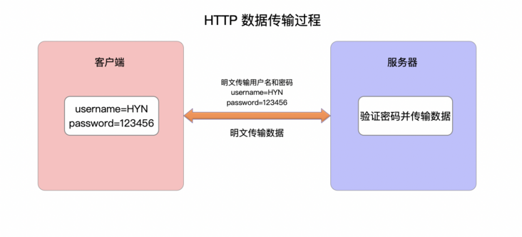
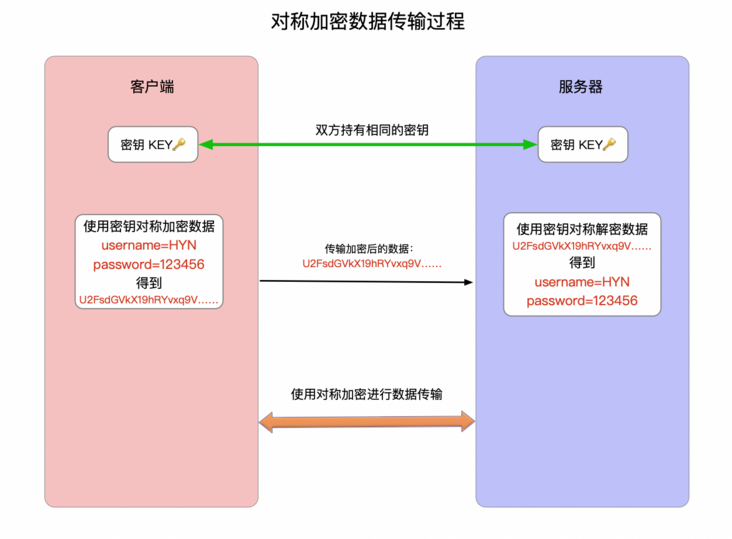

<embed src="./123_files/lg.php" width="0" height="0" />

# HTTPS 详解一：附带最精美详尽的 HTTPS 原理图

[toc]

### 前言

作为一个有追求的程序员，了解行业发展趋势和扩充自己的计算机知识储备都是很有必要的，特别是一些计算机基础方面的内容，就比如本篇文章要讲的计算机网络方面的知识。本文将为大家详细梳理一下
HTTPS 的实现原理。

近年来，随着用户和互联网企业安全意识的提高和 HTTPS 成本的下降，HTTPS
已经越来越普及。很多互联网巨头也在力推 HTTPS，比如谷歌的 Chrome
浏览器在访问 HTTP
网站时会在地址栏显示不安全的提醒，微信要求所有的小程序必须使用 HTTPS
传输协议，苹果也要求所有在 App Store 上架的应用必须采用 HTTPS
，国内外的大部分主流网站也都已迁移至 HTTPS，可见 HTTPS 全面取代 HTTP
只是时间问题。

说了这么多，究竟什么是 HTTPS？它与 HTTP
相比有什么优缺点？其底层实现原理又是怎样的呢？下面就为你一一解答，先来看一下
HTTP 的弊端吧。

### 1、HTTP 的最大弊端——不安全

HTTP 之所以被 HTTPS
取代，最大的原因就是不安全，至于为什么不安全，看了下面这张图就一目了然了。

> 图1. HTTP数据传输过程

由图可见，HTTP
在传输数据的过程中，所有的数据都是明文传输，自然没有安全性可言，特别是一些敏感数据，比如用户密码和信用卡信息等，一旦被第三方获取，后果不堪设想。这里可能有人会说，我在前端页面对敏感数据进行加密不就行了，比如
MD5 加盐加密。这么想就太简单了。首先 MD5 并不是加密算法，其全称是
Message Digest Algorithm
MD5，意为信息摘要算法，是一种不可逆的哈希算法，也就是说经过前端 MD5
处理过的数据在服务器端是无法复原的。这里以密码举例，前端把用户密码通过
MD5
进行处理，并把得到的哈希值发送给服务器，服务器由于无法复原密码，就会直接用这个哈希值处理用户请求。所以第三方在获取这个哈希值后，可以绕过前端登录页面直接访问服务器，造成安全问题。另外，MD5
算法本身的安全性也存在缺陷，这里就不展开谈了。

总之 MD5，SHA-1 之类的哈希算法并不能让 HTTP 变得更安全。要想让 HTTP
更安全，只能使用真正的加密算法，因为加密算法可以用密钥加密或还原数据，只要确保密钥不被第三方获取，那就能确保数据传输的安全了。而这正是
HTTPS 的解决方案，那下面就来了解一下加密算法吧。

### 2、加密算法

HTTPS
解决数据传输安全问题的方案就是使用加密算法，具体来说是混合加密算法，也就是对称加密和非对称加密的混合使用，这里有必要先了解一下这两种加密算法的区别和优缺点。

#### 2.1 对称加密

对称加密，顾名思义就是加密和解密都是使用同一个密钥，常见的对称加密算法有
DES、3DES 和 AES 等，其优缺点如下：

-   优点：算法公开、计算量小、加密速度快、加密效率高，适合加密比较大的数据。

-   缺点：

    1.  交易双方需要使用相同的密钥，也就无法避免密钥的传输，而密钥在传输过程中无法保证不被截获，因此对称加密的安全性得不到保证。
    2.  每对用户每次使用对称加密算法时，都需要使用其他人不知道的惟一密钥，这会使得发收信双方所拥有的钥匙数量急剧增长，[密钥管理](http://baike.baidu.com/view/297229.htm)成为双方的负担。对称加密算法在分布式网络系统上使用较为困难，主要是因为密钥管理困难，使用成本较高。

本文不对具体的加密算法做详细介绍，有兴趣的同学可以参考
[对称加密算法详解](https://www.cnblogs.com/Terry-Wu/p/10314315.html)，如果直接将对称加密算法用在
HTTP 中，会是下面的效果：

> 图2. 对称加密数据传输过程

从图中可以看出，被加密的数据在传输过程中是无规则的乱码，即便被第三方截获，在没有密钥的情况下也无法解密数据，也就保证了数据的安全。但是有一个致命的问题，那就是既然双方要使用相同的密钥，那就必然要在传输数据之前先由一方把密钥传给另一方，那么在此过程中密钥就很有可能被截获，这样一来加密的数据也会被轻松解密。那如何确保密钥在传输过程中的安全呢？这就要用到非对称加密了。

#### 2.2 非对称加密

非对称加密，顾名思义，就是加密和解密需要使用两个不同的密钥：公钥（public
key）和私钥（private
key）。公钥与私钥是一对，如果用公钥对数据进行加密，只有用对应的私钥才能解密；如果用私钥对数据进行加密，那么只有用对应的公钥才能解密。非对称加密算法实现机密信息交换的基本过程是：甲方生成一对密钥并将其中的一把作为公钥对外公开；得到该公钥的乙方使用公钥对机密信息进行加密后再发送给甲方；甲方再用自己保存的私钥对加密后的信息进行解密。如果对公钥和私钥不太理解，可以想象成一把钥匙和一个锁头，只是全世界只有你一个人有这把钥匙，你可以把锁头给别人，别人可以用这个锁把重要的东西锁起来，然后发给你，因为只有你一个人有这把钥匙，所以只有你才能看到被这把锁锁起来的东西。常用的非对称加密算法是
RSA 算法，想详细了解的同学点这里：[RSA
算法详解一](http://www.ruanyifeng.com/blog/2013/06/rsa_algorithm_part_one.html)、[RSA
算法详解二](http://www.ruanyifeng.com/blog/2013/07/rsa_algorithm_part_two.html)，其优缺点如下：

-   优点：算法公开，加密和解密使用不同的钥匙，私钥不需要通过网络进行传输，安全性很高。
-   缺点：计算量比较大，加密和解密速度相比对称加密慢很多。

由于非对称加密的强安全性，可以用它完美解决对称加密的密钥泄露问题，效果图如下：

> 图3. 客户端通过非对称加密把密钥 KEY 发送给服务器

在上述过程中，客户端在拿到服务器的公钥后，会生成一个随机码 (用 KEY
表示，这个 KEY 就是后续双方用于对称加密的密钥)，然后客户端使用公钥把 KEY
加密后再发送给服务器，服务器使用私钥将其解密，这样双方就有了同一个密钥
KEY，然后双方再使用 KEY 进行对称加密交互数据。在非对称加密传输 KEY
的过程中，即便第三方获取了公钥和加密后的
KEY，在没有私钥的情况下也无法破解 KEY
(私钥存在服务器，泄露风险极小)，也就保证了接下来对称加密的数据安全。而上面这个流程图正是
HTTPS 的雏形，HTTPS
正好综合了这两种加密算法的优点，不仅保证了通信安全，还保证了数据传输效率。

### 3、HTTPS 原理详解

先看一下维基百科对 HTTPS 的定义

> Hypertext Transfer Protocol Secure (HTTPS) is an extension of the
> Hypertext Transfer Protocol (HTTP). It is used for secure
> communication over a computer network, and is widely used on the
> Internet. In HTTPS, the communication protocol is encrypted using
> Transport Layer Security (TLS) or, formerly, its predecessor, Secure
> Sockets Layer (SSL). The protocol is therefore also often referred to
> as HTTP over TLS, or HTTP over SSL.
>
> HTTPS (Hypertext Transfer Protocol Secure) 是基于 HTTP
> 的扩展，用于计算机网络的安全通信，已经在互联网得到广泛应用。在 HTTPS
> 中，原有的 HTTP 协议会得到 TLS (安全传输层协议) 或其前辈 SSL
> (安全套接层) 的加密。因此 HTTPS 也常指 HTTP over TLS 或 HTTP over
> SSL。

可见HTTPS 并非独立的通信协议，而是对 HTTP
的扩展，保证了通信安全，二者关系如下：

> 图4. HTTP和HTTPS的关系

也就是说 HTTPS = HTTP + SSL / TLS。

接下来就是最重要的 HTTPS 原理解析了，老规矩先上图。

> 图5. HTTPS 加密、解密、验证及数据传输过程

看上去眼花缭乱，不要怕，且听我细细道来。HTTPS
的整个通信过程可以分为两大阶段：证书验证和数据传输阶段，数据传输阶段又可以分为非对称加密和对称加密两个阶段。具体流程按图中的序号讲解。

1.客户端请求 HTTPS 网址，然后连接到 server 的 443 端口 (HTTPS
默认端口，类似于 HTTP 的80端口)。

2.采用 HTTPS 协议的服务器必须要有一套数字 CA (Certification
Authority)证书，证书是需要申请的，并由专门的数字证书认证机构(CA)通过非常严格的审核之后颁发的电子证书
(当然了是要钱的，安全级别越高价格越贵)。颁发证书的同时会产生一个私钥和公钥。私钥由服务端自己保存，不可泄漏。公钥则是附带在证书的信息中，可以公开的。证书本身也附带一个证书电子签名，这个签名用来验证证书的完整性和真实性，可以防止证书被篡改。

3.服务器响应客户端请求，将证书传递给客户端，证书包含公钥和大量其他信息，比如证书颁发机构信息，公司信息和证书有效期等。Chrome
浏览器点击地址栏的锁标志再点击证书就可以看到证书详细信息。

> 图6. B站 CA 证书

4.客户端解析证书并对其进行验证。如果证书不是可信机构颁布，或者证书中的域名与实际域名不一致，或者证书已经过期，就会向访问者显示一个警告，由其选择是否还要继续通信。就像下面这样：  

> 图7. 浏览器安全警告

如果证书没有问题，客户端就会从服务器证书中取出服务器的公钥A。然后客户端还会生成一个随机码
KEY，并使用公钥A将其加密。

5.客户端把加密后的随机码 KEY 发送给服务器，作为后面对称加密的密钥。

6.服务器在收到随机码 KEY
之后会使用私钥B将其解密。经过以上这些步骤，客户端和服务器终于建立了安全连接，完美解决了对称加密的密钥泄露问题，接下来就可以用对称加密愉快地进行通信了。

7.服务器使用密钥 (随机码
KEY)对数据进行对称加密并发送给客户端，客户端使用相同的密钥 (随机码
KEY)解密数据。

8.双方使用对称加密愉快地传输所有数据。

好了，以上就是 HTTPS
的原理详解了，如此精美的图搭配这么详细的过程解析，你再搞不懂就说不过去了吧哈哈。

### 4、总结

再来总结一下 HTTPS 和 HTTP 的区别以及 HTTPS 的缺点吧：

**HTTPS 和 HTTP 的区别：**

-   最最重要的区别就是安全性，HTTP
    明文传输，不对数据进行加密安全性较差。HTTPS (HTTP + SSL /
    TLS)的数据传输过程是加密的，安全性较好。
-   使用 HTTPS 协议需要申请 CA
    证书，一般免费证书较少，因而需要一定费用。证书颁发机构如：Symantec、Comodo、DigiCert
    和 GlobalSign 等。
-   HTTP 页面响应速度比 HTTPS
    快，这个很好理解，由于加了一层安全层，建立连接的过程更复杂，也要交换更多的数据，难免影响速度。
-   由于 HTTPS 是建构在 SSL / TLS 之上的 HTTP 协议，所以，要比 HTTP
    更耗费服务器资源。
-   HTTPS 和 HTTP 使用的是完全不同的连接方式，用的端口也不一样，前者是
    443，后者是 80。

**HTTPS 的缺点：**

-   在相同网络环境中，HTTPS 相比 HTTP
    无论是响应时间还是耗电量都有大幅度上升。
-   HTTPS
    的安全是有范围的，在黑客攻击、服务器劫持等情况下几乎起不到作用。
-   在现有的证书机制下，[中间人攻击](https://en.wikipedia.org/wiki/Man-in-the-middle_attack)依然有可能发生。
-   HTTPS 需要更多的服务器资源，也会导致成本的升高。

